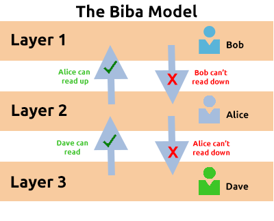

# 0. Introduction to Pentesting

An overview of what a penetration test involves

* [Pentesting Fundamentals](#pentesting-fundamentals)
  * [Penetration Testing Ethics](#penetration-testing-ethics)
  * [Penetration Testing Methodologies](#penetration-testing-methodologies)
  * [Black-, White- and Grey-box Penetration Testing](#black--white--and-grey-box-penetration-testing)
* [Principles of Security](#principles-of-security)
  * [The CIA triad](#the-cia-triad)
  * [Principles of Privileges](#principles-of-privileges)
  * [Security Models](#security-models)
  * [Threat Modelling and Incident Response](#threat-modelling-and-incident-response)

## Pentesting Fundamentals

Before looking at the technical aspects of ethical hacking, we need to understand more about the responsibilities of a penetration tester and the processes that are followed when performing penetration tests.

A *pentration test* or *pentest* is an **ethically-driven** attempt to test and analyse the security defences used to protect digital assets and information. A pentest involves using the same tools, techniques and methodologies that someone with malicious intent would use.

### Penetration Testing Ethics

Recall that a pentest is an **authorised audit** of a computer system's security and defences as agreed by the owners of the system. Thus, the legality of a pentest is clear-cut -- anything that falls outside of the agreement is deemed unauthorised.

Before a pentest, a formal discusstion should occure between the penetration teter and the system owner. The various tools, techniques, and systems to be tested are agreed upon and this forms the scope of the pentesting agreement. 

The *Rules of Engagement(ROE)* is a document that is created at the initial stages of a pentesting engagement. The doucment consists of three main sections, which are ultimately responsible for deciding how the engagement is carried out. 

* **Permission**: gives explicit permission for the engagement to be carrried out -- legally protects individuals and organisations for the activities they carry out.
* **Test Scope**: annotates the specific targets to which the engagement should apply.
* **Rules**: defines the exact techniques that are permitted during the engagement.

### Penetration Testing Methodologies

The steps a penetration tester takes during an engagement is known as the methodology. A practical methodology is a smart one, where the steps taken are relevant to the situation at hand. For example, having a methodology used to test web applications is **not practical** when the task is to test a network. 

In general, methodologies involve a number of stages:
1. **Information gathering**: collecting as much **publically** available information about the target via research (no scanning of any systems).
2. **Enumeration/Scanning**: discovering applications and services running on the systems.
3. **Exploitation**: leveraging vulnerabilities in applications or services running on the system.
4. **Privilege Escalation**: attempting to expand access to a system once it is sucessfully exploited.
5. **Post-exploitation**
   1. What other hosts can be targeted? 
   2. What additional information can we gather as the privileged user?
   3. Covering tracks
   4. Reporting

---

**Open Source Security Testing Methodology Manual (OSSTMM)**

The [OSSTMM](https://www.isecom.org/OSSTMM.3.pdf) provides a detailed framework of testing strategies for systems, software, applications, communications and the human aspect of cybersecurity. 

The framework focuses primarily on how these systems and applications communicate. Thus, it includes methodologies for:
* telecommunications,
* wired networks, and 
* wireless communications.

**Advantages**:
* Covers various testing strategies in-depth.
* Includes testing strategies for specific targets.
* Flexible depending on the organisation's needs
* Intended to set a standard for systems and applications, meaning that a universal methodology can be used for pentesting.

**Disadvantages**:
* Difficult to understand
* Very detailed
* Uses unique definitions

---

**Open Web Application Security Project (OWASP)**

The [OWASP](https://owasp.org/) framework is a community-driven and frequently updated framework used solely to test the security of web applications and services. 

Regular [reports](https://owasp.org/www-project-top-ten/2017/) are published, stating the top ten security vulnerabilities a web application may have, the testing approach, and remediation.

**Advantages**:
* Easy to pick up and understand.
* Actively maintained and is frequently updated.
* Covers all stages of an engagement -- from testing to reporting and remediation.
* Specialises in web applications and services.

**Disadvantages**:
* It may not be clear what type of vulnerability a web application has as they often overlap.
* OWASP does not make suggesstions to any specific software development life cycles.
* The framework does not hold any accreditation.

---

**NIST Cybersecurity Framework 1.1**

The [NIST Cybersecurity Framework](https://www.nist.gov/cyberframework) is a popular framework used to improve an organisation's cybersecurity standards and manage the risk of cyber threats. 

The framework provides guidelines on security controls and benchmarks success for organisations. There is also a section that provides a guideline for the methodology a penetration tester should take.

**Advantages**:
* Estimated to be used by 50% of American organisations as of 2020.
* Extremely detailed in setting standards to help organisations mitigate the threat posed by cyber threats.
* Frequently updated.
* NIST provides accreditation for organisations that use this framework.
* Designed to be implemented alongside other frameworks.
  
**Disadvantages**:
* There are many iterations of the framework, so it may be difficult to decide which one applies.
* The framework has weak auditing policies, making it difficult to determine how a breach occurred.
* The framework does not currently consider cloud computing, which is becoming increasingly popular for organisations. 

---

**National Cyber Security Centre Cyber Assessment Framework (NCSC CAF)**

The [CAF](https://www.ncsc.gov.uk/collection/caf/caf-principles-and-guidance) is an extensive framework of 14 principles used to assess the risk of various cyber threats and an organisation's defences against these.

The framework applies to organisations considered to perform "vitally important services and activities" such as critical infrastructure, banking, etc. The framework mostly focuses on and assesses the following topics:
* Data security
* System security
* Identity and access control
* Resiliency
* Monitoring
* Response and recovery planning

**Advantages**:
* Backed by a government cybersecurity agency.
* Provides accreditation
* Covers 14 principles ranging from security to response

**Disadvantages**:
* The framework is relatively new, meaning that organisations have not had much time to make the necessary changes to be suitable for it.
* Based on principles and ideas that is not as direct as having rules.

### Black-, White- and Grey-box Penetration Testing

There are **three** primary scopes when testing an application or service. The level of understanding of the targer determines the level of testing that is performed in the engagement.

**Black-box Testing**

This testing process is a high-level process where the tester is **not** given any information about the inner workings of the application or service. 

The tester acts as a regular user testing the functionality and interaction of the application or a piece of software. This testing can involve interacting with the interface, and observing whether the intended result is returned. 

Black-box testing generally takes more time in the information gathering and enumeration phase to understand the attack surface of the target.

**Grey-box Testing**

This is the most popular process for penetration testing. The tester will have **limited** knowledge of the internal components of the application or software. Still, the process involves interacting with the application as if it were a black-box, and then resolving issues as they are found using the knowledge of the application. 

Knowledge of the application, albeit limited, saves time. Thus, grey-box testing is often chosen for extremely well-hardened attack surfaces.

**White-box Testing**

This is a low-level testing process, usually done by a software developer familiar with programming and application logic. The tester will test the internal components of the application or piece of software and, for example, ensure that specific functions work correctly wand within a reasonable amount of time.

The tester has **full** knowledge of the application and its expected behaviour. White-box testing is the most time consuming, but it guarantees that the entrie attack surface can be validated.

## Principles of Security

In this section, we outline some of the fundamental principles of information security -- from the frameworks used to protect data and systems, to the elements of what exactly make data secure.

The measures, frameworks and protocols discussed throughout this section all play a small part in "Defence in Depth". 

*Defence in Depth* is the use of multiple varied layers of security in the hopes that multiple layers will provide redundancy in an organisation's security perimeter. 

### The CIA triad

The CIA triad is an information security model that is used in consideration throughout creating a security policy. 

Consisting of three sections: **C**onfidentiality, **I**ntegrity and **A**vailability (CIA), this model has quickly become an industry standard today. The model should help to determine the value of the data that it applies to, which in turn determines the attention it needs from organisation. 

The CIA triad is unlike a traditional model where there are individual sections. Instead, it is a continuous cycle. Whilst the three elements can overlap, if even one element is not met, then the other two are rendered useless. Thus, if a security policy does not address all the three sections, it is seldom an effective security policy. 

**Confidentiality**

Organisations will always have some form of sensitive data stored on their systems. To provide *confidentiality* is to protect this data from unauthorised access and misuse.

Possible real world examples include employee data and accounting records. Confidentiality is provided in the sense that only HR administrators will be able to access employee records, where vetting and tight access control measures are in place.

**Integrity**

*Integrity* is the condition where information is kept accurate and consistent unless authorised changes are made. It is possible for the information to change due to careless access and use, errors in the system, or unauthorised access and use. Integrity is maintained when the information remains **unchanged** during storage, transmission and usage not involving modification. Steps must be taken to ensure that the data cannot be altered by unauthorised people.

Many defences to ensure integrity can be put in place. Access control and rigourous authentication can help prevnet uanuthorised modifications. Hash verifications and digital signatures can help ensure that transactions are uthentic and that files have not been modified or corrupted.

**Availability**

In order for data to be useful, it must be **available and accessible** by the user. The information should be available when **authorised users** need it. 

Availability is a often a key benchmark for organisations -- websites or systems have to meet minimum uptime levels as laid out in Service Level Agreements. When a system is unavailable, it often results in damage to an organisation's reputations and a loss of finances. Availability can be acheived through a combination of:
* having reliable and well-tested hardware,
* having redundant systems in case the primary system fails,
* implementing security protocols to protect systems from attacks, etc.

### Principles of Privileges

It is vital to administrate and correctly define the various levels of access to a systen that users may require. The levels of access granted to users are determined by two primary factors:
1. the individual's role within the organisation, and
2. the sensitivity of the information being stored on the system.

To assign and manage the access rights of users, we follow two main concepts.
1. Privileged Identity Management (PIM) -- used to translate a user's role within an organisation into an access role on a system.
2. Privileged Access Management (PAM) -- management of the privileges an access role has and enforcement of security policies.

The guiding principle in assigning privileges and access controls is the *principle of least privilege*: users should be given the **minimum** amount of privileges, and only those that are absolutely necessary for them to perform their duties. 

### Security Models

Here, we look at two security models used to achieve the CIA triad: Confidentiality, Integrity and Availability.

---

**The Bell-La Padula Model**

This model is used to mainly achieve confidentiality and makes some assumptions, such as an organisations hierarchical structure -- where everyone has clearly defined roles.

The model works by granting access to pieces of data (objects) on a strictly need-to-know basis. The rule of thumb here is "no write down, no read up"

**Advantages**: 
* Policies in this model can be replicated to real-life organisation hierachies.
* Simple to implement and understand, and has proven to be successful.

**Disadvantages**:
* A user may have knowledge about the existence of an object, even if they do not have access to it.
* Relies on a large amount of trust within the organisation.

This model is popular within govenrments and military organisations because their members are presumed to have gone through a vetting process. Members' backgrounds have been examined to establish the risk they pose to the organisation, and are thus assumed to be trustworthy.

---

**The Biba Model**

The Biba model is similar to the Bell-La Padula model, but aimed more towards integrity. The rule here is "no write up, no read down" -- users can create or write content to objects at or below their level, but can only read contents of objects above their level.

**Advantages**:
* Simple to implement.
* Addresses both confidentiality and integrity.

**Disadvantages**:
* Many levels of access and objects, may result in oversights when applying security controls.
* Often results in delays in a business, e.g. a doctor would not be able to read notes made by a nurse.

This model is used in organisations where integrity is more crucial than confidentiality. For example, in software development, developers may only have access to the code that is necessary for their job.

---

### Threat Modelling and Incident Response

Threat modelling is the process of testing, reviewing and improving security protocols that an organisation has in place. Most critically, this is where we need to identify the likely vulnerabilities and threats that an application or system may be subjected to.\

An effective threat model should include:

* Threat intelligence
* Asset identification
* Mitigation capabilities
* Risk assessment

To help with threat modelling, there are frameworks such as STRIDE:
* **Spoofing** -- a malicious user falsely identifying itself as another. Users and requests should be authenticated via access keys or digital signatures.
* **Tampering** -- a malicious user making unauthorised modifications to data. Anti-tempering measures should be put in place to ensure the integrity of data.
* **Repudiation** -- all activity on a system or applicatioon should be logged.
* **Information Disclosure** -- applications and services that handle multiple users should be appropriately configured to only show information relevant to the owner.
* **Denial of Service** -- applications and services should have measures in place such that misuse will not cause an overconsumption of 
system resources.
* **Elevation of Privileges** -- a malicious user is able to escalate their authorisation to that of a higher level which usually leads to further exploitation or information disclosure.

Despite all rigourous threat models and secure system designs, incidents(security breaches) do happen. Incidents are classified using a rating of urgency and impact. Urgency is determined by the type of attack faced, while impact is determined by the affected system.

An incident is responded to by a Computer Security Incident Response Team (CSIRT) -- a predetermined group of employees with technical knowledege about the systems/incident. In general, there are six phases to Incident Response:
1. **Preparation** -- are resources and plans in place to deal with the incident? 
2. **Identification** -- has the threat and threat actor been correctly identified? 
3. **Containment** -- can the incident be contained to prevent other systems from being impacted?
4. **Eradication** -- removal of the active threat.
5. **Recovery** -- reviewing impacted systems to return to usual operation.
6. **Lessons Learnt** -- what lessons can be learnt from the incident? 