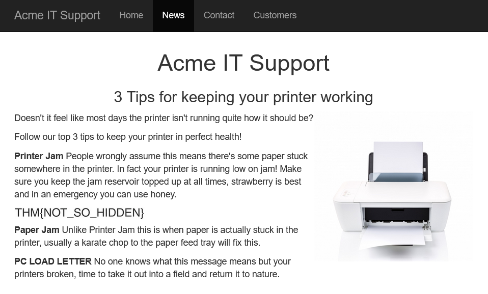

# 1. Introduction to Web Hacking
Understanding and exploiting common web application vulnerabilities

## Walking an application

We begin by discussing how we can manually review a web application for security issues using only tools built into the web browser. More often than not, automated tools and scripts will miss many potential vulnerabilities and useful information. 

The tools that we will look at are:
* **View Source** -- using the browser to view the human-readable source code of a website.
* **Inspector** -- inspect page elements and make changes to view usually blocked content.
* **Debugger** -- inspect and control the flow of JavaScript scripts on a webpage.
* **Network** -- inspect all network requests made by a webpage.

### Exploring the website

The role of a penetration tester when reviewing a website or web application is to discover featurs that can potentially be vulnerable and attempt to exploit them. Vulnerable features are commonly found in parts of a website that require human interaction.

The best way to start is to explore the website using the browser and noting doen the individual pages/areas/features with a summary for each one.

We are given an example: a website for "Acme IT Support". 


For this example, a site review would look something like this

| Feature | URL | Summary |
| :---: | :---: | :--- |
| Home Page | `/` | Contains a summary of what Acme IT Support does, and a company photo of their staff |
| Latest News | `/news` | Contains a list of recently published news articles by the company, and each news has an id number, i.e. `/news/article?id=1`. 
| News Article | `/news/article?id=1` | Displays the individual news article. Some articles seem to be blocked and reserved for premium customers only. |
| Contact Page | `/contact` | Contains a form for customers to contact the company. There is a name, email and message input fields, and a send button. |
| Customers | `/customers` | Redirects to `/custormers/login` |
| ... | ... | ... |

### Viewing Page Source

The page source is human-readable source code returned to our browser from the web server each time a request is made. The code consists of HyperText Markup Language (HTML), Cascading Style Sheets (CSS) and JavaScript. These tell the browser what content to display, how to show it and how users can interact with it. 

To view the page source:
1. Right-click on the page and click on "View Page Source" in the menu.
2. Some browsers support prepending the URL with `view-source:`, e.g. `view-source:https://www.google.com/`.
3. Click on "View Page Source" in the browser menu. This option may sometimes be located in submenus. 

We can use the above methods to view the source of the homepage of the Acme website.


At the top, we see some code starting with `<!--` and ending with `-->`, which is a HTML comment. Comments do not get displayed on the actual webpage. This comment tells us that the current homepage is a temporary one while a new one is under development at `/new-home-beta`. 

```html
<!--
This page is temporary while we work on the new homepage @ /new-home-beta
-->
```

Visiting the new homepage, we find a flag:
> THM{HTML_COMMENTS_ARE_DANGEROUS}

In HTML, links to other pages are enclosed in anchor tags denoted by `<a>`, and the link that we are directed to is stored in the `href` attribute. We see some examples in the Acme website.


Looking at the page source, at line 41, we see that there exists a link in the message on the homepage 

```html
<p class="welcome-msg">Our dedicated staff are ready <a href="/secret-page">to</a> assist you with your IT problems.</p>
```

Visiting the page, we find another flag:
> THM{NOT_A_SECRET_ANYMORE}

External files such as CSS, JavaScript and embedded images can be included via HTML. In the Acme website, we can see that these files are stored in the directory `/assets`.

```html
<script src="/assets/jquery.min.js"></script>
<script src="/assets/bootstrap.min.js"></script>
<script src="/assets/site.js"></script>
```

We can attempt to visit the directory, and we are able to see all the files within that directory.


Under normal circumstances, we should expect either a blank page or a `403 Forbidden` error as we should not have permission to access this page. 

Opening up `flag.txt` gives us another flag:
> THM{INVALID_DIRECTORY_PERMISSIONS}

Nowadays, websites are not made from scratch and make use of frameworks -- collections of premade code that allow developers to include common features. The page source may give us clues as to what frameworks are used, which may be important as there may be public vulnerabilities in the framework. In the Acme website, we see a comment that gives us information about the framework.

```html
<!--
Page Generated in 0.04611 Seconds using the THM Framework v1.2 ( https://static-labs.tryhackme.cloud/sites/thm-web-framework )
-->
```

Visiting the website for the THM Framework, we see that the latest version is v1.3, while the Acme website uses v1.2. The changelog also states that there is a vulnerability in v1.2 where a file `/tmp.zip` is publicly viewable. 


Downloading the zip file from the Acme website, we see that there is a file `flag.txt` contained within it. Opening `flag.txt` gives us the flag:
> THM{KEEP_YOUR_SOFTWARE_UPDATED}

### Developer Tools - Inspector

The page source does not fully represent what is shown the webpage as CSS, JavaScript and user interaction can change the content and style of the page. The element inspector allows provides us a way to view the live representation of what is currently on the website. Other than the live view, we can also use the inspector to edit and interact with page elements, which is useful for helping developers to debug issues.

On the "News" section of the Acme website, we see that the third article has been blocked with a floating notice, stating that the content is only for premium customers. This is known as a paywall.


We can inspect the paywall element on the page, and see that it belongs to the element class `premium-customer-blocker`. We can then view the styles of this element class.


Changing `display: block` to `display: none`, we can reveal the content underneath the paywall. This gives us the flag:
> THM{NOT_SO_HIDDEN}



Note that this edit is only valid in the current browser window. When the page is refreshed, everything will be back as it were.

### Developer Tools - Debugger

The debugger panel in the developer tools is intended for debugging JavaScript. This allows penetration testers to dig deep into the JavaScript code. Note that the debugger is called "Sources" in Google Chrome.

On the "Contact" page of the Acme website, notice that a red box quickly flashes by on the screen as the page is loaded. In the "assets" folder, we see that there is a file called `flash.min.js`. Clicking on the file displays its contents. We can make the file more readable using the "Pretty Print" function, by clicking the button with the braces `{}`. 

Scrolling to the end of the file, we see the line:

```javascript
flash['remove']();
```

which is what removes the red box from the page. We can click on the line number to set a breakpoint, which will pause the code before the line is executed. Refreshing the page, we see that the red box is present on the page and it contains the flag:
> THM{CATCH_ME_IF_YOU_CAN}


### Developer Tools - Network

The network panel in the developer tools keeps track of every external request a webpage makes. 

On the "Contact" page of the Acme website, if we fill up the form and click on "Send Message", we see that the network panel records a new event: the form being submitted in the background using AJAX.


Clicking on the event, we see that a request was sent to the file `/contact-msg`. Visiting the site gives us the flag:
> THM{GOT_AJAX_FLAG}

