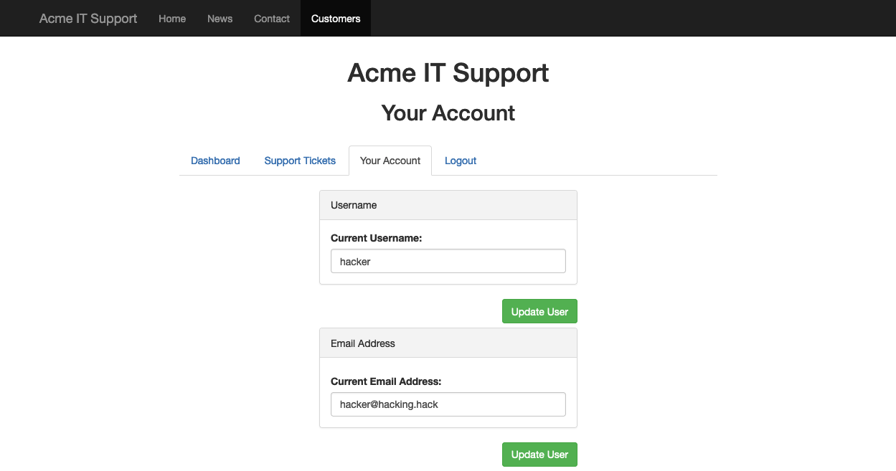
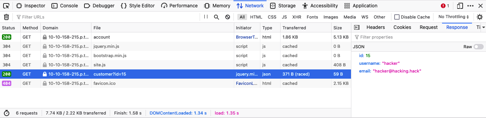
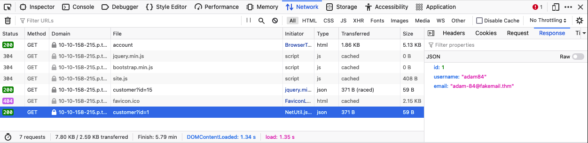

# 1b. Introduction to Web Hacking

Understanding and exploiting common web application vulnerabilities. In this part, we look at various web vulnerabilities and how to exploit them. 

## Insecure Direct Object Reference (IDOR)

*IDOR* is a type of access control vulnerability. It occurs when a webserver receives user-supplied input to retrieve objects (files, data, documents, etc.) and the input data is **not validated** on the server-side to confirm that the requested object belongs to the user requesting it. 

### IDOR example

Suppose we have registered ourself on some web service, and our private profile on this service exists at `/profile?id=1305`. However, we can attempt to change the query string to `id=1000`. If we are now able to see another user's private information, then we have discovered an IDOR vulnerability. 

### IDORs in encoded IDs

When passing data from webpage to webpage, either by `POST` or `GET` or cookies, developers will often encode the raw data. This ensures that the web server will understand the contents of the data.

The most commonly used encoding is base64 which uses the characters a-z, A-Z, 0-9, + and /. To determine if an IDOR vulnerability is present, we first decode the data into its raw form, tamper with it, then re-encode it before sending it back to the server and observing the response.


### IDORs in hashed IDs

Hashed data are more complicated to deal with due to the irreversibility of the hashing process. Nonetheless, it is worthwhile to use databases like [Crackstation](https://crackstation.net/) to see if a matching string can be found. 

If we are able to identify the unhashed data, we can use a similar process as encoded data to test for IDOR.

### IDORs in unpredictable IDs

If we are unable to determine the data used to request the objects, we can attempt to create two accounts and swap the ID numbers between them. If we can use one account to view the content of the other account by using their ID, then we have found an IDOR vulnerability.

### Where IDORs are located

The vulnerable endpoint may not always be a query string in the URL. It can also be content the browser loads via an AJAX request or something referenced in a Javascript file.

Sometimes endpoints may contain an unreferences parameter that was used during development, but accidentally got pushed to production. 

### A pratical IDOR example

On the Acme website, we log in to our account and go to the "Your Account" tab. We see that our information has been prefilled in the tab.



We investigate how this information is filled using the "Network" tab in the developer tools. We see that there is a call to an endpoint `/api/v1/customer?id=15`, and the page returns the ID, username and email address in JSON format.



We can try to change the ID to test for an IDOR vulnerability. Changing the ID to "1", reveals the data of the user with `id=1`.



## File Inclusion

Web applications can be written to request access to files (images, text, etc.) on a system via `GET` parameters. For example, if a user wants to access a CV on a web application, the request may look something like `http://webapp.thm/get.php?file=userCV.pdf`.

In such cases, file inclusion vulnerabilities occur when the user input is not sanitised or validated, and the user has full control over the input. 

If an attacker is able to exploit file inclusion vulnerabilities, they will be able to leak sensitive data. Furthermore, if an attacker is able to write to the server, it may be possible for them to gain remote code execution (RCE).

### Path traversal

*Path traversal* (also known as directory traversal) is a weeb sercurity vulnerability that allows and attacker to read operating system resources, such as local files on the server running the application. An attacker can exploit this vulnerability by manipulating and abusing the web application to locate and access files or directories stored **outside** of the application's root directory.

Path traversal vulnerablities occur when the user's input is passed into a functiun such as `file_get_contents` in PHP, **without proper input validation or filtering**. 

The graph below shows an example of how a web application stores files in `/var/www/app`. A proper request would be a request for the contents of `/var/www/app/CVs/userCV.pdf`. In this case, the request is made via a query string in the URL.  


Since the request is made via a query string, we can send malicious payloads via the URL to see how the web application behaves. Path traversal attacks (also known as **dot-dot-slash** attacks) take advantage of moving up one step in the directory using `../`. As in the image above, that attacker can send a malicious request: `http://webapp.thm/get.php?file=../../../../etc/passwd`, and if there is no proper input validation, the attacker wiil be able to read the contents of `/etc/passwd`. 

Similarly, if the web application runs on a Windows server, then the attacker has to provide a valid Windows path.

Sometimes, developers will only limit access to certain files or directories. Below is a (non-exhaustive) list of common OS files that we can try to access when testing.

| Location | Description |
| :---: | :--- |
| `/etc/issue` | contains a message or system identification information, which is printed before the login prompt | 
| `/etc/profile` | contains system-wide default variables |
| `/proc/version` | specifies the version of the Linux kernel |
| `/etc/passwd` | contains all registered users that have access to the system |
| `/etc/shadow` | contains information about the system's users' passwords |
| `/root/.bash_history` | contains the command history for the `root` user | 
| `/var/log/dmessage` | contains global system messages, including messaged logged during system startup | 
| `/var/mail/root` | contains all emails for the `root` user | 
| `/root/.ssh/id_rsa` | contains **private** SSH keys for any known user on the server | 
| `/var/log/apache2/access.log` | contains accessed requests for the Apache webserver | 
| `C:\boot.ini` | contains the boot options for PCs with BIOS firmware | 

### Local File Inclusion (LFI)

LFI attacks against web applications are often due to a developer's lack of security awareness. With PHP, using functions such as `include`, `require`, `include_once`, and `require_once` often lead to vulnerable web applications. Here, we focus our discussion around PHP, but it is worth noting that LFI vulnerabilities can also occur in other languages like ASP, JSP, or even Node.js. LFI exploits follow the same concepts as path traversal.

---
**Scenario 1.**

Suppose the web application provides two languages, and the user can select between `EN` for English and `AR` for Arabic. 

```php
<?php
    include($_GET["lang"]);
?>
```

The PHP code above uses a `GET` request via the URL parameter `lang` to include the file of the page. Thus, to load the English page, we make a HTTP request to `http://webapp.thm/index.php?lang=EN.php`, and to load the Arabic page, we make a HTTP request to `http://webapp.thm/index.php?lang=AR.php`. Here, we can also infer that `EN.php` and `AR.php` exist in the same directory as `index.php`. 

Theoretically, if there is no input validation, we can access and display any readable file on the server. Suppose that we want to read the `/etc/passwd`, we can try to make a request to `http://webapp.thm/index.php?lang=/etc/passwd`. 

--- 

**Scenario 2.**

Now, the developer decides to specify a directory in the function.

```php
<?php
    include("languages/".$_GET["lang"])
?>
```

In this case, any file path passed via `lang` is taken to be **relative** to the `languages` directory. If there is no input validation, an attacker can still access files on the system via path traversal. An example of a malicious request would be `http://webapp.thm/index.php?lang=../../../../etc/passwd`. 

---

**Scenario 3.**

In the previous scenarios, we discovered how to exploit the web app by analysing its source code. Here, we are conduct **black-box testing**, where we do not have the source code. Thus, error messages play a significant role in helping us understand how the data is passed into, and processed in the web app.

Suppose we have an entry point: `http://webapp.thm/index.php?lang=EN`. If we enter an invalid input, e.g. `lang=THM`, we get the following error code

```
Warning: include(languages/THM.php): failed to open stream: No such file or directory in /var/www/html/THM-4/index.php on line 12
```

From this error message, we can see that the `include()` function looks like `include(languages/THM.php)`. This tells us that the function includes files in the `languages` directory, and is adding `.php` to the user input. 

Also, the error message tells us that the web application exists in the directory `/var/www/html/THM-4`. Thus, we will need to traverse the directory using `../`.  We try making the following request: `http://webapp.thm/index.php?lang=../../../../../etc/passwd`. The request again gives us an error

```
Warning: include(languages/../../../../../etc/passwd.php): failed to open stream: No such file or directory in /var/www/html/THM-4/index.php on line 12
```

Although we have managed to move out of the directory, we still need to deal with the input being appended with `.php`. To bypass this, we use a null byte (`%00`) in the user input to terminate the string. The `include()` function will ignore anything after the null byte, i.e. `include("languages/../../../../../etc/passwd%00".".php")` will be equivalent to `include("languages/../../../../../etc/passwd")`.

> **Note that the null byte trick has been fixed since PHP 5.3.4**