# Solutions to File Inclusion lab

Below are solutions to the lab provided in the [File Inclusion room](./1b_intro_to_web_hacking.md#file_inclusion).


## Lab #1

We are given an input field, where we can specify a file name to be included.


We observe what happens when `welcome.php` is submitted in the form.


Notice that the file name is passed as a `GET` parameter, `file`. If we want to access and read, say `/etc/passwd`, we can request for `lab1.php?file=/etc/passwd`. 


## Lab #2

We are given an input field, similar to Lab #1. 


We attempt to directly request for `/etc/passwd`, but we get an error. From the error, it seems that the `include()` function is trying to include a file at the path `includes//etc/passwd`, which does not exist.


Thus, we know that the file path that we pass into the `file` parameter will be taken **relative** to the directory `includes/`. To get to `/etc/passwd`, we use `../` to traverse the path, and pass the value `../../../../etc/passwd` to the `file` parameter.


## Lab #3

We are again given an input field, and we try to make a request to `/etc/passwd`. 


From the error, we can see that:

1. the file path is taken to be relative to the `includes/` directory (similar to [Lab #2](#lab-2)), and
2. the file name is appended with `.php`. 

To overcome this, we use the null byte trick. We know this will work since the second error tells us that the system is running PHP 5.2. We pass the value `../../../../etc/passwd%00` to the `file` parameter.


## Lab #4

We are again given an input field, and we perform the usual recon. 

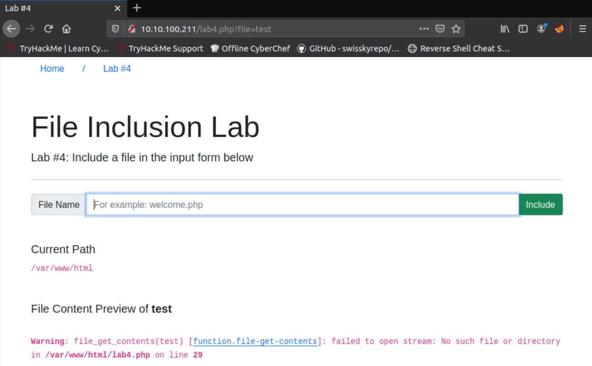

We see that the relevant function here is `file_get_contents()`.


It seems like the application filters the string for `/etc/passwd`. To bypass this, we use the `/.` trick, and send the request for `/etc/passwd/.` instead.


## Lab #5

Performing the usual recon shows us that the substring `../` is replaced by an empty string.


Using the payload `....//....//....//....//etc/passwd` bypasses the filtering, and we can successfully read `/etc/passwd`.

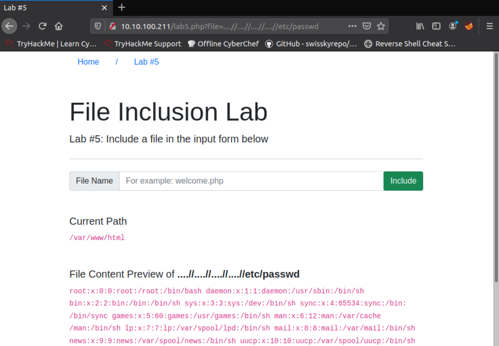

## Lab #6

Recon tells us that only files in the `THM-profile` directory can be accessed. 

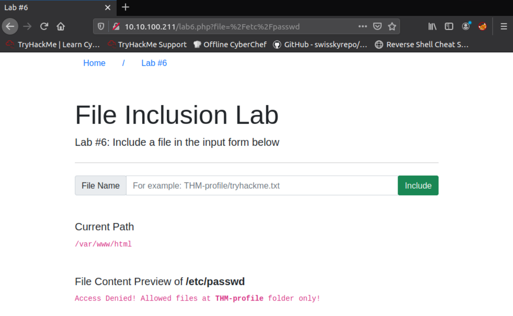

To bypass this, we include the required directory in the payload: `THM-profile/../../../../etc/os-release`, and we successfully read the file.

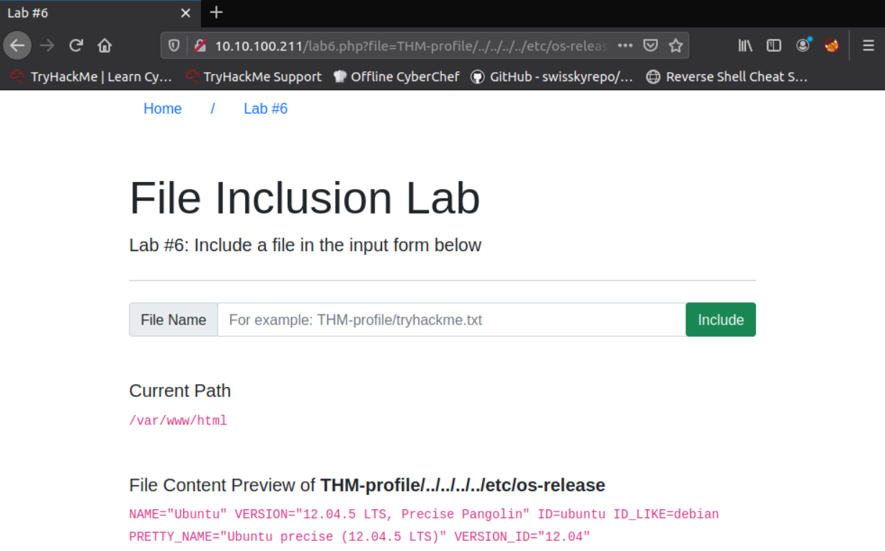


## Challenge

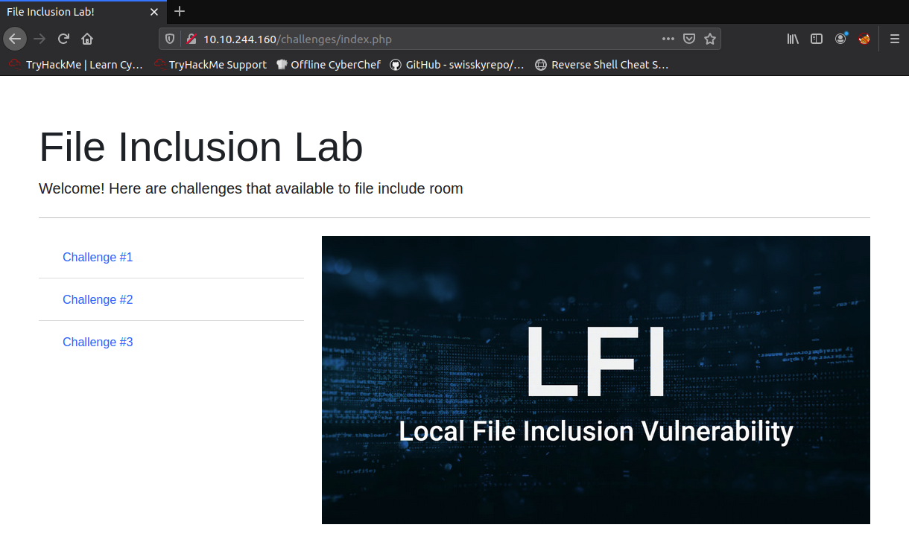

**Challenge #1**

The page tells us that we need to send a `POST` request with the `file` parameter.

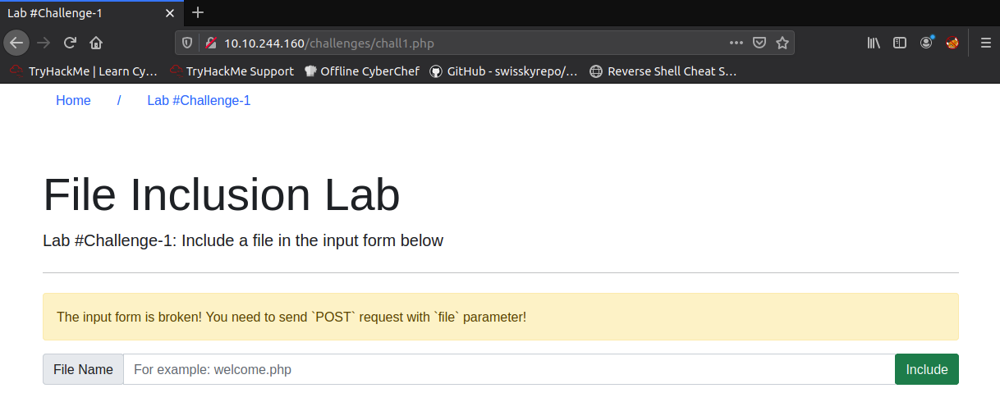

We send a `POST` request, with the payload: `file=/etc/flag1` and it gives us the flag.

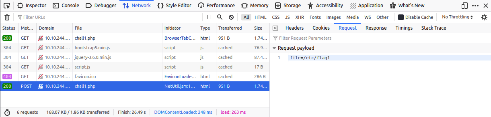

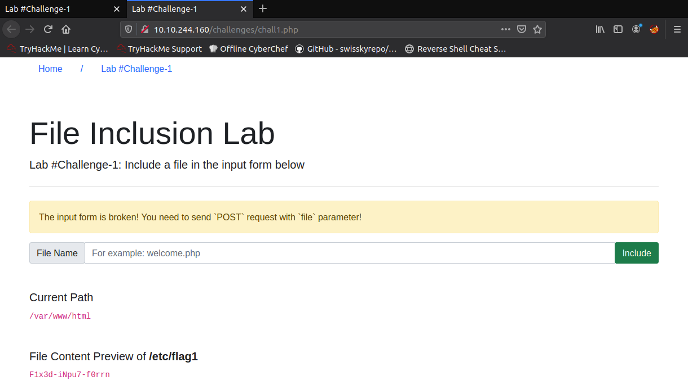

>  F1x3d-iNpu7-f0rrn 

**Challenge 2**

The page tells us to refresh the page, but refreshing does not change anything.

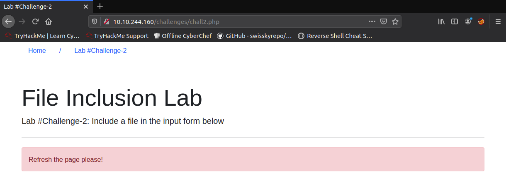

We open the developer tools and notice that there is a cookie:

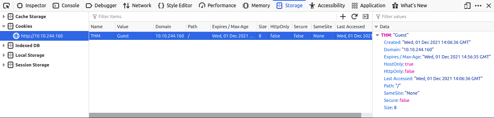

We try changing the value of the cookie to "Admin" and refresh the page.


We see that this causes the `include()` function to be `include(includes/Admin.php)`. Thus, the `include()` function on the web server should have the following structure:

```php
include("includes" . <value of THM cookie> . ".php")
```

The error messages also tell us that server is running PHP 5.2, so we can use the null byte trick, and that the application directory is `/var/www/html`. Thus, to get to `/etc/flag2`, we set the cookie value to `../../../../etc/flag2%00`.

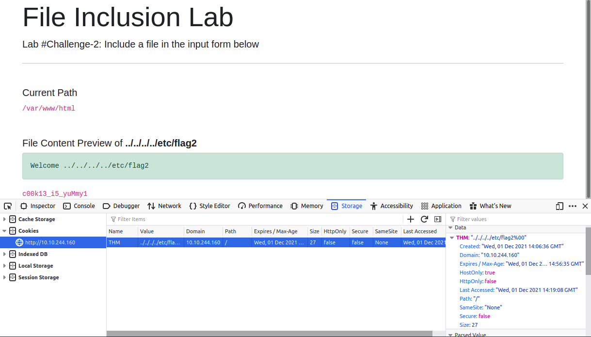

> c00k13_i5_yuMmy1