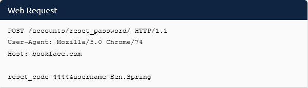

# 0. Cyber Security Introduction

A short introduction to some topics.

## Web Application Security

To attack web applications, we need to know how parts of the website function and **identify weaknesses** we can take advantage of. If something is vulnerable, then it can be attacked or harmed.

When submmitting a form, the web browser makes a web request with the relevant form data:
* Type of web request (`GET`, `POST`, `DELETE`, etc.) and location to send data to (see httpindetail TryHackMe lab).
* User-Agent, i.e. information about the program making the web request.
* Host, i.e. the website being requested
* Data being sent to the web server

## Network Security

Networking is an important concept in cyber security.  Understanding how networks work will allow us to
1. identify users and devices on a network, and
2. monitor and track users via network logs.

---
### Case study: Target
* Target's air-conditioning units connected to Target's main store network for remote control.
* Attackers could compromise the smart air-conditioning units and access other machines on the same network, i.e. the checkout tills to steal customers' credit card information.
* This is a prime example of a basic **segmentation flaw**
---

## Other topics covered in the Pre-Security learning path

* Linux fundamentals
* Windows fundamentals

