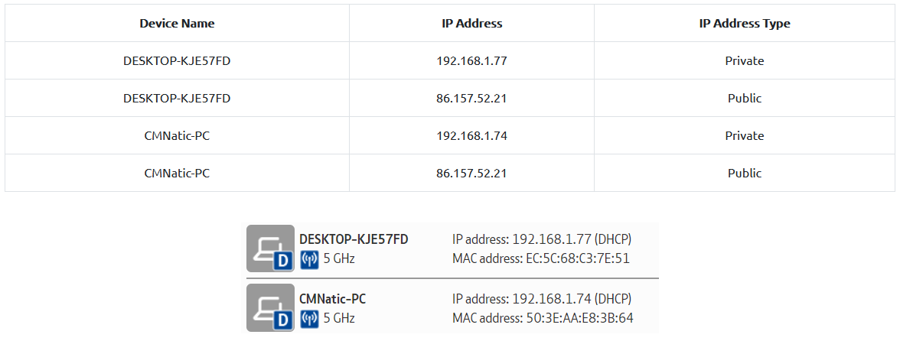
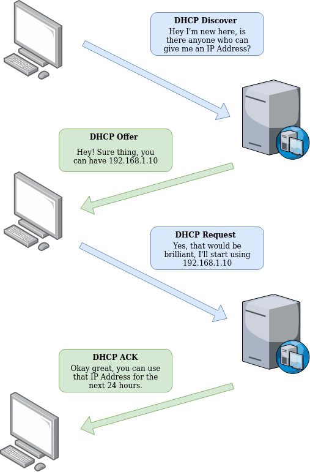
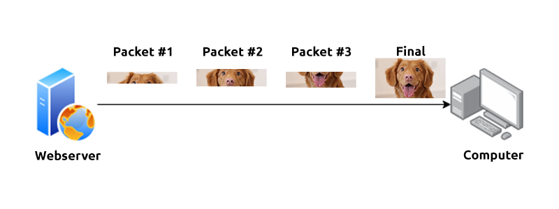

# 1. Network Fundamentals

Core concepts of how computers communicate with each other and types of network weaknesses. 

## Table of Contents
* [What is Networking](#what-is-networking)
    * [The Internet](#the-internet)
    * [Identifyng devices on a network](#identifying-devices-on-a-network)
    * [Ping](#ping)
* [Intro to LAN](#intro-to-lan)
    * [Introducing LAN topologies](#introducing-local-area-network-lan-topologies)
    * [A Primer on Subnetting](#a-primer-on-subnetting)
    * [The ARP protocol](#the-arp-protocol)
    * [The DHCP protocol](#the-dhcp-protocol)
* [The OSI model](#the-osi-model)
    * [Layer 7: Application](#layer-7:-application)
    * [Layer 6: Presentation](#layer-6:-presentation)
    * [Layer 5: Session](#layer-5:-session)
    * [Layer 4: Transport](#layer-4:-transport)
    * [Layer 3: Network](#layer-3:-network)
    * [Layer 2: Data Link](#layer-2:-data-link)
    * [Layer 1: Physical](#layer-1:-physical)
* [Packets and Frames](#packets-and-frames)
    * [TCP/IP (Three-way Handshake)](#tcp/ip-three-way-handshake)
    * [UDP/IP](#udp/ip)
* [Extending your network](#extending-your-network)
    * [Introduction to Port Forwarding](#introduction-to-port-forwarding)
    * [Firewalls 101](#firewalls-101)
    * [VPN Basics](#vpn-basics) 

## What is Networking? 

In computing, networking is connecting technological devices together. We will look at how these devices communicate with each other and the rules that follow.

A network can be formed by any number of devices, from 2 devices to even billions of devices. These devices can be anything: laptops, phones, security cameras, or even traffic lights. Networks are so embedded in everyday life, making networking a key concept in cybersecurity.

### The Internet

The **Internet** is one giant network consisting of many small networks within it. The Internet looks like a larger version of the following diagram:

The small networks are called *public* networks, and the networks connecting these smaller networks are called *private* networks. To summarise, networks come in two types:

1. private networks, and
2. public networks.

### Identifying devices on a Network

To communicate and maintain order on the network, devices must be identfying and **identifiable** on a network. i.e. we need to know who we are talking to. Devices have two means of identification:

1. An Internet Protocol (IP) address, and 
2. A Media Access Control (MAC) address (similar to a serial number). 

#### IP addresses

An IP address can be used as a way of identifying a device on a network for a period of time, after which that IP address can be associated with another device without the IP address changing.

An IP address is a set of numbers that are divided into *four* octets. These numbers are calculated by a technique known as *IP addressing and subnetting*, but the details are not discussed here. Most importantly, IP addresses can change from device to device but cannot be active **simultaneously more than once within the same** network. 

IP addresses follow a set of standards known as protocols, which force the devices to communicate in the same language. However, recall that device can be on both a private and public network. Thus, depending on who they are communicating with, they use either a public or private IP address.

A public IP address is used to identify the device on the Internet, whereas a private address is used to identify a device amongst other devices. Below is an example of two devices on a private network. 

The two devices will communicate with each other via their **private** IP addresses. Any data sent to the internet will be identified by the same **public** IP address. Public IP addresses are given by Internet Service Providers (ISPs). 

So far, we have discussed only one version of the IP addressing scheme known as *IPv4*, which uses a numbering system of 2^32 (~4.29 billion) IP addresses. However, as more and more devices become connected, it is increasingly harder to get a public address that is not already in use.  

*IPv6* is a new iteration of the addressing scheme to tackle this issue. It supports up to 2^128 (~340 trillion) IP addresses and is more efficient due to new methodologies.

#### MAC addresses 

Devices on a network will have a physical network interface, which is a microchip found on the devices' motherboard. This physical interface is assigned a unique address at the factory it was built at, called a MAC address. The MAC address is a 16 character **hexadecimal** number split into pairs and separated by colons. A MAC address can be broken down in the following manner.

However, MAC addresses can be faked by a process known as *"spoofing"*, where a networked device pretends to be another using its MAC addresss. Consider the following scenario: A firewall is configured to allow any communication going to to and from the MAC address of the administrator. If a device were to spoof this MAC address, the firewal would think that it is communicating with the adminstrator when it is not.

Places such as cafes, coffee shops, and hotels often use MAC address control to control their "Guest" or "Public" Wi-Fi. 

### Ping

Ping is the most fundamental network tools available. It uses Internet Control Message Protocol (ICMP) packets to determine the performance of a connection between devices. e.g. if the connection *exists* or is *reliable*.

The time taken for ICMP packets travelling between devices is measured by *ping*. Measurements are done by using ICMP's echo packet and then ICMP's echo reply from the target device. 

Pings can be performed against devices on a network or resources like websites. This tool comes installed on most operating systems. The syntax for a simple ping is `ping <IP address or website URL>`. 

In the example above, we are pinging a device with the private address `192.168.1.254`. Ping then informs us that we have send six ICMP packets, which were all received with an average time of 5.3 seconds.

## Intro to LAN

### Introducing Local Area Network (LAN) topologies

In networking, *"topology"* refers to the design or look of the network at hand. We will discuss the advantages and disadvantages of these topologies.

-----

**Star Topology**

In a star topology, devices are individually connected via a central networking device such as a switch or a hub. Information sent between devices are sent via the central device. This topology is commonly found today due to its *reliability* and *scalability* (despite the cost).

Advantages: 
* Scalability  -- easy to add more devices as demand for the network increases.

Disadvantages: 
* Higher cost -- more cabling and dedicated networking equipment is required.
* More maintenance is required as the network scales. This can also make troubleshooting harder.
* The network fails if the central device fails. However, these centralised devices are generally robust.

---

**Bus Topology**

The bus topology relies on a single connection known as the backbone cable. 

Advantages: 
* Easy to set-up
* Cost-efficient -- less cabling and dedicated networking equipment is required.

Disadvantages:
* With all the data travelling along the same cable, it is 
    1. prone to becoming slow if devices are simultaneously requesting data, and
    2.  hard to identify which device is experiencing issues.
* Single point of failure along the backbone cable. If this cable breaks, then devices can no long communicate along the bus.

---

**Ring Topology**

In a ring topology, devices are connected directly to each other in a loop. Data is sent across the loop until it reached the destined device, using devices along the loop to forward the data. A device will prioritise sending its own data before forwarding data from others.

Advantages:
* Low-cost -- little cabling required and less dependence on dedicated networking hardware.
* Relatively easy to troubleshoot -- data only travels in one direction along the loop.
* Less prone to bottlenecks -- only small amounts of data are travelling across the network at any one time. 

Disadvantages:
* Inefficient way for data to travel across the network -- data has to visit multiple devices before reaching its destination.
* If any of the devices or cables break, then the network is broken.

---

**Routers and Switches**

Routers connect networks and pass data between them. Routing is the process of data travelling across networks. It is useful when devices are connected by multiple paths. 

Switches are dedicated devices designed to aggregate multiple other network-capable devices using ethernet. Switches are usually found in larger networks (such as businesses and schools) where there are many devices to connect to the network. 

Unlike routers, switches do not perform routing (i.e. directing data along a certain route). Instead, switches use *"packet switching"* to break down pieces of data into smaller, more manageable chunks of data called **packets**. This makes a network more efficient because large pieces of data take up more resources. 

### A Primer on Subnetting

Subnetting is to **split up** a network into smaller networks **within itself**. Subnetting is achieved by splitting up the number of hosts that can fit within the network, represented by a number called the *subnet mask*. 

Recall that an IP address is made up of four sections (octets). The subnet mask is the same: 32-bit number separated into four octets, each ranging from 0 to 255. 

Subnets use IP addresses for three purposes:
1. Identify the network address
2. Identify the host address
3. Identify the default gateway
We summarise the three purposes in the table below.

| **Type** | **Purpose** | **Explanation** |
| ----- | ----- | ----- |
| Network Address | To identify the start of the actual network and to identify a network's existence | e.g. a device with the IP address `192.168.1.100` will be on the network identified by `192.168.1.0`. |
| Host Address | To identify a device on the subnet | e.g. a device with a network address `192.168.1.10`. |
| Default Gateway | A special address assigned to a device on the network capable of sending information to **another** network | Any data that is destined for a device **not** on the same network will be sent to this device. These devices can use any host address, but usually use the first (`.1`) or last (`.254`) host in the network.

Subnetting provides some benefits:
* Efficiency
* Security
* Full control

**Example of subnetting**
Consider a cafe on the street with two networks:
1. one for employees, cash registers and other smart devices in the facility, and 
2. one for a public hotspot. 
Subnetting allows us to separate these two use cases from each other whilst having a connection to the Internet. 

### The ARP protocol

The Address Resolution Protocol (ARP) allows devices to identify themselves on a network. The ARP does this by allowing devices to associate their MAC addresses with an IP address on the network.

When devices wish to communicate with each other, they can use the ARP to find the MAC address of the device they wish to communicate with.

**How does ARP work?**

Each device on the network has a ledger to store information, known as a *cache*. This cache stores the identifiers of other devices on the network.

In order to map the IP and MAC addresses together, two types of messages are sent:
1. an ARP request, and
2. an ARP reply. 

The ARP proceeds in the following manner: 
* A device sends an **ARP request**, broadcasting to every other device on the network, asking whether or not the particular device's MAC address matches the requested IP address. 
* If the device has the requested IP address, an **ARP reply** is returned to the initial device to acknowledge this. 
* The initial device will then store this mapping in its cache (an ARP entry). 

> Note to self: I don't really like this image. It confuses me. Redraw?

### The DHCP protocol

IP addresses can be assigned either manually (entering them physically into a device) or automatically using a Dynamic Host Configuration Protocol (DHCP) server. 

The DHCP involves a number of steps: 
1. **DHCP Discover** -- when a device connects to the network, if it is not manually assigned an IP address, it sends out a request to see if there are any DHCP servers on the network
2. **DHCP Offer** -- the DHCP server then replies back with an IP address the device can use
3. **DHCP Request** -- the device sends a reply confirming that it wants the offered IP address
4. **DHCP ACK** -- the DHCP server then replies to acknowledge the IP address assignment and the device can start using the IP address

## The OSI Model

The Open Systems Interconnection (OSI) model is a fundamental model in networking. The model provides a framework: dictating how all networked devices will send, receive and interpret data. Thus, the main benefit of the OSI model is that devices on a network can have different functions and designs while communicating with other devices. 

The OSI model consists of seven layers, with each layer having different responsibilities. At each layer, information is added to the data in a process known as *encapsulation* and we will discuss this in the later sections. 

### Layer 7: Application

The application layer is the layer which determines how users should interact with data sent or received.

Some examples of protocols in the application layer are:
* Hypertext Transfer Protocol (HTTP/HTTPS)
* Secure Shell Protocol (SSH)
* Domain Name System (DNS)

### Layer 6: Presentation

The presentation layer is where standardisation starts to take place. No matter how a software works, the data is handled in a standardised manner.

This layer acts as a translator for data sent to and from the application layer. On the sending device, this layer is responsible for translating the data into standard, transmittable formats. On the receiving device, it is responsible for the formatting and delivery of the data, for processing or display.

Data encryption may also occur at this layer.

### Layer 5: Session

Once data has been appropriately formatted by the presentation layer, the session layer will create a connection to the destination device. When a connection is established, a session is created. While the connection is active, so is the session. 

This layer synchronises the two devices to ensure that they are on the same page before data is sent and received. Once the devices are synchronised, the session layer will divide the data into smaller chunks (packets) and begin to send these chunks one at a time. The main benefit of this is: if the connection is ever lost, only chunks that were not yet sent will have to be send again, rather than the entirety of the data.

Sessions are **unique**, meaning that data cannot travel over different sections.

### Layer 4: Transport

The transport layer is vital in transmitting data across a network. When data is sent between devices, it follows one of two different protocols depending on several factors:
1. Transmission Control Protocol (TCP)
2. User Datagram Protocol (UDP)

---

**TCP**

This protocol is designed to be reliable. The protocol reserves a constant connection between the two devices for the amount of time it takes for the data to be sent and received. TCP also incoporates error checking into its design, which guarantees that the data packets received is reassembled in the same order.

Advantages:
* Guarantees data accuracy
* Capable of synchronising the two devices, preventing them from being flooded with data
* Performs more processes to ensure reliability

Disadvantages:
* Requires a reliable connection: all packets are required 
* A slow connection may bottleneck another device as the connection will be reserved on the receiving computer the whole time
* Significantly slower due to the extra process that have to be done

TCP is mainly used for situations that require data to be *accurate and complete*, such as:
* file sharing,
* internet browsing, and
* sending an email.

---

**UDP**

UDP is not as advanced as TDP, lacking features such as error checking and synchronisation. The data is simply sent to the receiving device, without regard to whether it has been received or not. Despite these, UDP still offers some advantages.

Advantages:
* UDP is much faster than TCP
* UDP lets the application layer decide if there is any control over how quickly data packets are sent
* UDP does not reserve a continuous connection between the devices

Disadvantages:
* UDP does not care if the data has been received
* Unstable connections will result in a terrible experience

UDP is useful in situations where only small pieces of data are being sent. For example, in protocols used for discovering devices. UDP can also be used when it is okay for some pieces of data to be lost, such as video streaming -- where it is okay for some pixels to be missing.

---

### Layer 3: Network 

The network layer is where *routing* and *re-assembly* of data occurs.  

Protocols that deal with routing include Open Shortest Path First (OSPF) and Routing Information Protocol (RIP). Factors that influence which route is taken are:
* Which path is the shortest (crosses the least devices)?
* What path is the most reliable (have packets been lost on that path)? 
* Which path has the faster physical connection?

At this layer, everything is dealt with via IP addresses. Thus, devices such as routers capable of delivering packets using IP addresses are known as *Layer 3 devices*.

### Layer 2: Data link

The data link layer focuses on the **physical** addressing of the transmission. It receives a packet from the network layer and adds in the MAC address of the receiving endpoint. 

The Network Interface Card in every device comes with a unique MAC address. MAC addresses are set by the manufacturer and cannot be changed (but they can be spoofed). 

The data link layer is also responsible for epresenting the data in a format suitable for transmission. 

### Layer 1: Physical

The physical layer references the **physical components** (i.e. the hardware) used in networking. One common example is the ethernet cable.

## Packets and Frames

Packets and frames are small pieces of data that, together, form a larger piece of information. A frame exists in layer 2 (data link layer), meaning that there is no IP address information. 

As an analogy, imagine putting an envelope into an envelope and sending it away. The outer envelope is the *packet*, while the envelope within is the *frame*. This is the process of encapsulation discussed earlier. 

Packets have differeent structures that are dependent upon the type of packet being sent. A packet using IP will have a set of headers containing additional information. Notable headers are:
* Time to Live -- an expiry timer for the packet if it never manages to reach a host or escape
* Checksum -- integrity checking for protocols such as TCP/IP. If any data is change, this value will be different from what is expected.
* Source Address -- IP address of the device that the packet is sent **from**
* Destination Address -- IP address of the device that the packet is being sent **to**

### TCP/IP (Three-way handshake)

The TCP/IP model is a sumamrised version of the OSI model, consisting of only **four** layers:
1. Application
2. Transport
3. Internet
4. Network Interface

The rough correspondence between the TCP/IP and the OSI models is shown in the image below.

One defining feature of TCP is that it is **connetion-based**, meaningthat a connection between the devices must be established before data is sent. This guarantees that any data sent will be received on the other end. The process of establishing a connection is known as a *three-way handshake*. 

TCP packets contain various sections of information -- known as headers -- that are added suring encapsulation. Some crucial headers are:

* Source IP -- IP address of the device sending the data.
* Source Port -- Port opened by the sender to send the TCP packet from. Chosen randomly from the unused ports.
* Destination IP -- IP address of the device receiving the data.
* Destination Port -- Port opened by the receiver to receive the data. This port is **not** randomly chosen.
* Sequence Number -- When a connection occurs, the first piece of data is given a random sequence number. More will be discussed later on.
* Acknowledgement Number -- After a piece of data has a sequence number. the next piece of data will have `(sequence number) + 1`. 
* Checksum -- A mathematically calculated value to ensure the integrity of the data.
* Data -- The data being transmitted. i.e. bytes of a file. 
* Flag -- Determines how the packet should be handled during the handshake process. Specific flags will have specific behaviours.

**The Three-way Handshake** 

The handshake is a process used to establish a connection. This is done by communicating a few special messages. We summarise the process in the table below.

| **Step**  | **Message**  | **Description** |
| --- | --- | --- |
| 1 | SYN | The initial packet sent by a device. This packet is used to initiate a connection and sychronise the two devices together. |
| 2 | SYN/ACK | The receiving device sends this packet to acknowledge the synchronisation request. |
| 3 | ACK | The acknowledgement packet can be used by either device to acknowledge that a series of packets have been successfully received. |
| 4 | DATA | Once the connection is established, data (bytes of a file) is sent. |
| 5 | FIN | Used to properly close the connection after communication is complete. | 
| # | RST | This packet abruptly ends all communication. This is the last resort and normally indicates that there was some problem during the process. | 

 A normal three-way handshake proceeds as follows. 

1. Alice sends a SYN packet with an initial sequence number `X`.
2. Bob responds with a SYN/ACK packet, associating an initial sequence number `Y` with the SYN portion, and the sequence number `X + 1` with the ACK portion.
3. Alice then responds with a ACK packet with the sequence number `Y + 1`.

**Closing a TCP connection**

TCP will close a connection once a device has determined that the other device has received all the data. Since TCP reserves system resources on a device, it is good practice to close a TCP connection as soon as possible. 

1. Alice sends Bob a FIN packaet. 
2. Bob responds to the message with an ACK packet, and also sends a FIn packet, indicating that he also wants to close the connection.
3. Alice will then respond by sending a final ACK packet, and the connection is closed.

### UDP/IP

Recall from before that UDP is stateless: a constant connection is not required between the two devices for data to be sent. The three-way handshake does not occur, nor is there any sychronisation.

UDP packets are much simpler than TCP packets and have fewer headers: 

* Time To Live (TTL) -- An expiry timer for the packet so that it does not clog up the network if it never reaches its destination or escape.
* Source IP -- IP address of the device sending the data.
* Source Port -- Port opened by the sender to send the TCP packet from. Chosen randomly from the unused ports.
* Destination IP -- IP address of the device receiving the data.
* Destination Port -- Port opened by the receiver to receive the data. This port is **not** randomly chosen.
* Data -- The data being transmitted. i.e. bytes of a file. 

An example UDP connection is shown below

### Ports

Ports are an essential point where data can be exchanged. Networking devices use ports to enforce strict rules when communicating with one another. When a connection has been estaablished, any data sent or received by a device will be sent through these ports. We enumerate these ports with a value between 0 and 65535 (inclusive). 

We associate applications, softwares and behaviours with a standard set of rules. e.g. we enforce that all web browser data is sent over port 80. Any port that is within 0 and 1024 is known as a *common port*. We list some commonly used ports and their associated protocols below:

| **Protocol** | **Port Number** | **Description** |
| --- | --- | --- |
| File Transfer Protocol (FTP) | 21 | Used by a file-sharing application built on a client-server model, meaning that we can download files from a central location |
| Secure Shell (SSH) | 22 | Used to securely log in to systems via a text-based interface for management |
| Hypertext Transfer Protocol (HTTP) | 80 | Used by browsers to download webpages | 
| Hypertext Transfer Protocol Secure (HTTPS) | 443 | Similar to HTTP, but done securely via encryption |
| Server Message Block (SMB) | 445 | Similar to FTP, but also allows us to share devices such as printers |
| Remote Desktop Protocol (RDP) | 3389 | Similar to SSH, but uses a visual desktop interface (as opposed to text-based) |

## Extending your network

### Introduction to Port Forwarding

Port forwarding is an essential component in connecting applications and services to the Internet. Without it, applications and services on web servers are only available to devices within the **same direct** network.

---

**Example :** The server with an IP address of ``192.168.1.10 `` runs a web server on port 80. Only the two other computers on the network will be able to access it. This is known as an *intranet*.

To expose the website publicly (via the Internet), we would need to implement port forwarding, as shown below.

In this case, devices on Network #2 will now be able to access the web server on Network #1 using the **public** IP address of Network #1. 

---

In essence, port forwarding opens specific ports. Port forwarding is configured at the router of a network.

### Firewalls 101

A firewall is a device within a network that can be configured to **permit or deny** traffic from entering or exiting a network based on numerous factors:

* Where is the traffic coming from/going to? 
* What port is the traffic destined for?
* What protocol is the traffic using?

Firewalls will perform packet inspections to determine the answers to these questions.

There are two primary categories of firewalls.

* **Stateful**: The firewall determines the behaviour of a device based on the **entire connection**.
    * Consumes relatively more resources since the decision making is *dynamic*. 
    * If the connection from a device is deemed bad, then the **entire device** is blocked.
* **Stateless**: The firewall uses *static rules* to determine whether **individual packets** are acceptable.
    * Only as effective as the rules defined within them -- rules have to be exactly matched.
    * Better at handling large amounts of traffic from multiple devices.

Firewalls operate at layers 3 (network) and 4 (transport) in the OSI model.

### VPN Basics

A Virtual Private Network (VPN) is a technology that allows devices on deparate networks to communicate securely by creating a dedicated path (known as a *tunnel*) between each other over the Internet.

An example is shown in the following diagram

The devices connected via Network #3 are still a part of Networks #1 and #2 but are able to communicate directly via the VPN (Network #3). 

VPNs offer a number of benefits:

* Allows networks in different geographical locations to be connected.
* Privacy -- encryption is used to protect data, meaning that the data is not vulnerable to sniffing.
* Anonymity. However, the level on anonymity is dependent on how much other devices on the network respect privacy. e.g. a VPN that logs all data/history is essentially the same as not using a VPN.

Below is a summary of some existing VPN technologies.

| **VPN technology** | **Description** |
| --- | --- | 
| Point-to-Point Protocol (PPP) | Used by PPTP (see below) to allow for authentication and provide encryption of data. VPNs work by using a private key and public certificate (similar to SSH), these credentials must match for a connection to be established. This technology is not capable of leaving a network by itself (*non-routable*). |
| Point-to-Point Tunneling Protocol (PPTP) | This technology allows PPP to travel and leave a network. PPTP is easy to set up and is supported by most devices. It is, however, weakly encrypted compared to its alternatives. |
| Internet Protocol Security (IPSec) | Encrypts data using the existing IP framework. It is relatively more difficult to set up, but has strong encryption and is supported on many devices. |

