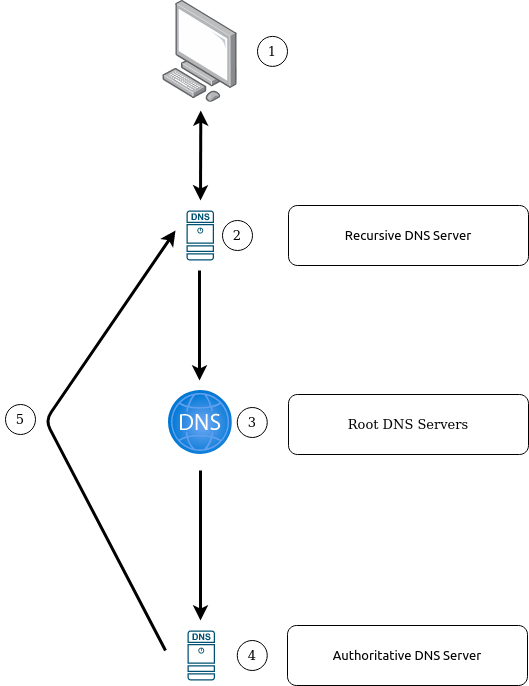

# 2. How the Web works

The underlying functions of the *World Wide Web* and what makes it work. 

## Table of Contents
* [DNS in detail](#dns-in-detail)
    * [Domain Hierachy](#domain-hierachy)
    * [DNS Record Types](#dns-record-types)
    * [Making a DNS Request](#making-a-dns-request)
* [HTTP in detail](#http-in-detail)
    * [Requests and Responses](#requests-and-responses)
    * [HTTP Methods](#http-methods)
    * [HTTP Status Codes](#http-status-codes)
    * [Headers](#headers)
    * [Cookies](#cookies)
* [How websites work](#how-websites-work)
    * [HTML](#html)
    * [JavaScript](#javascript)
    * [Sensitive Data Exposure](#sensitive-data-exposure)
    * [HTML injection](#html-injection)
* [Putting it all together](#putting-it-all-together)
    * [Other components](#other-components)
    * [How web servers work](#how_web_servers_work)

## DNS in detail

Domain Name System (DNS) provides a simple way for us to communicate with devices on the internet without remembering complex sets of numbers. Recall that every device on the internet has an IP address -- a set of numbers -- for communication. A DNS correlates domain names to their corresponding IP addresses. e.g. the domain name `tryhackme.com ` is linked to the IP address `104.26.10.229`. 

### Domain Hierachy

**Top-Level Domain (TLD)**

The most righthand part of a domain name is known as the *Top-Level Domain*. e.g. for the domain name `tryhackme.com`, the TLD is `.com`. There are two types of TLD:

1. Generic (gTLD) -- historically intended to inform the user of the domain's purpose. e.g. `.edu` for education and `.gov` for government.
2. Country Code (ccTLD) -- intended for geographical purposes. e.g. `.co.uk` for the United Kingdom and `.ca` for Canada.

**Second-Level Domain**

The second-level domain name is the main portion of the domain name used for identification. e.g. `tryhackme` in the domain name `tryhackme.com`. When registering a domain name, the domain is limited to 63 characters and limited to alphanumeric characters with hyphens (but cannot start/end with hyphens or have consecutive hyphens).

**Subdomain**

A subdomain sits on the left-hand side of the Second-Level Domain, separated by a period. e.g. in the domain name `drive.google.com`, the subdomain is `drive`. A subdomain name has the same restrictions as a Second-Level Domain, but we can use multiple subdomains separated by periods to create longer domain names. The caveat is that the entire domain name is limited to **at most** 253 characters. 


### DNS Record Types

Multiple types of DNS records exist. The common ones are:

* A record -- resolve to IPv4 addresses.
* AAAA record -- resolve to IPv6 addresses. 
* CNAME (canonical name) record -- resolve to another domain name. Another DNS request will then be made to resolve that domain name.
* MX record -- resolve to the servers that handle emails for the domain. These records come with a priority flag to tell the client in which order to try the servers; if the main server is down, the email can then be sent to a backup server.
* TXT record -- free text fields where *any* text data can be stored. Generally has multiple uses. 

### Making a DNS request

When a DNS request is made, the procedure is: 

1. The client (requesting device) first checks its local cache to see if the same address has been looked up recently. If not, a request is made to a *recursive DNS server* (usually provided by an ISP).
2. The recursive DNS server also has a local cache of recently looked up domain names. If a result is found in the cache, a response is sent to the client, and request is fulfilled. If not, the request is passed on the the Internet's root DNS servers. 
3. The root servers act as the backbone of the internet -- redirecting clients to the correct TLD server depending on the request. 
4. The TLD servers hold records for where to find the *authoritative server* (also known as the *nameserver*) to answer the DNS request. There are **multiple** nameservers for a domain name for redundancy.
5. Depending on the record type, the nameserver sends the DNS record back to the recursive DNS server, where a local copy will be cached for future requests and then relayed back to the original client. 

Note that the locally cached record comes with a Time-to-Live (TTL) value which determines how long the record is stored in the cache.



## HTTP in detail

HyperText Transfer Protocol (HTTP) is the set of rules used for communicating with web servers for ther transmitting of webpage data (HTML, images, videos, etc.). 

HyperText Transfer Protocol Secure (HTTPS) is the **secure** version of HTTP. The data is encrypted, guaranteeing that we communicate with the correct web server. 

### Requests and Responses

When we access a wwebsite, the browser makes requests to a webserver for resources such as the HTML and images, and downloads the responses. Before all this can happen, we first need to tell the browser specifically how and where to access these resources. 

**Uniform Resource Locators (URLs)**

A URL is an instruction on how to access a resource on the Internet. The image below is an example of a URL with all its features (not all features will be used in a request). 


| **Feature** | **Description** |
| --- | --- |
| Scheme | Protocol to use for accessing the resource. e.g. HTTP, HTTPS, FTP, etc. |
| User | Authenication for accessing the resource (if any). |
| Host/Domain | Domain name or IP address of the web server. | 
| Port | Port to connect to -- usually 80 for HTTP and 443 for HTTPS. |
| Path | Filename or location of the resource. |
| Query String | Extra information that can be sent to the path. |
| Fragment | Reference to a location on the actual page requested. |

**Making a Request** 

The simplest request to a webserver is `GET / HTTP/1.1`. But for a much richer web experience, other data is required. Such data are sent in headers. 


We consider a typical request, and break it down line-by-line. 
```http
GET / HTTP/1.1
Host: tryhackme.com
User-Agent: Mozilla/5.0 Firefox/87.0
Referer: https://tryhackme.com/

```

1. The request is sending the `GET` method, requesting the home page with `/` and telling the web server to use the protocol `HTTP/1.1`.
2. The request is for the website `tryhackme.com`.
3. The request is made from a Firefox version 87 browser.
4. The request was referred from the URL `https://tryhackme.com`.
5. HTTP requests always end with a blank line to denote the end of the request.

A typical response looks like:
```http
HTTP/1.1 200 OK
Server: nginx/1.15.8
Date: Fri, 09 Apr 2021 13:34:03 GMT
Content-Type: text/html
Content-Length: 98

<html>
<head>
    <title>TryHackMe</title>
</head>
<body>
    Welcome To TryHackMe.com
</body>
</html>

```

Breaking it down line-by-line:

1. `HTTP/1.1` is the version of the HTTP protocol used and `200 OK` is the *HTTP Status Code* that tells us that the request has completed successfully.
2. Information on the web server software and version number.
3. The current date, time and timezone of the webserver.
4. Information on the **type** of data sent.
5. Information on the length of the data, to confirm that no data is missing.
6. Blank line to confirm the end of the HTTP response.
7. The information that was requested.

### HTTP Methods

HTTP methods are a way for the client to show their intended action when making a HTTP request. Some of the common ones are: 

| **Request Method** | **Purpose** |
| --- | --- |
| GET | Retrieving information from a server |
| POST | Submitting data to a server, potentially creating new records |
| PUT | Submitting data to a server to *update* information |
| DELETE | Deleting information/records from a web server |

### HTTP Status Codes

Recall that in a HTTP response, the first line contains a HTTP status code which informs the client of the outcome of their request and also potentially how to handle it. These status codes fall into one of five different ranges:

| **Range** | **Type** | **Description** |
| --- | --- | --- |
| 100-199 | Information Response | Tells the client that the first part of their request has been accepted and to continue sending the rest of the request. These are no longer very common. | 
| 200-299 | Success | Tells the client that their request was successful. | 
| 300-399 | Redirection | Redirects the request to another resource (can be a different webpage or website). | 
| 400-499 | Client Errors | Tells the client that there was an error with the request. | 
| 500-599 | Server Errors | Reserved for errors on the **server-side**. Usually indicates a major problem with the server handling the request. | 

Some common HTTP status codes are: 

| **Code** | **Description** | 
| --- | --- |
| 200 OK | The request was completed successfully. | 
| 201 Created | A resource was successfully created. e.g. a new user or a new blog post. |
| 301 Permanent Redirect | Redirects the client's browser to a new webpage, or tells search engines that the page has moved and to look there instead. |
| 302 Temporary Redirect | Same as `301 Permanent Redirect` but only temporarily -- the resource may move again. |
| 400 Bad Request | Tells the browser that something was wrong or missing in the request. |
| 401 Not Authorised | Tells the client that it is not authorised to view the resource. |
| 403 Forbidden | Tells the client that it does not have permission to view the resource, regardless if they are authorised or not. |
| 404 Page Not Found | The page/resource requested does not exist. | 
| 405 Method Not Allowed | The resource does not allow a particular method request. |
| 500 Internal Service Error | The server has encountered an error with the request and does not know how to handle it. |
| 503 Service Unavailable | The server cannot handle the request as it is either overloaded or down for maintenance. | 

### Headers

Headers are additional bits of data that can be sent to a web server when making a request.

**Common Request Headers**
* Host -- Some web servers host multiple websits so the host header tells the server which website is required.
* User-Agent -- Information about the browser software and version number so that the web server can format the website appropriately.
* Content-Length -- Length of the data in the request so that the server can ensure that no data is missing.
* Accept-Encoding -- Information about the compression methods supported by the browser.
* Cookie -- Data sent to the web server to help remember information about the client.

**Common Response Headers** 
* Set-Cookie -- Information to store about the lclient, which will get sent to back to the web server.
* Cache-Control -- How long to store the content of the response in the browser's cache.
* Content-Type -- Tells the client about the type of data being returned. 
* Content-Encoding -- Tells the client about the compression method used to compress the data.

### Cookies

Cookies are small pieces of data saved on a computer. Cookies are saved whenever a `Set-Cookie` header is received from a web server. Then with every further request made, cookie data is sent back to the web server. Since HTTP is stateless, cookies can be used to remind the web server of who the client is, etc.

Below is an example of a HTTP request involving cookies:


Cookies can be used for many purposes, but are most commonly used for website authentication. 

We can use the "Developer Tools" in a browser to view the cookies being sent to a web server.

## How websites work

When visiting a website, the browser makes a request to a web server: asking for information about the webpage. The server then responds with data that the browser can use to render the webpage.


There are **two** major components that make up a website: 
1. Front End (Client-Side) -- the way that the browser renders a website.
2. Back End (Server-Side) -- a server that processes the request and returns a response. 

### HTML

Hypertext Markup Language (HTML) is the langugae used to build websites and define their structure. Elements (demarcated by *tags*) are the building blocks of HTML pages and tell the borwser how to display content. A simple HTML document looks like

```html
<!DOCTYPE html>
<html>
    <head>
        <title>Page Title</title>
    </head>
    <body>
        <h1>Example Heading</h1>
        <p>Example paragrah... </p>
    </body>
</html>
```
The HTML structure above has the following components:

* `<!DOCTYPE html>` defines that the page is a HTML document. This helps with standardisation across different browsers and tell the browser to interpret the page using HTML5.
* The `<html>` element is the **root** element of the HTML page -- all other elements have to be inside this element.
* The `<head>` element contains information about the page (such as the title, in the `<title>` element).
* The `<body>` element defines the HTML document's body; only content in the body is shown by the browser.
* The `<h1>` element defines a large heading.
* The `<p>` element defines a paragraph. 

There are many other elements used for different purposes (such as `<button>` or ``). 

Tages can contain attributes such as the class attribute that can be used to style an element (e.g. `<p class="bold-text"`) or the source attribute which can be used on images to specify the source of the image (e.g. ``) which should be unique to the element. These identity attributes can be used for styling or identification in JavaScript.

We can view the HTML of any web page via the "View Page Source" function in any browser.

### JavaScript

JavaScript is one of the most popular coding languages in the world and allows webpages to become interactive. JavaScript can dynamically update the page in real-time, giving the web page functionality. e.g.
```javascript
document.getElementById("demo").innerHTML = "Hack the Planet";
```

JavaScript is added within the page source code and can be loaded either within `<script>` tags or (more commonly) remotely via the source attribute 
```html
<script src="(path to javascript file).js"></script>
```

HTML elements can also have events, such as `onclick` or `onhover`, that execute Javascript when the event occurs. For example:
```html
<button onclick='document.getElementById("demo").innerHTML = "Button Clicked";'> Click Me </button>
```

### Sensitive Data Exposure

Sensitive Data Exposure occurs when a website does not properly protect (or remove) sensitive plaintext information to the end-user -- usually in the front-end source code. Recall that we can view the HTML document of a web page in any browser: a developer may forget to remove sensitive data such as log in credentials or hidden links in the HTML or JavaScript documents. Such sensitive data can be leveraged to further an attacker's access within a web application. 

Whenever we are assessing a web application for security issues, one of the first things we do is to review the page source to see if there are any exposed sensitive information. 


### HTML Injection

HTML Injection is a **vulnerability** that occurs when *unfiltered* user input is displayed on the page. If a website fails to *sanitise* user input (i.e. filter any "malicious" input), and that input is used on the page, then an attacker can inject HTML code into the website.

> **Input sanitisation** is very important in keeping a website secure, as user input is often used in other front- and back-end functionality. Another vulnerability involving user input is *database injection*, where a database query is manipulated. 

An example of HTML injection:


The image shows how a form outputs text to a page. The user input into the "What's your name?" field is passed into a JavaScript function and output to the page. Thus, if the user inputs their own HTML or JavaScript into the field, it will be used in the `sayHi` function and is added to the page.

In general, user input should never be trusted. All user input should be sanitised before being passed into JavaScript functions. 

## Putting it all together

To summarise the previous sections, when a website is requested, the device needs to know the server's IP address -- which the device finds using DNS. The device then then talks to the web server using the HTTP protocol and the web server responds with HTML, JavaScript, CSS, etc., which is then used by the browser to display the webpage.


There are also other components that help the web run more efficiently and provide extra features. 

### Other components

**Load balancers**

When a website's traffic gets heavy or is running an application that requires high availability, one web server may no longer be sufficient. Load balancers solve this by providing two functions:
1. ensuring that high traffic websites can handle the load, and
2. providing a failover in the event that a web server becomes unresponsive.

When a website with a load balancer is requested, the load balancer receives the request first and then decides (via some algorithm) which web server to forward it to. Some algorithms are:

* **Round-robin** -- where each server is sent a request in turn.
* **Weighted** -- which checks each server and sends the request to the least busy server.

Load balancers also periodically perform *health checks* with each server to ensure that they are running correctly. If a server does not respond appropriately, then the load balancer stops sending the server traffic until it responds appropriately again. 


**Content Delivery Networks (CDNs)**

A CDN can be an excellent resource for cutting down traffic to a busy website. It allows us to host *static* files (such as JavaScript, CSS, images, videos, etc.) across thousands of servers all over the world. When, a user requests one of the hosted files, the CDN works out the physical location of the nearest server and sends the request there.

**Databases**

Databases allow websites to store information for its users -- web servers communicate with databases to store and recall data from them. Databases can range from being a simple plaintext file up to complex clusters of mutliple servers (to provide speed and resilience). Somne common databases are: MySQL, MongoDB, GraphQL, etc. and each has its specific features.

**Web Application Firewall (WAF)**

A WAF sits between the web request and the web server, protecting the web server from hacking or denial of service (DoS) attacks. It analyses the web requests for common attack techniques, such as whether the request is from a real browser or from a bot. The WAF also performs *rate limiting*, only allowing a certain number of requests from an IP per second. 

If a request is deemed to be a potential attack, it is dropped and never reaches the server.


### How web servers work

A web server is a software that listens for incoming connections and then utilises the HTTP protocol to deliver web content to its clients. Some common web server softwares are Apache, Nginx, IIS and NodeJS. A webserver delivers files from its root directory, which is defined in the software's settings. 

**Virtual Hosts**

Web servers can host multiple websites with different domain names using virtual hosts. The web server software matches the hostname being requested from the HTTP headers against its virtual hosts (which are text-based configuration files). If a match is found, the correct website will be responded. Otherwise, a default website will be provided instead. 

Virtual hosts can have their root directories mapped to *different* locations on the web server's hard drive. There is no limit to the number of virtual hosts on a web server.

**Static and Dynamic content**

*Static* content never changes. These are files served directly from the web server without changes made to them.

*Dynamic* content is content that can change with different requests. For example, a blog with the latest entries shown on its homepage. The homepage changes when a new entry is created.

Dynamic content is changed in what is called the **backend** with the use of programming or scripting languages. On the other hand, everything that is displayed by the browser is known as the **frontend**.

**Scripting and backend languages**

Backend languages are what make a website interactive to the user. Some languages are PHP, Python, Ruby, and many more. These languages can interact with data bases, call external services, process user data, etc. 

Consider an example in PHP. If we have `index.php`:

```php
<html><body>Hello <?php echo $_GET["name"]; ?> </body></html>
```

on the domain name http://example.com, and we made a request to http://example.com/index.php?name=adam. The response would be

```html
<html><body>Hello adam</body></html>
```

