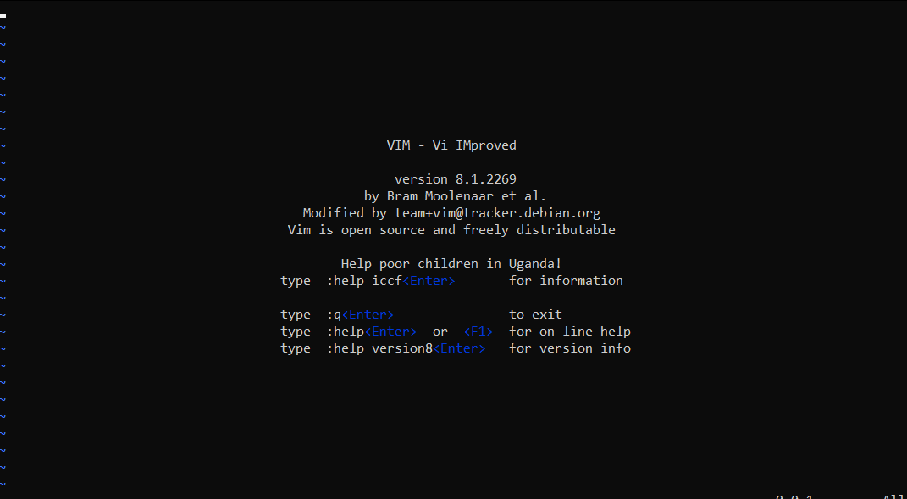

# Linux Fundamentals 

Linux is one of the most popular *operating systems* in the world: powering smart cars, Android devices, enterprise servers and more. 

## Table of Contents
* [Background](#background)
* [`echo` and `whoami`](#echo-and-whoami)
* [Interacting with the Filesystem](#interacting-with-the-filesystem)
* [Searching](#searching)
  * [`find`](#find)
  * [`grep`](#grep)
* [Shell operators](#shell-operators)
* [SSH](#ssh)
* [Flags and Switches](#flags-and-switches)
  * [The man(ual) page](#the-manual-page)
* [More Filesystem interaction](#more-filesystem-interaction)
* [Permissions 101](#permissions-101)
  * [Users and Groups](#users-and-groups)
* [Common directories](#common-directories)
  * [/etc](#etc)
  * [/var](#var)
  * [/root](#root)
  * [/tmp](#tmp)
* [Terminal text editors](#terminal-text-editors)
  * [Nano](#nano)
  * [VIM](#vim)
* [Transferring files](#transferring-files)
  * [`wget`](#wget)
  * [Secure Copy (SCP)](#secure-copy-scp)
  * [Serving files on the host via HTTP](#serving-files-on-the-host-via-http)
* [Processes 101](#processes-101)
* [Viewing processes](#viewing-processes)
* [Managing processes](#managing-processes)
  * [How do processes start?](#how-do-processes-start)
  * [Starting processes on boot](#starting-processes-on-boot)
  * [Foregrounding and Backgrounding](#foregrounding-and-backgrounding)
* [Automation](#automation)
* [Package Management](#package-management)
* [Logs](#logs)

## Background

Each operating system (OS) has their own advantages and disadvantages. Linux is considerably more lightweight and hence powers things such as:

* websites, 
* car entertainment systems, 
* Point-of-Sales systems, and
* traffic light controllers and other critical infrastructures.

"Linux" is actually an umbrella term for multiple OSes that are based on *UNIX* (another OS). UNIX is open-source, and hence variants of Linux comes in all shapes and sizes -- configured to best suit the use case.  For example, Ubuntu and Debian are the more common distributions (distros) of Linux due to their extensibility -- Ubuntu can be run as a server or as a fully-fledged desktop.

## `echo` and `whoami`

The lightweight of Ubuntu comes with at the cost of a graphical user interface (GUI). A large part of interacting with such systems is via the *Terminal*.

We interact with the Terminal via text-based commands. The first two commands that we will look at are: 

* `echo` : output any text provided as an argument. e.g.

    ```console
    ~$ echo "Hello World"
    Hello World
    ```
* `whoami` : returns the user that is currently logged in. e.g. 

    ```console
    ~$ whoami
    ubuntu
    ```

    telling us that we are currently logged into the user `ubuntu`.


## Interacting with the Filesystem

It is essential that we are able to navigate through the file system via the Terminal. The main commands that allow us to do so are:

* `ls` (listing): listing all files in the current directory. e.g. 

    ```console
    ~$ ls
    'My Documents'  'My Pictures'   'Important Files'
    ```

    telling us that there are three folders/sub-directories -- "My Documents", "My Pictures" and "Important Files" -- in the current directory. 

    We can even access the listing of a sub-directory directly:

    ```console
    ~$ ls "My Pictures"
    ```

* `cd` (change directory): change to another directory. In the previous example, if we wanted to move to the "Important Files" sub-directory, we would execute the command

    ```console
    ~$ cd "Important Files"
    ~/"Important Files"$ 
    ```

* `cat` (concatenate): outputs the contents of files (not just text files!). Suppose we have a text file `Hello.txt`, which contains:
    > the quick brown fox jumps over the lazy dog!

    If we execute the command

    ```console
    ~$ cat Hello.txt
    the quick brown fox jumps over the lazy dog!
    ```

* `pwd` (print working directory): outputs the current directory. e.g.

    ```console
    ~/Documents$ pwd
    /home/ubuntu/Documents 
    ```

## Searching

### `find`

To search for files in a filesystem, we can use the `find` command. If we know the name of the file we are looking for we can execute 

```console
~$ find -name <FILE_NAME>
```

We can use the `find` command together with the wildcard operator `*`. Suppose we want to find all `.txt` files, we can execute the command

```console
~$ find -name *.txt
```

### `grep`

We can also search the contents of files for a specific value using the `grep` command. 

```console
~$ grep <SEARCH_STRING> <FILE_NAME>
```

## Shell operators

Shell operators give us an extra level of control in the Terminal. We will look at some basic ones.

* `&` : Terminating a command with this operator excuters the command in the background in a subshell. e.g. `<command> & `.
* `&&` : This operator allows us to join multiple commands into a list which is executed sequentially. e.g. `<command1> && <command2>`, but it should be noted that `command2` only executes if `<command1>` was executed successfully. 
* `>` : This operator redirects output to somewhere else. e.g. if we execute the command

    ```console
    ~$ echo hello > welcome
    ```

    then a file named `welcome` is created, containing the text "hello". If the file already exists, then the contents are **overwritten**.

* `>>` : This operator is similar to `>` but appends the output to the end of the file, rather than overwriting the file (if it already exists). 

## SSH

We can connect to and interact with the Terminal of a *remote* Linux machine via the Secure Shell (SSH) protocol. In the SSH protocol, the human-readable input is encrypted before travelling across the network, and is then unencrypted when it reaches the remote machine.


## Flags and Switches

It is common for commands to allow arguments identified by a hyphen and keyword -- these are known as *flags* or *switches*. 

Flags and switches extend the behaviour of commands. Without them, commands will perform their default behaviour. Consider the example of `ls`. By default, `ls` does not show hidden files. e.g.

```console
~$ ls
folder1 image1
```

But we can extend `ls` to show hidden files using the `--all` (or its shorthand `-a`) flag. e.g.

```console
~$ ls --all
. .. .bash_logout .bashrc .hiddenfolder folder1 image1
```

and we see that the output contains the hidden files and folders (whose names are prefixed with a period ".").

Commands that can be extended by flags and switches will also have a `--help` flag. This flag will list all the possible flags for the command.

### The man(ual) page

The `--help` flag is actually just a formatted output of the *man* page which contains the documentation for the command.
To access the man page directly, we can use the `man` command, followed by the command we want the documentation for. e.g. `man ls` will show us the man page for `ls`.

## More Filesystem interaction

In a [previous section](#interacting-with-the-filesystem), we looked at the commands `ls`, `find` and `cd`. These allowed us to list and find files, and navigate through the filesystem. In this section, we will discuss how to create, move and delete files and folders.

* `touch` : creates a new file. e.g.
  
    ```console
    ~$ ls
    file1 file2

    ~$ touch file3

    ~$ ls
    file1 file2 file3
    ```

* `mkdir` (make directory): creates a new folder e.g.
  
    ```console
    ~$ ls
    file1 

    ~$ mkdir newfolder

    ~$ ls
    file1 newfolder
    ```

* `rm` (remove): removes files and folders. Files can be removed by executing the command `rm <file name>`. e.g. 

    ```console
    ~$ ls
    file1 file2

    ~$ rm file1

    ~$ ls
    file2
    ```

    To delete folders, we will need to include the `-r` switch: `rm -r <folder name>`. e.g.

    ```console
    ~$ ls
    folder1 folder2

    ~$ rm folder1
    rm: cannot remove 'folder1': Is a directory

    ~$ rm -r folder1

    ~$ ls
    folder2
    ```

* `cp` (copy): copies the entire contents of a file from a source to a destination. The command takes in two arguments: the source (name of the existing file) and the destination (name we wish to assign to the new file), i.e.

    ```console
    ~$ cp <SOURCE> <DESTINATION>
    ```

    An example is

    ```console
    ~$ ls
    file1

    ~$ cp file1 file2

    ~$ ls
    file1 file2
    ```

* `mv` (move): moves or renames files. Similar to `cp`, this command takes two arguements. e.g.

    ```console
    ~$ ls
    folder file1 file2

    ~$ mv file2 file3

    ~$ ls
    folder file1 file3

    ~$ mv file1 folder

    ~$ ls
    folder file3

    ~$ ls folder
    file1
    ```

* `file` : determines the type of a file. File types are usually denoted by their extension (such as `.txt` or `.csv`) but this is not necessary. The `file` command allows us to identify the file's type, from which we can then deduce its purpose. e.g.

    ```console
    ~$ file note
    note: ASCII text
    ```

    So the file named `note` is a text file containing ASCII text.

## Permissions 101

If we run `ls` with the flag `-l`, we get the file listing in the long listing format. In this format, we can see the file information. Here, we are concerned with the first, third and fourth columns of the output -- the file permissions, file owner and file group respectively.


These three columns determine whether or not we have access to the file and what we can do with it. We can break down the permissions column in the following manner:


Using our example from the first image above, the file `file2`:

* has the "-" indicator, indicating that it is a file,
* followed by "rw-rw-r--" which indicates that the file owner and group owner can read and write to the file, and any other user can only read the file; 
* no user has permissions to execute the file.

### Users and Groups

One feature of Linux the granular control over file permissions. Whilst a user technically owns a file, if the permissions have been set appropriately, then a *group* of users can also have either the same or different permissions, without affecting the file owner. 

For example, on a web server, we have an `admin` user that oversees the overall operation. The web server hosts two websites which are owned by groups `website1` and `website2`. The file permissions may look something like this:

```console
-rw-rw-r-- 1 admin website1 16 Jul 23 01:00 website1.config
-rw-rw-r-- 1 admin website2 16 Jul 20 23:13 website2.config
```
Thus, the `admin` user has write permissions to **both** `.config` files, while the owners of each website can only write to their own `.config` file (without accessing the `admin` user).

**Switching between users**

Switching between users on Linux can be done via the `su` (switch user) command. Unless we are the root user (or have root permissions via `sudo`), we require:

* the name of the user we want to switch to, and
* the password of the user.

Furthermore, if we use the `-l` switch, then we start a shell (similar to the user logging into the system) and inherit more properties (such as the environment variables) of the new user.

## Common directories

In this section, we discuss some important root directories in the Linux filesystem

### /etc

This root directory stores system files that are used by the OS. There are some important files here:

* `sudoers` : contains the list of users and groups that have permissions to run `sudo` or commands as the root user.
* `passwd` : contains the list of users and their details, such as their home directory and groups.
* `shadow` : contains the list of users and their passwords in an **encrypted** format (SHA512 encryption).

### /var

Var stands for variable data and this root directory stores the data that is frequently accessed or written to by services and applications running on the system (such as log files or databases not associated to a particular user).

### /root

This is the home directory for the root user.

### /tmp

Tmp stands for temporary and this root directory is volatile -- its contents are cleared out whenever the computer is restarted. This directory is commonly used to store data that is only needed to be accessed once or twice (such as enumeratiion scripts once we have access to the machine).

## Terminal text editors

In the previous sections, we have interacted with text in files via a combination of the `echo`, `>` and `>>` operators. However, this is not really efficient when dealing with large files with multiple lines. Luckily, there are text editors available to us via the Terminal -- nano and VIM. 

### Nano

To create or edit a file using nano, we simply run the command 

```console
~$ nano <FILE_NAME>
```

and nano will launch. The "up" and "down" arrow keys will allow us to navigate across the lines, while the "enter" key will start a new line. 


Nano has a few features that we need from a text editor, including:
* searching for text,
* copying and pasting,
* jumping to a particular line, and 
* finding the current line number.

### VIM

VIM is a much more advanced text editor, including features such as:
* customisable hotkeys,
* syntax highlighting, and 
* is available on *all* terminals.



## Transferring files

Being able to transfer files is also an essential skill. Try are multiple ways to do so in Linux. 

### `wget`

The `wget` command allows us to download files from the **Web** via HTTP -- as if we were accessing the file from the browser. We simply provide, as an argument, the URL to the file we wish to download.
```console
~$ wget <URL_TO_FILE>
```

### Secure Copy (SCP) 

SCP is a means of securely copying files between our current system and the remote system; it transfers files between two computers using the SSH protocol to provide both *authentication* and *encryption*.

The `scp` command takes the source and destination as its parameters. i.e.
```console
~$  scp <SOURCE> <DESTINATION>
```

For example, if we want to transfer a file `important.txt` from our current system to a user `user` on a remote system at `192.168.1.30`, then the command is 
```console
scp important.txt user@192.168.1.30:/home/user/transferred.txt
```
and the file will be saved at `/home/user` as `transferred.txt`.

On the other hand, if we want to transfer a file from a remote system to our current system, using the example before, the command is 
```console
scp user@192.168.1.30:/home/user/important.txt transferred.txt
```
and the file `transferred.txt` will be stored in the current working directory. 

### Serving files on the host via HTTP

Ubuntu machines are prepackaged with `python3`. Python comes with the HTTPServer module which allows us to turn our computer into a web server where we can serve our own files. These files can then be downloaded by another computer using `wget` or `curl`. 

HTTPServer serves the files in the directory where it is run, but this can be changed by providing options (see the manual page). To run HTTPServer, we run the command `python3 -m http.server`. We can then use `wget` on another computer to download the file.

Consider the following example: 

Source device (IP: `192.168.1.20`)
```console
~/webserver$ ls
file

~/webserver$ python3 -m http.server
Serving HTTP on 0.0.0.0 port 8000 (http://0.0.0.0:8000/) ...
```

Destination device (omitting the output of `wget`)
```console
~/files$ ls

~/files$ wget http://192.168.1.20:8080/file
...

~/files$ ls
file
```

The request made by `wget` will also be logged on the source device. 

There are other alternatives to HTTPServer, such as [Updog](https://github.com/sc0tfree/updog), which provides a simple graphical user interface (GUI).


## Processes 101

Processes are the programs running on the machine. Processes are managed by the kernel and associated to an ID -- known as the PID. The PID is incremented as processes are started, i.e. the 60th process will have a PID of 60. 

### Viewing processes

We can use the `ps` (process status) command to view the list of currently running processes **in the current user's session** and additional information such as the status codes and the CPU usage. e.g.

```console
~$ ps
    PID TTY         TIME CMD
      8 pts/0   00:00:00 bash
     19 pts/0   00:00:00 ps

~$ ps
    PID TTY         TIME CMD
      8 pts/0   00:00:00 bash
     20 pts/0   00:00:00 ps    
```

Note how the PID of the process `ps` increments from 19 to 20. 

In order to view the processes run by other users and processes not belonging to a session -- i.e. system processes -- we use the `aux` argument. e.g.

```console
~$ ps aux
USER       PID %CPU %MEM    VSZ   RSS TTY      STAT START   TIME COMMAND                    
root         1  0.6  0.0    892   580 ?        Sl   13:29   0:00 /init
root         6  0.0  0.0    892    84 ?        Ss   13:29   0:00 /init
root         7  0.0  0.0    892    84 ?        S    13:29   0:00 /init
user         8  3.6  0.0  10036  4924 pts/0    Ss   13:29   0:00 -bash
user        19  0.0  0.0  10616  3384 pts/0    R+   13:29   0:00 ps aux  
```

In this example, we have a total of five processes. Note that we now have both the `root` and `user` users.

Another useful command is `top` (table of processes), which gives us real-time statistics about the processes rather than a one-time view. These statistics will refresh either every 10 seconds, or when the arrow keys are used to browse through the various rows. 

### Managing processes 

To kill a process, we can use the `kill` command with the PID of the process we want to kill as the argument. For example, to kill a process with the PID 1245, we execute

```console
~$ kill 1245
```

Additionally, we can send signals to indicate how a process should be killed. Some such signals are:

* SIGTERM -- kill the process, but allow it to do some cleanup tasks before hand
* SIGKILL -- kill the process, but *without* any cleanup after the fact
* SIGSTOP -- stop or suspend a process

### How do processes start? 

It turns out that the PID is a Linux namespace: used by the OS to allocate available resources (such as CPU and RAM) to the processes. Namespaces also *isolate* processes from one another -- only those in the same namespace will be able to see each other.

PID namespaces are *nested*: when a new process is created, it will have a PID for each namespace from its current namespace, up to the initial PID namespace. Hence, the initial PID namespace is able to see **all** processes, but with different PIDs than other namespaces will see processes with. 

When the system is booted, the process with a PID of 1 is started. This process is the system's initialisation process, `systemd` (system daemon) -- which provides a way of managing a user's processes and sits between the user and the OS.

Any programs that starts then becomes a *child process* of  `systemd`: it is **controlled** by and shares resources with `systemd`, but will run as its own process to be easily identifiable.

### Starting processes on boot

Some applications can be started on system boot, e.g. web servers, database servers or file transfer servers. 

The command `systemctl` allows us to interact with `systemd`, and we can use this command to start or stop processes. The command takes two arguments:

```console
~$ systemctl <OPTION> <SERVICE>
```

For example, if we want to tell the system to start an instance of apache web server manually, we would run the command:

```console
~$ systemctl start apache2
```

There are four main options we can select:

1. `start` -- starts an application.
2. `stop` -- stops an application.
3. `enable` -- tells the computer to start the application on boot.
4. `disable` -- tells the computer to disable the application startup on boot.

## Foregrounding and Backgrounding

A process can run in two states, either in the foreground, or in the background. Any command we execute in the terminal will normally be run in the foreground. Recall that to run a process in the background, we can terminate the command with the `&` operator. The command then returns the PID of the process. Processes such as copying files can be run in the background and we can move on to running other processes.

We can also push processes such as scripts to the background by pressing `Ctrl + Z` as the process is being executed.

We can also pull a process running in the background into the foreground by the command `fg`: 

```console
~$ fg <JOB_ID>
```

where the `<JOB_ID>` can be found by the `jobs` command.

## Automation

We can schedule certain actions or tasks, such as backing up files, to take place after the system has booted using the `cron` process. We interact with the `cron` process via `crontabs` (cron tables) which is started during boot and responsible for managing cron jobs. 

A `crontab` is simply a file with formatting that is recognised by the `cron` process -- executing each line in the `crontab` step-by-step. A `crontab` instruction has the following format:

```console
<MIN> <HOUR> <DOM> <MON> <DOW> <COMMAND>
```

Each value represents the following:

* `<MIN>` -- what minute to execute at
* `<HOUR>` -- what hour to execute at
* `<DOM>` -- what day *of month* to execute at
* `<MON>`-- what month of year to execute at
* `<DOW>`-- what day *of week* to execute at
* `<COMMAND>` -- the command to be executed 

Other than the `<COMMAND>` field, the fields generally have numerical values. However, they also accept some special characters for additional functionality:

* `*` -- wildcard; represents any value
* `,` -- separator to denote a list of values
* `~` -- denotes a range of values
* `/` -- represents intervals

As an example, suppose we want to backup the contents of `/home/user/Documents` to `/var/backups/` every 12 hours. The `crontab` entry would be 

```console
0 */12 * * * cp -R /home/user/Documents /var/backups/
```

Some useful tools for checking/generating `crontab` entries are: 

* [Cron Guru](https://crontab.guru/)
* [Crontab Generator](https://crontab-generator.org/)

`crontabs` can be edited by the command `crontab -e`.

## Package Management

Developers release software for Linux OSes by submitting the software to the "apt" repository. While OS vendors will maintain their own repositories, one can also add community repositories to their registry to access more software. 

Normally, we would use the `apt` command to install software onto our Ubuntu system. The `apt` command is a part of the management software named apt -- a suite of tools that allows us to manage the packages and sources of our software, and to install or remove software.

It is also possible to install software via the use of package installers like `dpkg`, but the benefit of apt is that whenever our system is updated, the software we use is also updated.

We will walkthrough an example where we install "Sublime Text 3" onto our system. 

**Step 1.**  We need to add the GPG key for the developers of "Sublime Text 3". We do so by first downloading the key, and then use `apt-key` to trust it:
    
    ```console
    ~$ wget -qO https://download.sublimetext.com/sublimehq-pub.gpg | sudo apt-key add -
    ```

**Step 2.** We then need to add the repository for "Sublime Text 3" into our apt sources list. A good practice is to have a separate file for every repository we add.

We first create a file in `/etc/apt/sources.list.d`

```console
/etc/apt/sources.list.d$ touch sublime-text.list
```

In that file, we add the following entry 

```
deb https://download.sublimetext.com/ apt/stable/
```

and update apt using `apt update` so that this new entry is recognised. We can now install "Sublime Text 3" from the repository by running

```console
~$ apt install sublime-text
```

To remove a repository, we can simply reverse the steps above.

To remove a software, we can execute the command

```console
apt remove <SOFTWARE>
```

## Logs

Log files are generally stored in `/var/log` and contain logging information for applications and services running on the system. The OS automatically manages these logs in a process known as "*rotating*". 

Logs are a way of monitoring the health of the system and protecting it. Logs for services such as a web server also contain information about **every single request**, allowing developers or administrators to diagnose performance issues or investigate suspicious activity. In these cases, two types of log files are of interest:

1. access logs, and
2. error logs. 

There are also other types of log files that store information about how the OS is running itself and actions that are performed by users, such as authentication attempts. 

