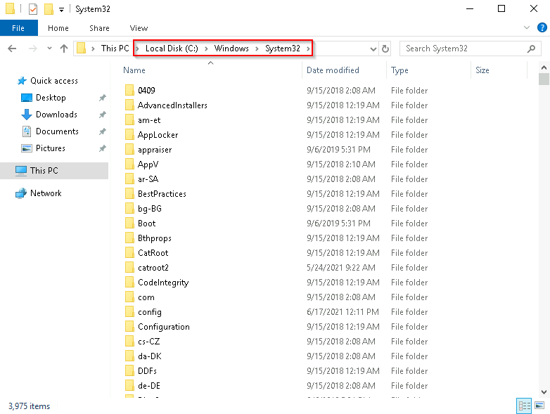

# 4. Windows Fundamentals

The Windows OS is a complex product with many system files, utilities, settings, features, etc. In this section, we will provide a general overview of the Windows OS. 

## Table of Contents
* [Windows editions](#windows-editions)
* [The File System](#the-file-system)
* [The Windows\System32 Folder](#the-windowssystem32-folder)
* [User accounts, Profiles and Permissions](#user-accounts-profiles-and-permissions)
* [User Account Control](#user-account-control)
  * [How does UAC work?](#how-does-uac-work)
* [System configuration](#system-configuration)
  * [General](#general)
  * [Boot](#boot)
  * [Services](#services)
  * [Startup](#startup)
  * [Tools](#tools)
* [Change UAC Settings](#change-uac-settings)
* [Computer Management](#computer-management)
  * [System Tools](#system-tools)
* [System Information](#system-information)
* [Resource Monitor](#resource-monitor)
* [Command Prompt](#command-prompt)
* [Registry Editor](#registry-editor)
* [Windows Update](#windows-update)
* [Windows Security](#windows-security)
  * [Virus and Threat Protection](#virus-and-threat-protection)
  * [Firewall and network protection](#firewall-and-network-protection)
  * [App and Browser control](#app-and-browser-control)
  * [Device Security](#device-security)
* [Bitlocker](#bitlocker)
* [Volume Shadow Copy Service](#volume-shadow-copy-service)

## Windows editions
The Windows OS is currently the dominant operating system in both home use and corporate networks. Because of this, Windows has always been targeted by malicious actors.

Windows 10 is the current Windows operation system version for desktop computers, and comes in two different flavours: Home and Pro. The differences between the two are listed on Microsoft's [website](https://www.microsoft.com/en-us/windows/compare-windows-10-home-vs-pro). As of June 2021, the retirement dates of Windows 10 are listed [here](https://docs.microsoft.com/en-us/lifecycle/products/windows-10-home-and-pro?ranMID=24542&ranEAID=kXQk6*ivFEQ&ranSiteID=kXQk6.ivFEQ-M28j3qbUhtM2JFCT2wmhOA&epi=kXQk6.ivFEQ-M28j3qbUhtM2JFCT2wmhOA&irgwc=1&OCID=AID2000142_aff_7593_1243925&tduid=%28ir__uszrgcddyskfqz3fkk0sohz3wv2xuurc01kgzkod00%29%287593%29%281243925%29%28kXQk6.ivFEQ-M28j3qbUhtM2JFCT2wmhOA%29%28%29&irclickid=_uszrgcddyskfqz3fkk0sohz3wv2xuurc01kgzkod00&ranMID=24542&ranEAID=kXQk6*ivFEQ&ranSiteID=kXQk6.ivFEQ-4cKUPfbv9lM_IR2EX7K_hw&epi=kXQk6.ivFEQ-4cKUPfbv9lM_IR2EX7K_hw&irgwc=1&OCID=AID2000142_aff_7593_1243925&tduid=%28ir__feexvhocigkfqna9kk0sohznb32xutanagupypus00%29%287593%29%281243925%29%28kXQk6.ivFEQ-4cKUPfbv9lM_IR2EX7K_hw%29%28%29&irclickid=_feexvhocigkfqna9kk0sohznb32xutanagupypus00).

The current version of Windows for servers is *Windows Server 2019*. 

## The File System

Modern versions of Windows use the **New Technology File System** (NTFS): a journaling file system. In case of a failure, journaling allows the file system to automatically repair the contents on disk using information. 

NTFS also brings about many improvements over its predecessor (the File Allocation Table (FAT16/FAT32)), such as:

* support for files larger than 4GB, 
* specific permissions on folders and files,
* folder and file compression, and
* encryption (via the *encryption file system* (EFS)). 
  
On a Windows system, we can check the file system being used on a drive from its "Properties".


On NTFS drives, we can set permissions that grant or deny access to files and folders. The table below lists the permissions and shows how each permission applies to files and folders (taken from [Microsoft](https://docs.microsoft.com/en-us/previous-versions/windows/it-pro/windows-2000-server/bb727008(v=technet.10)?redirectedfrom=MSDN))

| **Permission** | **for Folders** | **for Files** |
| --- | --- | --- |
| Full Control | Permits reading, writing, changing, and deleting of files and subfolders. | Permits reading, writing, changing and deleting of file. |
| Modify | Permits reading and writing of files and subsfolders. Allows deletion of the folder. | Permits reading, writing, and deleting the file. |
| Read and Execute | Permits viewing and listing of files and subfolders, and executing files. Inherited by files and folders. | Permits viewing and accessing of the file's contents, and execution of the file. | 
| List folder contents | Permits viewing and listing of files and subfolders, and executing files. Inherited by folders only.| N/A |
| Read | Permits viewing and listing of files and subfolders. | Permits viewing or accessing of the file's contents. |
| Write | Permits adding of files and subfolders. | Permits writing to a file. |

To look at the permissions for a file or folder, look under the "Security" tab in the file/folder "Properties" and select the relevant group or username.

**Alternative Data Stream** (ADS) is a file *attribute* specific to NTFS. Every file has at least one data stream -- `$DATA` -- and ADS allows files to contain more than one stream of data. Natively, Windows Explorer does not display the ADS for files. 

From a security perspective, ADS has been used to hide data in malware. However, not all uses of the ADS are malicious. For example, when we download a file from the Internet, the identifiers written to the ADS identify that the file was downloaded from the Internet. 

## The Windows\System32 Folder

The Windows folder (almost always at `C:\Windows`) is the folder containing the Windows OS. The system *environment variable* for the Windows folder is `%windir%`.

**Environment variables** store information about the operating system environment. This information includes details such as the operating system path, the number of processors used by the operating system, and the location of temporary folders. 

Within the Windows folder, there are many sub-folders as seen below. 


Among the sub-folders of the Windows folder is System32, which holds the files critical for the OS.



One should exercise *extreme* caution when interacting with the System32 folder. Accidentally deleting any file or folder in System32 may render the Windows OS inoperational. 

## User accounts, Profiles and Permissions

On a Windows system, there are two types of accounts: **Administrator** and **Standard user**. The user account type determines what actions the user can perform on the system. 

* Administrators can make changes to the system: adding and deleting users, modifying groups, modifying settings, etc.
* Standard users can only make changes to folders and files attributed to the user. System-level changes, such as installing programs, **cannot** be performed. 

To view the user accounts on a system, we can search for "Other users" in the Start Menu, or look under "Other users" in the system settings. If we are on a Administrator account, we will then see an option to add a new user. We will also able to remove or change the account type of other users. 

When a user account is created, a profile is created for the user at initial login. The profile folders are normally found under `C:\Users`. e.g. if we had a user named "John", the user profile folder will be `C:\Users\John`. Each user profile will have the same folders which includes:

* Desktop
* Documents
* Downloads
* Music
* Pictures

Another way to access information about users on a system is the "Local User and Group Management" application. To open it, select "Run" from the Start Menu, and run `lusrmgr.msc`.

In the application, we will also see the local groups on the system, along with a brief description for each group. Each groups has different permissions, and users can be added into groups by Adminstrators. Users will inherit permissions of the groups that they are in. A single user can be part of multiple groups.

## User Account Control

The large majority of home users are logged in to their Windows sytems as the local administrator, allowing them to make changes to the system.

Usually, a user would not require such elevated privileges since they are only running tasks such as surfing the Internet, word processing, etc. Thus, the elevated privileges increases the risk of system compromise as it makes it easier for malware to infect the system. 

To protect the local user with administrator privileges, Microsoft introduced **User Account Control** (UAC). UAC, by default, does not apply to the built-in local administrator account.

### How does UAC work? 

When an administrator user logs into the system, the current session does not immediately run with the elevated permissions. When an operation requiring higher-level privileges needs to execute, the user will then be prompted to confirm if they permit the operation to run. 

This feature will reduce the likelihood of malware compromising the system. 

## System configuration

The *system configuration* utility (also known as `msconfig`) is for advanced troubleshooting, and its main purpose is to help diagnose startup issues. 
Refer to the [System Configuration Utility documentation by Microsoft](https://docs.microsoft.com/en-us/troubleshoot/windows-client/performance/system-configuration-utility-troubleshoot-configuration-errors) for more information. Note that this utility requires admininstrator rights. 

The utility has five tabs across the top:

1. General
2. Boot
3. Services
4. Startup
5. Tools


### General

In the *General* tab, we can select the devices and services which Windows will load upon boot. The available options are: **Normal**, **Diagnostic**, or **Selective**. 

### Boot

In the *Boot* tab, we can define the various boot options of the OS.


### Services

The *Services* tab lists all services -- applications that run in the background --  configured for the system, regardless of their state (running or stopped).


### Startup

In the *Startup* tab, Microsoft advises the use of **Task Manager** (`taskmgr`) to manage (enable/disable) startup items. The System Configuration utility is **NOT** a startup management program.


### Tools

The *Tools* tab contains various utilities that can be run to configure the OS further. A brief description of each utility is also given.


Notice the *"Selected command:"* section. We can use the command shown here to launch the tool via the run prompt or the command prompt. We can also directly run the tool using the "Launch" button. 

In the upcoming sections, we will discuss some of the tools that are available in this panel. 

## Change UAC Settings

One of the tools available in the system configuration utility is the "*Change UAC Settings*". This tool allows us to change the UAC settings, or even turn UAC off completely (which is not recommended). 


## Computer Management

Computer Management (`compmgmt`) is another tool available in the system configuration utility, comprising of three main sections: 

* System Tools,
* Storage, and
* Services and Applications


### System Tools

There are a variety of tools in this section. 

* **Task Scheduler** allows us to create and manage common tasks that out computer can carry out automatically at user-specified times. 
* **Event Viewer** allows us to view events that have occured on the computer. These records of events can then be used to understand the activity and diagnose problems of the system.
* **Shared Folders** shows us a complete list of shared files and folders that others have access to. 
*  **Local Users and Groups** is just `lusrmgr.msc` which we have discussed earlier. 
*  **Performance** give us access to the utility "Performance Monitor" (`perfmon`), where we can view performance data either in real-time or from a log file. 
* **Device Manager** allows us to view and configure hardware connected to the system

**Storage** 

This section contains the "Disk Management" utility that enables us to set up, partition or configure storage drives.
 
**Services and Applications** 

In this section, not only can we enable and disable services, but we can also view the properties of a service.

## System Information

The system configuration utility also contains the "System Information" (`msinfo32`) tool. This tool gathers information about the system and displays a comprehensive overview of the hardware, system components and software environment of the system, which can be used to diagnose system issues.

The "*System Summary*" displays general technical specifications for the computer, such as the processor brand and model. Subsequently, there are three sections:

  * **Hardware Resources** which details the assignable, addressable bus paths that allow peripheral devices and system processors to communicate with each other.
  * **Components** contains specific information about the hardware devices installed on the computer. 
  * **Software Environment** contains details about software on the system and details about the operating environment, such as the *environment variables* and *network connections*


## Resource Monitor

The "Resource Monitor" (`resmon`) displays CPU, memory, disk and network usage information, in addition to providing details about which processes are using individual file handles and modules.

There are four main sections in the Resource Monitor:

1. CPU
2. Disk
3. Network
4. Memory

The "Overview" tab provides information from all four sections on a single page while the other tabs provide detailed information about each section


## Command Prompt

The Command Prompt (`cmd`) is similar to the terminal in Linux systems -- we interact with it via text commands. We will look at some simple commands in this section. 

The command `hostname` outputs the computer name. For example:
```powershell
> hostname
John-PC
```

The command `whoami` outputs the name of the logged-in user. For example:
```powershell
> whoami
John-PC\John
```

A commonly used command is `ipconfig` which will show the network address settings of the computer.

To retrieve the help manual for a command, we can suffix the command with `/?`. For example, to view the help manual of `ipconfig`,
```powershell
> ipconfig /?
```

To clear the command prompt screen, we use the command `cls`. 

The command `netstat` will display protocol statistics and current TCP/IP network connections. The netstat command can be run alone, or with parameters such as `-a`, `-b`, `-e`, etc. 

The command `net` is used to manage network resources. The net command has sub-commands that can perform different tasks. 

## Registry Editor

The *Windows Registry* is a central hierarchical database used to store information necessary for system configuration. The registry contains information that Windows continually references during operation, such as:

* profiles for each user,
* applications installed on the computer and the types of document that each can create,
* property sheet settings for folders and application icons,
* hardware on the system, and
* the ports being used.

The Registry Editor (`regedit`) is one way that we can view/edit the registry. 


## Windows Update

Windows Update is a service provided by Microsoft to provide security updates, feature enhancements and patches for the Windows OS and other Microsoft products on the system. 

Updates are typically released on the **2nd Tuesday of every month** (commonly known as *Patch Tuesday*). However, if a particular update is critical or urgent, then Microsoft may push the update immediately via the Windows Update service.

Windows Update can be found in the system settings. Alternatively, we can run the command
```powershell
control /name Microsoft.WindowsUpdate
```


## Windows Security

Windows Security allows users to easily manage the tools that protect their device and their data. Windows Security is also available in the system settings.

Windows Security provides an overview of the *Protection Areas*:

* Virus annd threat protection
* Firewall and network protection
* App and browser control
* Device security

Each protection area comes with a status icon:

* **Green** means that the device is sufficiently protected in that area.
* **Yellow** means that there is a safety recommendation to be reviewed.
* **Red** means that there is something that requires immediate attention. 

### Virus and Threat Protection

The virus and threat protection section can be split into two main parts: current threats, and virus and threat protection settings. 

**Current threats** gives us an overview of threats to our system. From here, we can conduct (quick, full or custom) *scans* in order to identify threats. We also have access to the *threat history* which keeps a record of the previous threats found and the actions that were taken. 

There are many **virus and threat protection settings** that are available:

* **Real-time protection** -- locates and stops malware from installing and running on the device. 
* **Cloud-delivered protection** -- provides increased and faster protection using the latest protection data from the cloud.
* **Automatic sample submission** -- sends sample files to Microsoft to help protect all of Windows' users from potential threats.
* **Controlled folder access** -- protects files, folders and memory areas on the deivce from unauthorised changes by malicious applications. 
* **Exclusions** -- items to exclude from Windows Defender Antivirus scans.
* **Notifications** -- notification from Windows Defender Antivirus with crucial information about the health and security of the device.
* **Check for updates** -- manually check for updates to Windows Defender Antivirus definitions.

*Ransomware protection* is also one of the security features provided by Microsoft here. However, it requires both "controlled folder access" and "real-time protection" to be enabled. 

### Firewall and network protection

A *firewall* controls what data is allowed to pass through the network ports of a device. 

Windows Firewall offers three firewall profiles:

* Domain -- applies to networks where the host system can authenticate to a domain controller. 
* Private -- a user-defined profile; applies to private or home networks.
* Public -- the default profile; applies to public networks such as Wi-Fi hotspots at coffee shops, airports, and other locations. 

For each profile, we can choose to turn the firewall on or off, or block all incoming connections. 

There is also the option of *allowing apps through the firewall*, where we can view the current settings for the firewall profiles. Some apps may also provide more information via the "Details" button. 

**Advanced settings** are also available for users to configure the Windows Firewall. 

### App and Browser control

Here, users are able to change the settings for **Microsoft Defender SmartScreen** -- which protects against phishing or malware websites and applications, and the downloading of potentially maclicious files.

**Exploit protection** is built into Windows 10 and Windows Server 2019 to protect devices against malicious attacks. 


### Device Security 

This section contains built-in security options to protect your device from malicious software attacks. 

**Core Isolation: Memory Integrity** prevents attacks from inserting malicious code into high-security processes. 

**Security processor details** provides information on the *Trusted Platform Module (TPM)* -- a cryptoprocessor designed to perform cryptographic operations. The chip includes multiple **physical** security mechanisms to make it tamper-resistant and malicious software is unable to tamper with the security functions of the TPM. 

## Bitlocker

*Bitlocker Driver Encryption* is a data protection feature that is integrated with the Windows OS and addresses the threats of data theft or exposure from lost, stolen or inappropriately decommissioned devices.

Bitlocker provides the most protection when used with a TPM module version 1.2 or later. 

## Volume Shadow Copy Service

The *Volume Shadow Copy Service (VSS)* coordinates the required actions to create a consistent shadow copy (also known as a snapshot) of the data that is to be backed up. 

Volume Shadow Copies are stored on the System Volume Information folder on each drive that has the protection enabled. 

If VSS is enabled, users can:

* Create a system restore point
* Perform system restore
* Configure restore settings
* Delete restore points

From a security perspective, malware writers know of this Windows feature and can write code in their malware to look for these files and delete them. This makes in impossible to recover from a ransomware attack unless an offline/off-site backup is available. 


